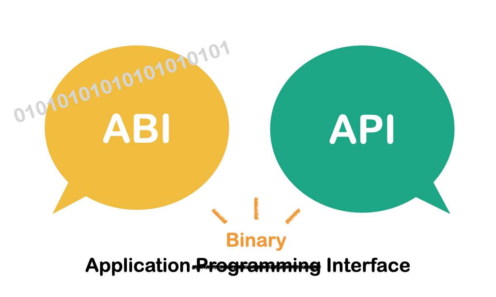
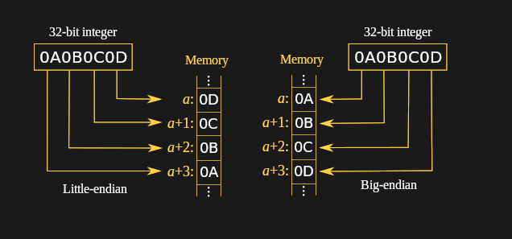

## ABI
- **Understanding ABI:** Bridging C/C++ and Python, Communication and More.




---

## **What is ABI?**
- **Definition**: ABI defines the binary interface between two program modules.

- **Key Components**:
  - Data types and alignment
  - Object layout 
  - Function calling conventions
  - Name mangling in C++

---

## **Key Topics Covered**
1. Alignment and Padding
2. Calling Conventions
3. Data Types and Compatibility
4. Endianness
5. Reflection in C++

---

## Simple types


| **Type**       | **Size (Linux)** | **Size (Windows)** | **Notes**                                                                                     |
|-----------------|-----------------------|--------------------------|------------------------------------------------------------------------------------------------|
| `char`          | 1 byte               | 1 byte                  | Always 1 byte (8 bits) per the C++ standard.                                                 |
| `bool`          | 1 byte               | 1 byte                  | Represents `true` or `false`.                                                                |
| `short`         | 2 bytes              | 2 bytes                 | Both platforms use 16 bits for `short`.                                                      |
| `int`           | 4 bytes              | 4 bytes                 | Always 32 bits on both platforms.                                                            |

---

## Simple types


| **Type**       | **Linux** | **Windows** | **Notes**                                                                                     |
|-----------------|-----------------------|--------------------------|------------------------------------------------------------------------------------------------|
| `long`          | 8 bytes              | 4 bytes                 | **Linux**: 64 bits. **Windows**: 32 bits. This is the most significant difference.           |
| `long long`     | 8 bytes              | 8 bytes                 | 64 bits on both platforms.                                                                   |
| `float`         | 4 bytes              | 4 bytes                 | IEEE 754 single-precision (32 bits).                                                        |
| `double`        | 8 bytes              | 8 bytes                 | IEEE 754 double-precision (64 bits).                                                        |
| `long double`   | 16 bytes             | 8 bytes                 | **Linux**: Extended precision (80 or 128 bits). **Windows**: Matches `double` (64 bits).     |
| `void*`         | 8 bytes              | 8 bytes                 | Pointer size depends on the architecture: 8 bytes on 64-bit systems.                        |
| `size_t`        | 8 bytes              | 8 bytes                 | Equivalent to `unsigned long` on Linux, `unsigned long long` on Windows.                    |
| `wchar_t`       | 4 bytes              | 2 bytes                 | **Linux**: 4 bytes (UTF-32). **Windows**: 2 bytes (UTF-16).                                   |

---

## Practical Usage

```cpp
#include <stdint.h>
#include <climits>

uint16_t t1;
double d;

static_assert(CHAR_BIT == 8, "Expected 8-bit bytes");
```

---

## **Alignment and Padding**
- **Why Important**: Ensures memory alignment for efficient CPU access.
- **C/C++ Specifics**:
  - Structures may include padding to align data.
  - Use `#pragma pack` for custom control.

---

## **Example**

```cpp
struct MyStruct {
    char a;    // 1 byte
    int b;     // 4 bytes
    short c;   // 2 bytes
};
```

---

## **Example**

```cpp
struct MyStruct {
    char a;    // 1 byte
    char pad1[3];
    int b;     // 4 bytes
    short c;   // 2 bytes
    char pad2[2];

};
```

---

## In code

```cpp
int main() {
    std::cout<<"Size of struct:" << sizeof( MyStruct) << std::endl;
    std::cout<<"Offset of a   :" << offsetof( MyStruct, a) << std::endl;
    std::cout<<"Offset of b   :" << offsetof( MyStruct, b) << std::endl;
    std::cout<<"Offset of c   :" << offsetof( MyStruct, c) << std::endl;
    return 0;
}
```

```
Size of struct:12
Offset of a   :0
Offset of b   :4
Offset of c   :8
```

---

## pahole (linux)

```bash
sudo apt install dwarves
gcc abi.cpp -g
pahole a.out 
```

```
struct MyStruct {
        char                       a;                    /*     0     1 */
        /* XXX 3 bytes hole, try to pack */
        int                        b;                    /*     4     4 */
        short int                  c;                    /*     8     2 */
        /* size: 12, cachelines: 1, members: 3 */
        /* sum members: 7, holes: 1, sum holes: 3 */
        /* padding: 2 */
        /* last cacheline: 12 bytes */
};
```
---

## Visual Studio (windows)

```bash
cl /d1reportSingleClassLayoutMyStruct abi.cpp
```

```
class MyStruct
   size: 12
   alignment: 4
   a: offset 0 (1 byte)
   <padding>: offset 1 (3 bytes)
   b: offset 4 (4 bytes)
   c: offset 8 (2 bytes)
   <padding>: offset 10 (2 bytes)
```

---

## Disable padding


```cpp

#pragma pack(push, 1) 

struct MyStruct {
    char a;    // 1 byte
    int b;     // 4 bytes
    short c;   // 2 bytes
};

#pragma pack(pop) 

```

---

## **Calling Conventions**
- **Definition**: Rules for function arguments and return values.
- **Examples**:
  - **Cdecl**: Default in C/C++, caller cleans up.
  - **Stdcall**: Used in Windows APIs, callee cleans up.
  - **Fastcall**: Arguments passed via registers for speed.

---

## POD - Plain Old Data


### Definition:
A **POD** (Plain Old Data) type in C++ is a type that is compatible with C-style data structures.
POD types allow direct memory manipulation and guarantee a predictable memory layout without added complexities like constructors, destructors, or virtual functions.


---

## Non POD (structure only !)

- Virtual functions
- Inheritance

---

## Non POD example

How will you implement `std::string` ?


---

## `std::string` in MSVC

```cpp
struct std::string {
    char* _Ptr;         // Pointer to the string's data (heap or SSO buffer).
    size_t _Size;       // Length of the string (excluding null terminator).
    size_t _Capacity;   // Capacity of the buffer.
    char _SSO[16];      // Small string optimization buffer.
};
```


---

## `std::string` in GCC (<5.0)


```cpp
struct std::string {
    struct _Rep {
        size_t _Length;     // Length of the string.
        size_t _Capacity;   // Allocated capacity.
        size_t _RefCount;   // Reference count for COW.
        char _Data[1];      // Flexible array member holding the string data.
    };
    _Rep* _M_dataplus;      // Pointer to the _Rep structure.
};

```


---

## `std::string` in GCC (>=5.0)


```cpp
struct std::string {
    union {
        struct {
            char* _Ptr;     // Pointer to the dynamically allocated buffer.
            size_t _Size;   // Length of the string.
            size_t _Cap;    // Capacity of the buffer.
        };
        char _SSO[24];      // Inline buffer for small string optimization.
    };
};


```

---

##  **Endianness**



---
##  **Endianness**

Endianness refers to the order in which bytes are stored in memory for multi-byte data types (e.g., int, float, etc.).

* Little-Endian:
The least significant byte (LSB) is stored at the lowest memory address.
Used by CPUs like x86, x86-64, ARM (in little-endian mode).
* Big-Endian:
The most significant byte (MSB) is stored at the lowest memory address.
Used by older mainframes, **network protocols**, and PowerPC.

---

## Code !

```cpp
void PrintEndianess() {
    unsigned int x = 0x12345678;
    unsigned char *byte = (unsigned char *)&x;

    if (byte[0] == 0x78) {
        printf("Little-Endian\n");
    } else if (byte[0] == 0x12) {
        printf("Big-Endian\n");
    }
}

```
---

## Code ! [c++20]

```cpp
#include <bit>
#include <iostream>

int main() {
    if constexpr (std::endian::native == std::endian::little) {
        std::cout << "Little Endian\n";
    } else if constexpr (std::endian::native == std::endian::big) {
        std::cout << "Big Endian\n";
    } else {
        std::cout << "Mixed Endian (Rare CPU!)\n";
    }
}
```

---


## Endianess


Most modern CPUs are little-endian but often support configurable endianness (e.g., ARM, RISC-V).

Check data sent over networks to ensure portability.

---


## Bitfields

- **Definition**: Bitfields are a way to pack multiple variables into a smaller memory footprint, typically used in structures.

- **Syntax**:
```cpp
  struct Flags {
      unsigned int a : 1;  // 1-bit wide
      unsigned int b : 3;  // 3-bit wide
      unsigned int c : 4;  // 4-bit wide
  };
```

---

## **Reflection in C++**

**Reflection** is the ability of a program to introspect and possibly modify its structure and behavior at runtime or compile time.

* Some macro manipulation
* Boost.PFR
* Other libraries

---

## Boost.PFR

```cpp
#include <boost/pfr.hpp>
#include <iostream>

struct Person {
    std::string name;
    int age;
};

int main() {
    Person p{"Alice", 25};
    boost::pfr::for_each_field(p, [](const auto& field) {
        std::cout << field << '\n';
    });
}

```
---

## **How to Ensure ABI Compatibility**
✅ **Use Standard C Types** (`int32_t`, `size_t`).  
✅ **Use single byte packing**.  
✅ **Never remove or reorder struct fields**.  
✅ **Add functions that returns structs sizes**.  
✅ **When using extern c - Never change function API**.  


---

# ❓ Q: What happens if you change the order of fields in a struct that is used in a shared library?

- `①` Nothing, the compiler automatically adjusts offsets.  
- `②` It may break ABI compatibility because offsets change.  
- `③` The linker will resolve the new field order dynamically.  
- `④` Only affects Windows, not Linux.  

<!---
✅ **Answer:** **② It may break ABI compatibility because offsets change.**  
🔍 **Explanation:** Changing the field order alters the memory layout, which breaks binary compatibility for programs compiled with the old layout.
-->

---

# ❓ Q: Which of these C++ features does NOT affect ABI?

- `①` Virtual functions  
- `②` Inline functions  
- `③` Name mangling  
- `④` Static local variables  

<!---
✅ **Answer:** **④ Static local variables**  
🔍 **Explanation:** Virtual functions change vtable layout, inline functions may affect linking, and name mangling affects symbol resolution.  
Static local variables only impact runtime behavior but do not affect binary compatibility.
-->

---

# ❓ Q: What is the most reliable way to maintain ABI compatibility in a shared library?

- `①` Use `extern "C"` for exported symbols.  
- `②` Never change struct layouts, vtables, or function signatures.  
- `③` Use symbol versioning (`-Wl,--version-script`).  
- `④` All of the above.  

<!---
✅ **Answer:** **④ All of the above.**  
🔍 **Explanation:** ABI compatibility requires careful management of symbols, function signatures, and struct layouts, along with symbol versioning when necessary.
-->

---

# ❓ Q: Which of the following changes in a shared library **DOES NOT** break ABI?

- `①` Changing a function parameter from `int` to `long`  
- `②` Adding a new function at the end of the `.so`  
- `③` Removing an unused function  
- `④` Changing the order of struct fields  

<!---
✅ **Answer:** **② Adding a new function at the end of the `.so`**  
🔍 **Explanation:** Adding new functions does not break ABI as long as existing functions and their signatures remain unchanged.
-->

---

# ❓ Q: Which tool helps check exported symbols in a shared object in Linux?

- `①` `ldd`  
- `②` `nm -D`  
- `③` `objdump -t`  
- `④` `readelf -h`  

<!---
✅ **Answer:** **② `nm -D`**  
🔍 **Explanation:** `nm -D` lists all **dynamically exported symbols** in a shared library (`.so`).
-->

---

# ❓ Q: Why do different compilers (GCC, Clang, MSVC) generate incompatible binaries?

- `①` Different function calling conventions.  
- `②` Different name mangling schemes.  
- `③` Different vtable layouts.  
- `④` All of the above.  

<!---
✅ **Answer:** **④ All of the above.**  
🔍 **Explanation:** Each compiler has **different ABI rules** for function calling, name mangling, and class vtable layouts, making cross-compiler compatibility difficult.
-->

---


 
