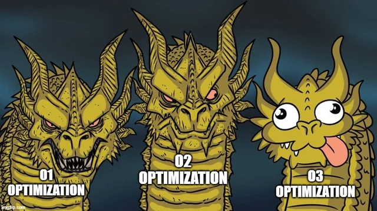
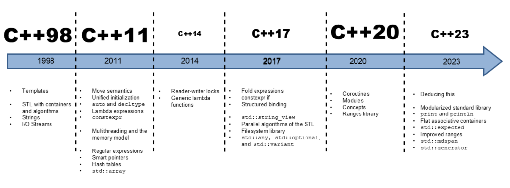
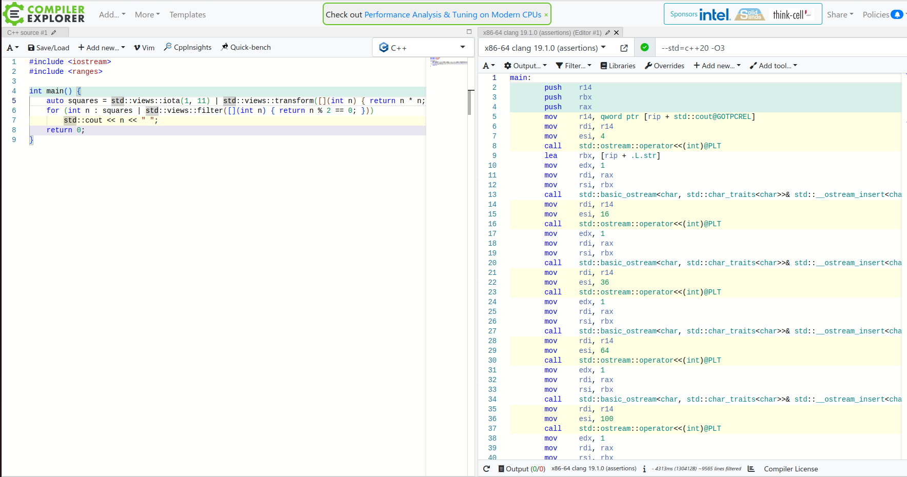

# C/CPP Compiler

A **C/C++ compiler** is a grumpy wizard that grudgingly transforms your poetic code into **machine gibberish**, while delighting in pointing out every tiny mistake you make.

---

# Optimization



---

Magics list:
1. Code Reordering (Instruction Scheduling)

2. Function Inlining

3. Variable Elimination (Dead Code Elimination)

4. Register Allocation

5. Loop Unrolling

7. Removal of Asserts or Debug Checks

8. Constant Folding and Propagation

9. Code Merging

---

```cpp
#include <stdint.h>

uint64_t foo()
{
    const int N(1024);
    uint64_t total(0);
    for (int i=0;i<N;++i)
        total+=i*i;
  return total;
}
```

---

# No Optimization

```asm
_Z3foov:
 push   rbp
 mov    rbp,rsp
 mov    DWORD PTR [rbp-0x4],0x400
 mov    QWORD PTR [rbp-0x10],0x0
 mov    DWORD PTR [rbp-0x14],0x0
 cmp    DWORD PTR [rbp-0x14],0x400
 jge    46 <_Z3foov+0x46>
 mov    eax,DWORD PTR [rbp-0x14]
 imul   eax,DWORD PTR [rbp-0x14]
 cdqe
 add    rax,QWORD PTR [rbp-0x10]
 mov    QWORD PTR [rbp-0x10],rax
 mov    eax,DWORD PTR [rbp-0x14]
 add    eax,0x1
 mov    DWORD PTR [rbp-0x14],eax
 jmp    1a <_Z3foov+0x1a>
 mov    rax,QWORD PTR [rbp-0x10]
 pop    rbp
 ret
```

---

# Maximal Optimization


```asm
_Z3foov:
 mov    eax,0x154d5600
 ret
```

---

# Notes :


* One may use optimized code **with** debug symbols.
* One may optimize _some_ of the code (usually whole file)


---

# Language



---

# Language

* g++ --std=c++20

```cpp
#include <iostream>
#include <ranges>

int main() {
    auto squares = std::views::iota(1, 11) | std::views::transform([](int n) { return n * n; });
    for (int n : squares | std::views::filter([](int n) { return n % 2 == 0; })) 
        std::cout << n << " "; 
    return 0;
}
```

<!---
4 16 36 64 100
-->

---

# The C/C++ Spec


---


# Undefined Behavior (UB)


* **Behavior not specified by the C++ standard**  
* The compiler is **free to do anything** (crash, optimize, etc.)
* No guarantees! UB can cause:
  * Crashes  
  * Silent data corruption  

💀 **Avoid UB at all costs!**

---

# Common Types of Undefined Behavior

```cpp
// ❌ 1. Division by zero (UB: Crash or unexpected result)
int x = 42;
int y = x / 0; 

// ❌ 2. Out-of-bounds array access (UB: Overwriting random memory)
int arr[5];
arr[10] = 7; 

// ❌ 3. Dereferencing null or invalid pointer (UB: Segmentation fault)
int* p = nullptr;
*p = 5; 

// ❌ 4. Using an uninitialized variable (UB: Garbage value or crash)
int a;
int b = a + 1; 
```

---

```cpp
// ❌ 5. Use-after-free (UB: Accessing freed memory)
int* ptr = new int(10);
delete ptr;
std::cout << *ptr; 

// ❌ 6. Signed integer overflow (UB: Compilers assume it NEVER happens!)
int max = INT_MAX;
int result = max + 1; // UB: Wraparound not guaranteed in signed integers

// ❌ 7. Non-void function missing a return statement (UB: Can cause random behavior)
int brokenFunction() {
    // No return statement! UB if this function is called.
}

// ❌ 8. Type punning (UB: Violates strict aliasing rules)
float f = 1.5f;
int* ip = (int*)&f; 
```

---

# 🛠️ Optimization Flags  

| **Flag** | **MSVC** | **GCC** | **Effect** |
|---------|-----------------|-----------------|------------|
| **None (Debug Mode)** | `/Od` | `-O0` | No optimizations |
| **Basic Optimizations** | `/O1` | `-O1` | Optimize for size & speed |
| **Full Optimizations** | `/O2` | `-O2` | Optimize aggressively |
| **Max Optimizations** | `/Ox` | `-O3` | Highest optimization level |
| **Optimize for Size** | `/Os` | `-Os` | Optimize for small binaries |


---


# ⚠️ Warning & Debugging Flags  

| **Flag** | **MSVC** | **GCC** | **Effect** |
|---------|-----------------|-----------------|------------|
| **Enable All** | `/W4` | `-Wall` | Show most warnings |
| **Extra Warnings** | `/Wall` | `-Wextra` | More strict checking |
| **Treat as Errors** | `/WX` | `-Werror` | Warnings become errors |
| **Debug Info** | `/Zi` | `-g` | Enable debugging symbols |

---

# 🚀 More Flags?  

✔ **Linking Flags** (`/MD`, `-static`)  
✔ **Standard Selection** (`/std:c++17`, `-std=c++20`)  
✔ **Multithreading Flags** (`/openmp`, `-fopenmp`)  

---

# Godbolt




---

# Common Compilation Errors & Fixes

* Compile a single file. (`make VERBOSE=1` / `cmake --build . -- VERBOSE=1`)
* Begin with first error / warning.
* Check flags and preprocessor definitions.
* Check the preprocessed file

* Check list of included files (`-H`/`/showIncludes`)<!--- slow compilation -->
  * Too long ?
  * Network ?

---

```cpp
#include <iostream>

void printHello() {
    std::cout << "Hello, world!" << std::endl;
}

int main() {
    printHe1lo(); 
    return 0;
}
```

🔹 **Error: `undefined reference`**

<!---
undefined reference 
-->

---

```cpp
#include <iostream>

int main() {
    char hello[5] = "hello";
    std::cout<<hello;
}
```

<!---
 error: initializer-string for char array is too long
 -->


---

```cpp
#include <algorithm>

uint64_t square(uint32_t i) {
    return i*i;
}
```

<!---
'uint64_t' does not name a type
 -->

---

```cpp
class A
{
    A(){};
}

A a;
```

```
expected initializer before 'a'
```

<!---
A::A()' is private within this context```
-->


---

```cpp
 struct A
    {
        int a() {return 1;}
    };

void foo(const A& a){
    a.a();
}
```

```
error C2662: 'int A::a(void)': cannot convert 'this' pointer from 'const A' to 'A &'
note: Conversion loses qualifiers
```

<!---
A::a()' has single parameter - this. "this" in foo is const, it cannot change to non const.
-->

---

```cpp
int main()
{
    return 1;
}
```

```
fatal error C1010: unexpected end of file while looking for precompiled header. Did you forget to add '#include ""' to your source?
```
<!---
/Yu
-->

---

```cpp
#include <stdio.h>

void foo(int answer)
{
    printf( “The answer is %d\n”,answer );
}
```

```
5:13: error: stray '\342' in program
     printf( ���The answer is %d\n”,answer );
             ^
5:14: error: stray '\200' in program
     printf( ���The answer is %d\n”,answer );
              ^
5:15: error: stray '\234' in program
     printf( ��The answer is %d\n”,answer );
               ^
5:32: error: stray '\' in program
     printf( “The answer is %d\n”,answer );
                                ^
5:34: error: stray '\342' in program
     printf( “The answer is %d\n���,answer );
                                  ^
5:35: error: stray '\200' in program
     printf( “The answer is %d\n���,answer );
                                   ^
5:36: error: stray '\235' in program
     printf( “The answer is %d\n��,answer );
                                    ^
 In function 'void foo(int)':
5:16: error: 'The' was not declared in this scope
     printf( “The answer is %d\n”,answer );
                ^~~
```

---

```cpp
enum BoolType
{
  FALSE = 0,
  TRUE = 1
};
```
---

Slow compilation

```cpp
#include <boost/multiprecision/cpp_dec_float.hpp>

template <typename T>
T fibonacci(int n) {
    if (n <= 1) return n;
    return fibonacci<T>(n - 1) + fibonacci<T>(n - 2);
}

int main() {
    using namespace boost::multiprecision;
    cpp_dec_float_100 big_float = fibonacci<cpp_dec_float_100>(10); // Use float precision
    return 0;
}
```

```bash
time g++ -std=c++17 -O2 slow.cpp -o slow_compile
```

<!---
real    0m2.020s
user    0m1.809s
sys     0m0.166s
-->