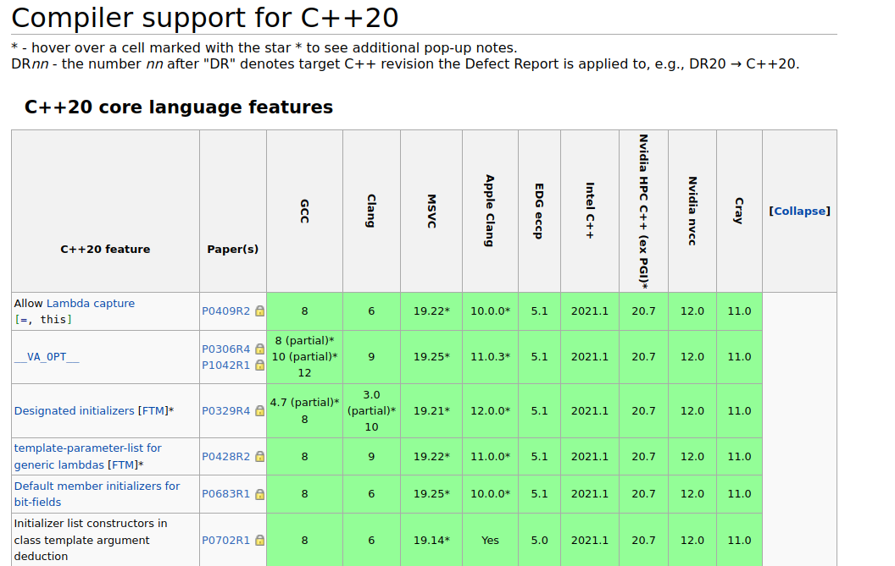

# C/CPP Compiler

A C/C++ compiler is a grumpy wizard that grudgingly transforms your poetic code into machine gibberish, while delighting in pointing out every tiny mistake you make.

---

# Optimization


Magics list:
1. Code Reordering (Instruction Scheduling)

2. Function Inlining

3. Variable Elimination (Dead Code Elimination)

4. Register Allocation

5. Loop Unrolling

7. Removal of Asserts or Debug Checks

8. Constant Folding and Propagation

9. Code Merging

---

```cpp
#include <stdint.h>

uint64_t foo()
{
    const int N(1024);
    uint64_t total(0);
    for (int i=0;i<N;++i)
        total+=i*i;
  return total;
}
```

---

# No Optimization

```asm
_Z3foov:
 push   rbp
 mov    rbp,rsp
 mov    DWORD PTR [rbp-0x4],0x400
 mov    QWORD PTR [rbp-0x10],0x0
 mov    DWORD PTR [rbp-0x14],0x0
 cmp    DWORD PTR [rbp-0x14],0x400
 jge    46 <_Z3foov+0x46>
 mov    eax,DWORD PTR [rbp-0x14]
 imul   eax,DWORD PTR [rbp-0x14]
 cdqe
 add    rax,QWORD PTR [rbp-0x10]
 mov    QWORD PTR [rbp-0x10],rax
 mov    eax,DWORD PTR [rbp-0x14]
 add    eax,0x1
 mov    DWORD PTR [rbp-0x14],eax
 jmp    1a <_Z3foov+0x1a>
 mov    rax,QWORD PTR [rbp-0x10]
 pop    rbp
 ret
```

---

# Maximal Optimization


```asm
_Z3foov:
 mov    eax,0x154d5600
 ret
```

---

# Notes :


* One may use optimized code **with** debug symbols.
* One may optimize _some_ of the code (usually whole file)


---

# Language



---

# Language

* g++ --std=c++20

```cpp
#include <iostream>
#include <ranges>

int main() {
    auto squares = std::views::iota(1, 11) | std::views::transform([](int n) { return n * n; });
    for (int n : squares | std::views::filter([](int n) { return n % 2 == 0; })) 
        std::cout << n << " "; 
    return 0;
}
```
---

# Flags

* Class I
  * Options that Control Optimization.
  * Options for Debugging Your Program.
* Class II
  * Options Controlling C++ Dialect.
  * Options to Control Diagnostic Messages Formatting
  * Options to Request or Suppress Warnings.
  * Options Controlling the Kind of Output.
* Class III
  * Options Controlling the Preprocessor.
  * Options for Directory Search.
  * Program Instrumentation Options.


---

# Godbolt


---

# Compilation error


* Compile a single file. (`make VERBOSE=1` / `cmake --build . -- VERBOSE=1`)
* Check flags and preprocessor definitions.
* Begin with first error / warning.
* Check list of included files (flag!)
* Check the preprocessed file (flag !)

---

```cpp
#include <iostream>

void printHello() {
    std::cout << "Hello, world!" << std::endl;
}

int main() {
    printHe1lo(); 
    return 0;
}
```

<!---
undefined reference 
-->

---

```cpp
#include <iostream>

int main() {
    char hello[5] = "hello";
    std::cout<<hello;
}
```

<!---
 error: initializer-string for char array is too long
 -->


---

```cpp
#include <windows.h>

bool is_odd(int IN)
{
    return IN % 2 == 1;
}
```

```
 error C3071: operator '%' can only be applied to an instance of a ref class or a value-type
Compiler returned: 2
```

---

```cpp
#include <algorithm>

uint64_t square(uint32_t i) {
    return i*i;
}
```

<!---
'uint64_t' does not name a type
 -->

---

```cpp
class A
{
    A(){};
}

A a;
```

```
expected initializer before 'a'
```

---

```cpp
class A
{
    A(){};
}

A a;
```

<!---
A::A()' is private within this context```
-->


---

```cpp
 struct A
    {
        int a() {return 1;}
    };

void foo(const A& a){
    a.a();
}
```

```
error C2662: 'int A::a(void)': cannot convert 'this' pointer from 'const A' to 'A &'
note: Conversion loses qualifiers
```


---

```cpp
 struct A
    {
        int a() {return 1;}
    };

void foo(const A& a){
    a.a();
}
```

```
fatal error C1010: unexpected end of file while looking for precompiled header. Did you forget to add '#include ""' to your source?
```
<!---
/Yu
-->

---

```cpp
#include <stdio.h>

void foo(int answer)
{
    printf( “The answer is %d\n”,answer );
}
```

```
5:13: error: stray '\342' in program
     printf( ���The answer is %d\n”,answer );
             ^
5:14: error: stray '\200' in program
     printf( ���The answer is %d\n”,answer );
              ^
5:15: error: stray '\234' in program
     printf( ��The answer is %d\n”,answer );
               ^
5:32: error: stray '\' in program
     printf( “The answer is %d\n”,answer );
                                ^
5:34: error: stray '\342' in program
     printf( “The answer is %d\n���,answer );
                                  ^
5:35: error: stray '\200' in program
     printf( “The answer is %d\n���,answer );
                                   ^
5:36: error: stray '\235' in program
     printf( “The answer is %d\n��,answer );
                                    ^
 In function 'void foo(int)':
5:16: error: 'The' was not declared in this scope
     printf( “The answer is %d\n”,answer );
                ^~~
```

---

```cpp
enum BoolType
{
  FALSE = 0,
  TRUE = 1
};
```
---

Slow compilation

```cpp
#include <boost/multiprecision/cpp_dec_float.hpp>

template <typename T>
T fibonacci(int n) {
    if (n <= 1) return n;
    return fibonacci<T>(n - 1) + fibonacci<T>(n - 2);
}

int main() {
    using namespace boost::multiprecision;
    cpp_dec_float_100 big_float = fibonacci<cpp_dec_float_100>(10); // Use float precision
    return 0;
}
```

```bash
time g++ -std=c++17 -O2 slow.cpp -o slow_compile
```


