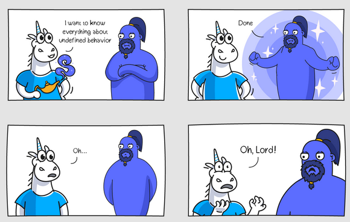

# Compiler 🧙‍♂️

A **compiler** is a grumpy wizard that grudgingly transforms your **poetic code** into **machine gibberish**, while delighting in pointing out every tiny mistake you make.

---

# 📜 The C++ Standard


[C++17 Standard](../preprocessor/images/c++17.pdf)

---


# 🌍 Language Evolution


---
# 📜 cppreference


---


# 🚀 Enabling C++ version

|     | g++ | MSVC | _cplusplus |
|-------------|-----------|-----------|-|
| c++17 | `-std=c++17` | `/std=c++17` |201703L|
| c++20 | `-std:c++20` | `/std:c++20` |202002L|


🔹 MSVC requires `/Zc:__cplusplus`
🔹 Partial implementations : `-std=c++2a`, `-std=c++0x`

---

# 🚀 Enabling C++ version

<br/>


```cmake
cmake_minimum_required(VERSION 3.20)
project(MyCpp20Project LANGUAGES CXX)

add_executable(my_program main.cpp)

target_compile_features(my_program PUBLIC cxx_std_20)
```

---

# ⚡ Modern C++ Features


```cpp
#include <iostream>
#include <ranges>

int main() {
    auto squares = std::views::iota(1, 11) | std::views::transform([](int n) { return n * n; });
    for (int n : squares | std::views::filter([](int n) { return n % 2 == 0; })) 
        std::cout << n << " "; 
    return 0;
}
```

`g++ --std=c++20`


<!---
4 16 36 64 100
-->

---

# Optimization


---

# 🔧 Optimization Tricks

- Code Reordering 🌀
- Function Inlining ⚡
- Dead Code Elimination ☠️
- Register Allocation 📦
- Loop Unrolling 🔄
- Debug Code Removal 🚫
- Constant Folding 🧮
- Code Merging 🏗️

---

# 📝 Example Code

```cpp
#include <stdint.h>

uint64_t foo()
{
    const int N(1024);
    uint64_t total(0);
    for (int i=0;i<N;++i)
        total+=i*i;
  return total;
}
```

<!--
sum of squares from 0 to 1023.
-->

---

# 🐌 No Optimization

```asm
_Z3foov:
 push   rbp
 mov    rbp,rsp
 mov    DWORD PTR [rbp-0x4],0x400
 mov    QWORD PTR [rbp-0x10],0x0
 mov    DWORD PTR [rbp-0x14],0x0
 cmp    DWORD PTR [rbp-0x14],0x400
 jge    46 <_Z3foov+0x46>
 mov    eax,DWORD PTR [rbp-0x14]
 imul   eax,DWORD PTR [rbp-0x14]
 cdqe
 add    rax,QWORD PTR [rbp-0x10]
 mov    QWORD PTR [rbp-0x10],rax
 mov    eax,DWORD PTR [rbp-0x14]
 add    eax,0x1
 mov    DWORD PTR [rbp-0x14],eax
 jmp    1a <_Z3foov+0x1a>
 mov    rax,QWORD PTR [rbp-0x10]
 pop    rbp
 ret
```

---

# 🚀 Max Optimization


```asm
_Z3foov:
 mov    eax,0x154d5600
 ret
```


---

# 🛠️ Optimization Flags  

| **Flag** | **MSVC** | **GCC** | **Effect** |
|---------|-----------------|-----------------|------------|
| **None (Debug Mode)** | `/Od` | `-O0` | No optimizations |
| **Basic Optimizations** | `/O1` | `-O1` | Optimize for size & speed |
| **Full Optimizations** | `/O2` | `-O2` | Optimize aggressively |
| **Max Optimizations** | `/Ox` | `-O3` | Highest optimization level |
| **Optimize for Size** | `/Os` | `-Os` | Optimize for small binaries |

---

# 🚀 Debugging optimized code

✔ **Add debug information** (`/Zo /Zi`, `-g`) 
✔ **Don't touch fp !** (`/Oy`,`-fno-omit-frame-pointer`) 
✔ **No inlining** (`-fno-inline`) 

<!---
The -fno-omit-frame-pointer flag preserves the frame pointer (rbp) in function calls

-->

---


# 🛠️ Optimizations & Debugging

- ⚡ More optimized code → More **undefined behaviors**
- 🛠️ More optimized code → **Harder to debug**  
- 🧐 Debug symbols can **coexist** with optimized code  
- 🎯 **Partial optimization** is possible (e.g., per file) 

<!--
show how to remove optimization from a single file
visual studio
-->


---




---

# Undefined Behavior (UB)

- **Behavior not defined by C++** 🚨
- Compiler **can do anything** 🤯
- UB may cause:
  - Crashes 💥
  - Silent data corruption 🕵️‍♂️

---

# 💀 Undefined Behavior

```cpp
int main(){
    int i = 0x10000000;
    do{
        i*=2;
        std::cout<<i<<std::endl;
    } while (i > 0);
    return 0;
}
```

```
536870912
1073741824
```
```
-2147483648
```

<!--
overflow

C99 standard (§3.4.3/1):
An example of undefined behavior is the behavior on integer overflow
-->

---


---


---

# 💀 Undefined Behavior

```cpp
#include <iostream>

int main() {
    int64_t i;
    double* d = (double*)&i; 
    *d = 1.0; 
    std::cout << i << "\n";
    return 0;
}
```

If we attempt to access a value using a type not allowed it is classified as undefined behavior(UB). 

<!---
*p = 42;  // ARM may crash here !
-->

---


# 😊 (Un)defined Behavior

```cpp
#include <iostream>

int main() {
    float f = 3.14f;
    int i;
    std::memcpy(&i, &f, sizeof(f));
    std::cout << i << "\n";
}
```

---

# 😊 (Un)defined Behavior

```cpp
#include <iostream>
#include <bit>

int main() {
    float f = 3.14f;
    int i = std::bit_cast<int>(f);
    std::cout << i << "\n";
}
```

---

# Common Types of Undefined Behavior

```cpp
// ❌ 1. Int Division by zero 
int x = 42;
int y = x / 0; 

// ❌ 2. Out-of-bounds array access
int arr[5];
arr[10] = 7; 

// ❌ 3. Dereferencing null or invalid pointer
int* p = nullptr;
*p = 5; 

// ❌ 4. Using an uninitialized variable
int a;
int b = a + 1; 
```

---

```cpp
// ❌ 5. Use-after-free
int* ptr = new int(10);
delete ptr;
std::cout << *ptr; 

// ❌ 6. Signed integer overflow
int max = INT_MAX;
int result = max + 1; 

// ❌ 7. Missing a return statement
int brokenFunction() {
    // No return statement! 
}

// ❌ 8. Type punning
float f = 1.5f;
int* ip = (int*)&f; 
```

<!---
ub_return

-->


---


<!-- 
Bad practice
-->

---

# Prevent UB in your code


---

# Tool


---

# 🚨 Sanitizers

💡 **Sanitizers (UBSan, ASan, MSan)** detect dangerous runtime issues like:
- 🔥 **UB: Signed overflows, invalid pointer derefs**
- 💾 **Memory errors: Out-of-bounds, use-after-free**
- ⚡ **Thread & race conditions (TSan)**

---

# 🛠️ How Do They Work?

🔍 **Compile-time instrumentation** adds checks
🐞 **Runtime validation** detects UB
⚠️ **Crashes or warnings** when UB happens

```bash
# G++/Clang
-fsanitize=undefined,address,thread,memory

# MSVC
/fsanitize=address
```

<!-- 
export UBSAN_OPTIONS=print_stacktrace=1,
UBSAN_OPTIONS=suppressions=MyUBSan.supp

-->

---

# 🛠️ How Do They Work?


```cpp
#include <climits>

int main() {
   int max = INT_MAX;
    max++;  //  UB: Signed integer overflow

    return 0;
}
```

---

# 🛠️ How Do They Work?


---

# ⚠️ Warning & Debugging Flags  

| **Flag** | **MSVC** | **GCC** | **Effect** |
|---------|-----------------|-----------------|------------|
| **Enable All** | `/W4` | `-Wall` | Show most warnings |
| **Extra Warnings** | `/Wall` | `-Wextra` | More strict checking |
| **Treat as Errors** | `/WX` | `-Werror` | Warnings become errors |
| **Debug Info** | `/Zi` | `-g` | Enable debugging symbols |

---

# 🚀 More Flags?  

✔ **Standard Selection** (`/std:c++17`, `-std=c++20`)  
✔ **Multithreading Flags** (`/openmp`, `-fopenmp`)  
✔ **Allows larger object files** (`/bigobj`)  
✔ **Position-independent code** (`-fPIC`) 


---

# Single file flags

```cmake
add_executable(my_program main.cpp special.cpp other.cpp)

set_source_files_properties(special.cpp PROPERTIES COMPILE_FLAGS "-O3")
```

<!---
single

-->


---

# Godbolt


---


# 🛠️ Debugging Compilation Errors

* Compile **one file at a time** 📝
  * `make VERBOSE=1` / `cmake --build . -- VERBOSE=1`
  * `compile_commands.json` / `cmake -DCMAKE_EXPORT_COMPILE_COMMANDS=ON`

* Start with the **first error** 🚨

* Try a **different compiler**.


---

# 🤯 Debugging Weird Compiler Errors  

- Read the **entire error message** 
- Create a **minimal example**
- Enable **extra warnings** 
- Start reading from the **bottom** of **first** error
- Search missing `{}` or `;`
- Problem in **header file** may affect cpp
- **Google** the error message (partial/full)


---

```cpp
#include <iostream>

void printHello() {
    std::cout << "Hello, world!" << std::endl;
}

int main() {
    printHe1lo(); 
    return 0;
}
```

---

msvc:
```
<source>(8): error C3861: 'printHe1lo': identifier not found
```

clang++:
```
<source>:8:5: error: use of undeclared identifier 'printHe1lo'; did you mean 'printHello'?
    8 |     printHe1lo(); 
      |     ^~~~~~~~~~
      |     printHello
<source>:3:6: note: 'printHello' declared here
    3 | void printHello() {
      |      ^
```


<!---
-->

---

```cpp
#include <iostream>

int main() {
    char hello[5] = "hello";
    std::cout<<hello;
}
```

<!---
-->


---

msvc:
```
<source>(4): error C2117: 'hello': array bounds overflow
```

clang++:
```
<source>:4:21: error: initializer-string for char array is too long, 
array size is 5 but initializer has size 6 
(including the null terminating character)
    4 |     char hello[5] = "hello";
      |                     ^~~~~~~
```
---

```cpp
struct A
{
    A(){};
}

A a;
```

---

msvc:
```
<source>(6): error C2146: syntax error: missing ';' before identifier 'a'
<source>(6): error C4430: missing type specifier - int assumed. Note: C++ does not support default-int
```

clang++:
```
<source>:4:2: error: expected ';' after struct
    4 | }
      |  ^
1 error generated.
```


<!---

-->

---

```cpp
#include <iostream>


int main() {
    int foo();
    foo = 42; 
    std::cout << foo << "\n";
    return 0;
}
```

---

msvc:
```
example.cpp
<source>(6): error C2659: '=': function as left operand
```

clang++:
```
<source>: In function 'int main()':
<source>:5:12: warning: empty parentheses were disambiguated as a function declaration [-Wvexing-parse]
    5 |     int foo();
      |            ^~
<source>:5:12: note: remove parentheses to default-initialize a variable
    5 |     int foo();
      |            ^~
      |            --
<source>:5:12: note: or replace parentheses with braces to value-initialize a variable
<source>:6:9: error: assignment of function 'int foo()'
    6 |     foo = 42; //  Error: Redeclaration of `foo` as a variable
      |     ~~~~^~~~
```

---

# 🤯 Weird Compilation Errors  

"When the compiler speaks a language I don’t understand..."  

---

```
1>------ Build started: Project: Project1, Configuration: Debug Win32 ------
1>  Source.cpp
1>c:\documents\visual studio 2013\projects\project1\project1\source.cpp : fatal error C1001: 
An internal error has occurred in the compiler.
1>  (compiler file 'f:\dd\vctools\compiler\cxxfe\sl\p1\c\p0io.c', line 2807)
1>   To work around this problem, try simplifying or changing the program near the locations listed above.
1>  Please choose the Technical Support command on the Visual C++ 
1>   Help menu, or open the Technical Support help file for more information
========== Build: 0 succeeded, 1 failed, 0 up-to-date, 0 skipped ==========
```

---


```cpp
#include <vector>

class Foo{};
int main()
{
    std::vector<Foo> foo;
    foo.emplace_back(5); 
    return 0;
}
```

---

msvc:
```
xmemory0(819): error C2664: 'Foo::Foo(Foo &&)': cannot convert argument 1 from '_Ty' to 'const Foo &'
        with
        [
            _Ty=int
        ]
```

clang++:
```
/bits/new_allocator.h:191:23: error: no matching constructor for initialization of 'Foo'
```

---

```cpp
 struct A
    {
        int a() {return 1;}
    };

void foo(const A& a){
    a.a();
}
```

```
error C2662: 'int A::a(void)': cannot convert 'this' pointer from 'const A' to 'A &'
note: Conversion loses qualifiers
```

<!---
A::a()' has single parameter - this. "this" in foo is const, it cannot change to non const.

clang :
 error: 'this' argument to member function 'a' has type 'const A', but function is not marked const
-->

---

```cpp
int main()
{
    return 1;
}
```

```
fatal error C1010: unexpected end of file while looking for precompiled header. Did you forget to add '#include ""' to your source?
```


<!---
/Yu
-->


--- 

# 🎉 Questions?  