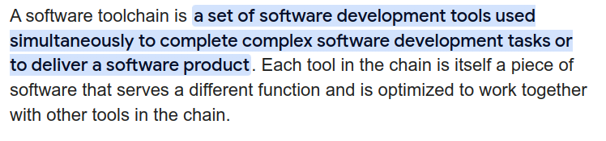
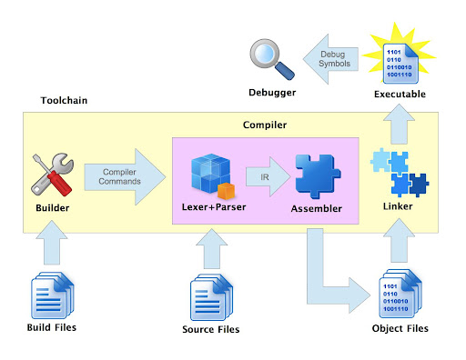
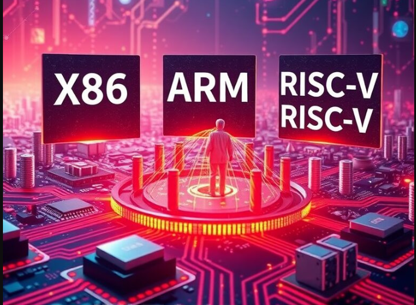

# Toolchain and Build System Components 🛠️

---

# Toolchain Overview 🔗



<!-- 
A software toolchain is a set of software development tools used together to compile, link, optimize, and debug software. A well-integrated toolchain ensures compatibility across components.
-->

---

# Toolchain Components 🏗️



<!-- 
* GCC Toolchain: g++, objdump, readelf, strings, nm, c++filt, ar...
* MSVC: cl, link, dumpbin, editbin...
* LLVM Toolchain: clang++, lld, llvm-nm, llvm-objdump...
* Cross-compilation toolchains: aarch64-linux-gnu-gcc, arm-none-eabi-gcc...
-->

---

# Toolchains by Platform 💻

* **Windows:**
  * MSVC
  * MinGW-w64 / Clang
  * Intel C++ Compiler (icpc / icpx) [Classic/OneAPI]
* **Linux/macOS:**
  * GNU toolchain (GCC)
  * Clang
  * Intel C++ Compiler (icpc / icpx) [Classic/OneAPI]

<!-- 
LLVM
Different operating systems have different native toolchains. Some, like Intel's ICC, support multiple platforms.
-->

---

# CUDA Toolchain 🚀


* **Compiles** `.cu` files for NVIDIA GPUs
* Includes `nvcc`, `cuobjdump`, `nvdisasm`, `nvprune`, Nsight profiler

<!-- 
CUDA toolchain is specialized for GPU programming. Works with MSVC, GCC, and Clang but requires specific linker configurations.
-->

---

# Toolchain Compatibility ⚠️

1. **Binary Formats:** ELF (Linux), PE (Windows)
2. **Application Binary Interface (ABI):** Function calling conventions, data alignment
3. **Debugging Symbols Formats:** DWARF (ELF), PDB (MSVC)

<!-- 
Ensuring toolchain compatibility requires using the correct binary format, ABI, and debug symbols.
-->

---

# Build Systems 🔨


* **Features:** Dependency management, compiler flags, file manipulation, installation

<!-- 
Build systems automate compiling, linking, and installing software. Examples: Make, CMake, Ninja, Meson.
-->

---

# IDE - Integrated Development Environment 🖥️

* **Features:** Code Editor, Compilation, Debugging, Toolchain Integration


<!-- 
IDEs help developers by integrating all tools into a single interface. Examples: Visual Studio, CLion, VS Code.
-->

---

# Additional Components 📦

* **Standard Libraries:** `stdlib.h`, `malloc.h`, `vector`, `map`
* **OS-Specific Headers:** `windows.h`, `afxwin.h`, `unistd.h`, `pthread.h`
* **Compiler-Specific Headers:** `x86intrin.h`, `intrin.h`

<!-- 
Libraries and headers differ by OS and compiler. Some functions are available only in specific environments.
-->

---

# Executable Binaries 🏗️



<!-- 
Binary format varies by architecture and OS. x86_64, ARM, RISC-V have different instruction sets and calling conventions.
-->

---

# Why Can't I Compile on Windows and Run on Linux? 🤔

* **ABI Differences** (e.g., function calling conventions)
* **Executable Formats** (PE vs ELF)
* **Runtime Libraries & Syscalls** (`printf`, `malloc` differ)
* **OS-Specific APIs** (`pthreads` vs `Win32 API`)

<!-- 
Binaries compiled for one OS rarely run on another due to fundamental system differences.
-->

---

# Cross-Compilation 🌍


<!-- 
Cross-compilation allows compiling software for a different architecture or OS than the host system.
-->

---

# Cross-Compilation Challenges 🛠️

* **Missing target's C/C++ libraries**
* **Sysroot and cross toolchain dependencies**
* **More similarity between host & target = Bigger problems**

<!-- 
Cross-compilation requires careful dependency management. Example: ARM cross-compilers for embedded systems.
-->

---

# Cross-Compilation Demo 🏗️

```sh
apt install mingw-w64
x86_64-w64-mingw32-g++ -o hello.exe test.cpp
```

```sh
qemu-aarch64 ./binary
```

<!-- 
This demonstrates cross-compiling a Windows executable from Linux using MinGW-w64 and running an ARM binary using QEMU.
-->

---

# Usable but Unfamiliar Tool: `strace` 🕵️

```sh
strace -e open,read,write ./myprogram
```

🔍 **Shows system calls used by a program.**

<!-- 
`strace` is useful for debugging permission issues, missing files, and system call errors.
-->

---

# Usable but Unfamiliar Tool: `ldd` 🔎

```sh
ldd myprogram
```

🔍 **Lists shared library dependencies.**

<!-- 
Useful for checking which libraries are required and diagnosing missing dependencies.
-->

---

# Summary ✅

✔ Toolchains provide compilers, linkers, and libraries
✔ Build systems automate compilation
✔ Cross-compilation enables targeting different architectures
✔ Compatibility between components is key

<!-- 
This presentation covered toolchains, build systems, and challenges in cross-compilation.
-->

---

# Thank You! 🎯
