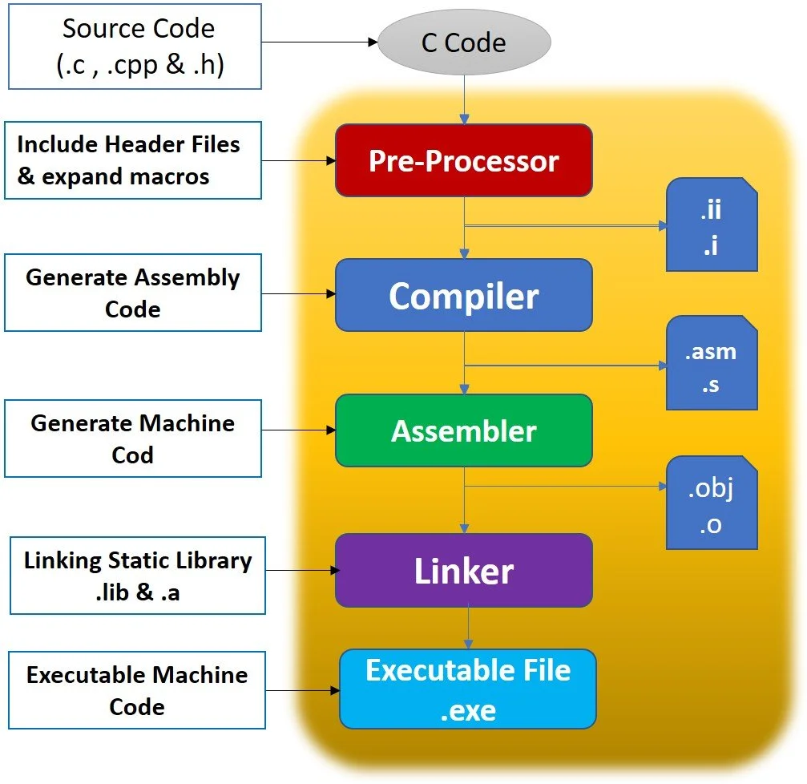
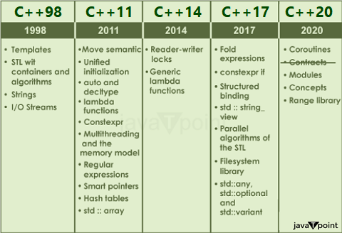
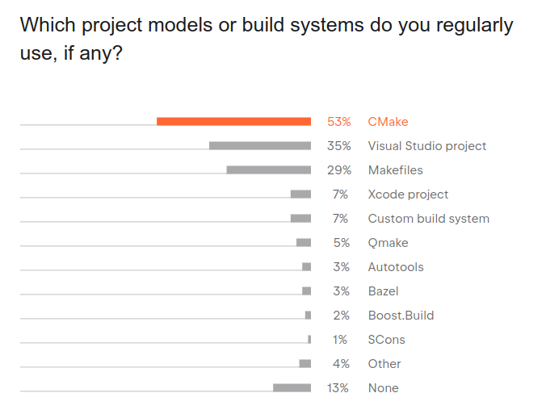
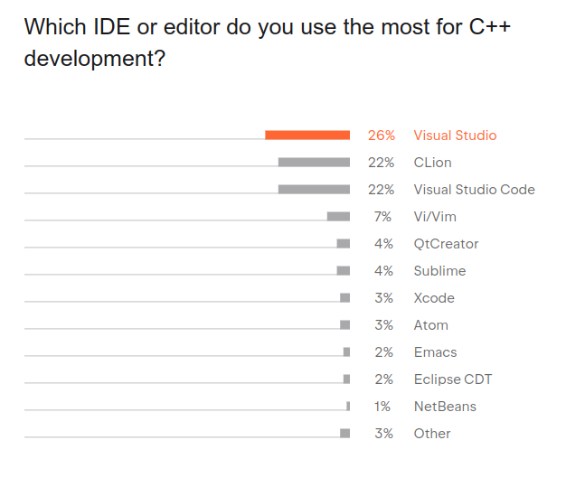
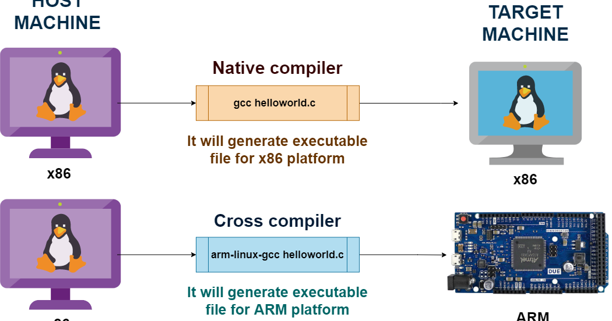

# C/C++ components

---

# Toolchain

* gcc : g++, objdump, readelf, string, nm, c++filt, ar...

---

# Toolchains

* Windows :
  * msvc
  * mingw
  * icpc / icpx [Classic/OneAPI]
* Linux :
  * GNU toolchain - gcc
  * llvm-clang
  * icpc / icpx [Classic/OneAPI]

---

# C++ Versions

* Rule of thumb - use version of 5 years ago.

---

# Build systems

* Features : Flags, Files manipulation, Installation

---

# IDE - Integrated Development Environment 

* Features : Code Editor, Compile, Debugger,  Integration with other tools

---

# Architecture vs Operation system 

* ABI - e.g. function call 
* Executable format 
* Runtime libraries / syscalls (e.g. : printf, malloc)
* OS specific libraries - pthreads/win32api

---

# Cross Compilation

* More the host and target are similar, the problems are bigger
---

# Common libraries

* STL
* Boost
* Eigen
* OpenMP
* OpenCV
* TBB
* gtest

---

# Compiler specific

* Flags...
* Optimizations
* Alignment
* Warnings, notes and hints
* OpenMp
* Sanitizers and Static Code Analysis
* AVX intrinsics
* Vectorization

