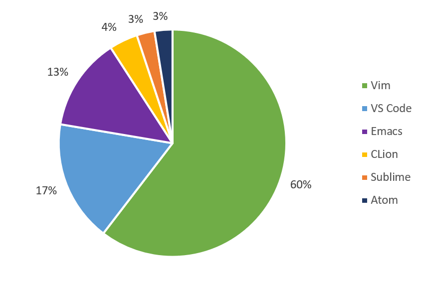
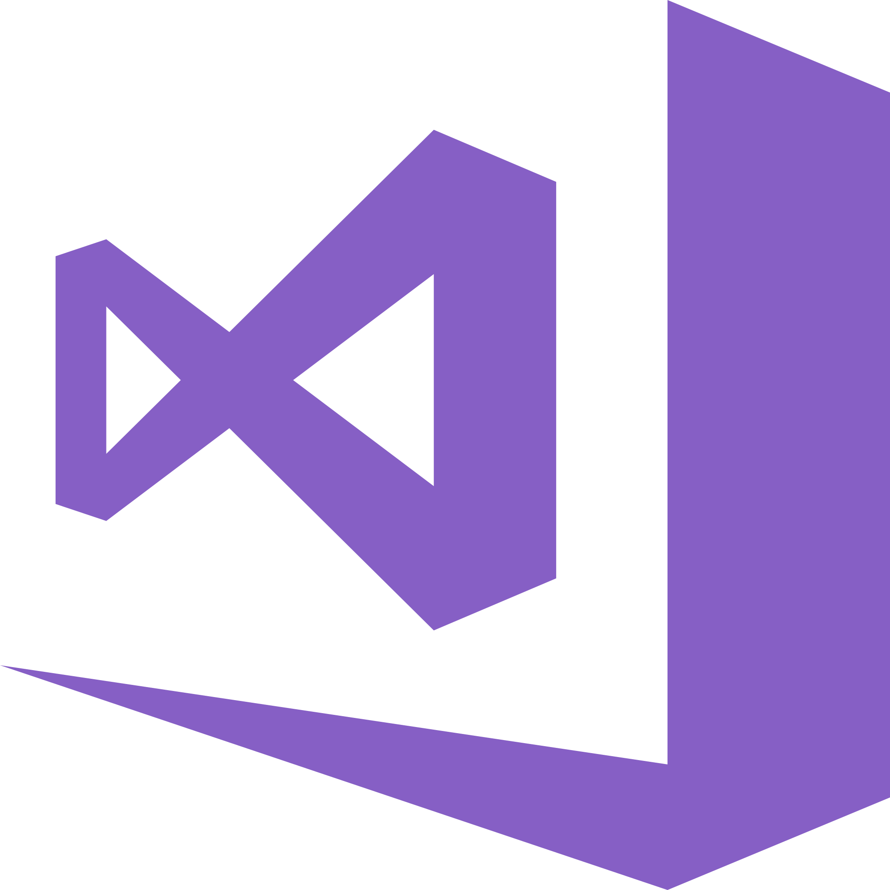
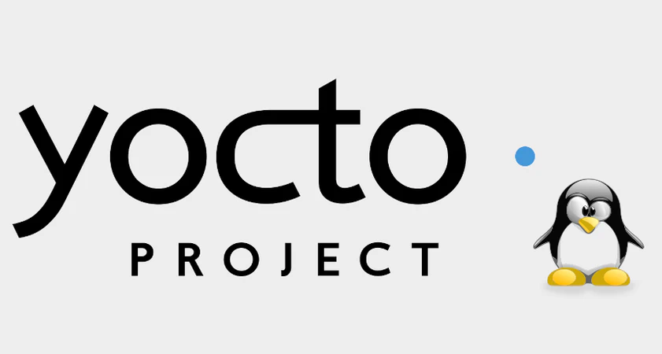

# Toolchain and Build System Components 🛠️


---

# Toolchain Definition 🔗

<br/><br/> 


<!-- 
1. כל הכלים מרגע כתיבת הקוד עד קבלת קובץ הריצה וגם אח"כ
2. אח"כ - ניפוי שגיאות אופטימיזציה
3. כלים צריכים לעבוד ביחד
-->

---

# 🔧 18 Toolchain Components

### **Compilers**: g++, clang++, cl.exe, icx, nvcc, icpx

### **Linkers**:ld, lld, link.exe

### **Assemblers**:as, ml.exe, ml64.exe

### **Library Managers**:ar, lib.exe, strip

### **Debuggers**:gdb, lldb, windbg

<!-- 
1. חלק ראשון - את רוב הכלים הקומפיילר יפעיל בעצמו
2. נדגים כיצד קומפיילר מריץ את הכלים
strace g++ simple.cpp
3. debugger - all uses

-->
---

# 🔧 +20 Toolchain Components

### **Build Systems**: cmake, ninja, make, bazel, b2

### **Dependency Management**:ldd, depends.exe, dependenciesGui.exe, pahole

### **Profilers**:perf, valgrind, vtune

### **Binary Utilities**:nm, objdump, readelf, dumpbin.exe, strings, patchelf, addr2line, strip

<!-- 
חלק שני כלים נפוצים לא חובה
1. סדר בבנייה של הרבה קבצים, דגלים קומפילציה ועוד
2. כלים לניתוח קובץ הריצה
3. profile
4. כלים לניתוח של קבצי הביניים

-->
---

# 🔧 +13 Toolchain Components

### **Static Analysis**:clang-tidy, cppcheck, pvs-studio, sonar-scanner

### **Code Formatting**:clang-format, uncrustify, cmake-format

### **Package Managers**:vcpkg, conan, apt

### **Debug Symbols**:symchk.exe, symstore.exe, eu-readelf

<!-- 
כלים שכדאי להכיר
1. אנליזה סטטית - מציאת שגיאות ללא הרצה
2. format - precommit
3. הורדת חבילות מוכנות - ניתן לבחינה
4. בחינת של מידע הניפוי
-->
---

# Build Systems 🔨


* **Features:** Dependency management, compiler flags, file manipulation, installation

<!-- 
two packages that are not toolchain (my opinion):

1 - build system
תפקידה - ליצור את אוסף שורות הפקודה לכלים המרכזיים

cmake - meta build system
makefiles/visual studio code
ninja - python

-->

---

# Integrated Development Environment

* **Features:** Code Editor, Compilation, Debugging, Toolchain Integration



<!-- 

2 - (not part of toolchain) IDE

visual studio - can use many toolchains 
example - set toolchain from visual studio - General -> Platform Toolset

New IDEs are only the word processor with some features that helps : emacs, sublime, vscode

-->


---


# **Toolchain** 🔗

<br/>

A structured set of software development tools **where each component depends on the output or functionality of another**, forming a continuous workflow for compiling, assembling, linking, and debugging software.
 (E.B)


<!-- 

My definition

תלות של הקומפוננטות אחת בשניה
-->
---

# Toolchain Components 🏗️


<!-- 
מה קורה בשלבי הקומפילציה

creating makefiles


g++ -E simple.cpp -o simple.i
g++ -S simple.i -o simple.s
g++ -c simple.s -o simple.o
g++ simple.o -o simple

1. g++ -print-prog-name=cc1plus
2. run with : `strace -f -e execve `

cat simple.i
cat simple.s
objdump -d simple.o
objdump -d simple

-->

---


# Common Toolchains 💻




<!-- 
LLVM - framework, clang - compiler

1. Faster than gcc
2. Readable error messages 
3. static analyzers (clang-tidy)

Some, like Intel's ICC, support multiple platforms.
-->

---

## Heterogeneous computing Toolchains 🧩


* **Compiler** : `nvcc` / `icpx`
* **Debugger** 
* **Profiler**
<!-- 
חברות רוצות לייצר רק את המומחיות שלהם 
בשקף זה קומפיילרים
הן רוצות שהקומפיילר יעבוד במירב הסביבות

**More** : `cuobjdump`, `nvdisasm`, `nvprune`
CUDA toolchain is specialized for GPU programming. Works with MSVC, GCC, and Clang
-->


---

# Cross-Compilation 🌍


<!-- 
הגדרה 

טכנולוגיה המאפשרת קומפילציה של קוד ריצה במערכת שונה מהמערכת בה נרוץ
תהליך הקומפילציה הוא עיבוד וניתוח טקסט,
אין סיבה אמיתית שיזדקק למערכת היעד אלא רק למידע עליה

embedded systems CANNOT run compiler (arduino)

sudo apt install -y g++-aarch64-linux-gnu
aarch64-linux-gnu-g++ simple.cpp -o simple 

גם המחשב שלי יודע לקמפל קוד שהוא לא יודע להריץ
g++ avx.cpp -mavx512f -oavx
# Illegal instruction (core dumped)

חידה- מתי מחשב צריך להריץ קוד בזמן קומפילציה?
consteval constexpr

-->

---


# **Summary** 🔗

* All toolchain components should be available in order to compiler.
* Toolchain can compile to it's target 

<!-- 
סיכום ביניים 

הקומפיילר וכלי העזר שלו צריכים לרוץ ביחד
הקומפיילר הוא סט של כלים
אילו עוד מצרכים שקשורים הדוק לקומפיילר אנחנו צריכים?

-->

---

# Additional Components 📦

* **Standard Libraries:** `stdlib.h`, `malloc.h` /`vector`, `map`
* **OS-Specific Headers:** `windows.h`, `afxwin.h`/ `unistd.h`, `pthread.h`
* **Compiler-Specific Headers:** `x86intrin.h`, `intrin.h`

<!-- 
1. ספריות שמקשרות בין השפה למערכת ההפעלה
2. ספריות של מערכת ההפעלה
3. ספריות ספציפיות לקומפיילר

אי אפשר להעתיק קומפיילר ולהניח שהוא ירוץ
 הוא צריך את כל הסביבה שלו 
header, environment variables, scripts

msvc : "x64 native tools command line"
set 
echo %INCLUDE%
echo %LIB%
cl

כשמקבלים סביבת קומפילציה דבר ראשון לנסות לקמפל קוד פשוט 
c / c++ / cuda /...

איזה מידע על היעד צריך הקומפיילר לדעת

-->

---

# 🖥️ **System Data**  

* **🛠️ ISA - Instruction Set Architecture**
  * **x86 / x86_64 / ARM**
* **📜 Instruction Sets**
  * **MMX / SSE / AVX / FMA / AES**

* **🚀 Execution Formats && Flow**
  * **Windows PE**: `_start → mainCRTStartup → main`
  * **Linux ELF**: `_start → main`
<!-- 
איזה מידע הקומפיילר צריך לדעת
1. ארכיטקטורת מעבד ISA
2. סט פקודות מעבד
3. מערכת ההפעלה

PE portable executable
ELF - Executable and Linkable format

ואיזה מידע נוסף ?

-->


---

# 🏗️ **Compiler's External Data**  

📦 **Libraries** → Uses host **glibc, libstdc++**  
⚙️ **Kernel Headers** → Uses **host kernel/Windows headers** 
📂 **Sysroot Path** → Links to **`/usr/lib`** from host  

🔍 **Check Compiler Data:**  
🖥️ `echo | gcc -E -Wp,-v -`  
📜 `g++ -print-search-dirs`  


<!-- 
Search dirs :
/usr/local/include
/usr/include/x86_64-linux-gnu
/usr/include

include dirs :
/lib/:/usr/lib/

לשם מידע על מערכת ההפעלה הקומפיילר עושה שימוש במחשב המארח
מה שיכול להיות מסוכן

win32API / glibc 

Windows : General -> Windows SDK version (or WINNT_VER)

-->

---


# 🏗️ **glibc - The GNU C Library**  

📦 **Core library** for **GNU/Linux** 
🔹 `open`, `read`, `write`, `malloc`  
🔹 `printf`, `getaddrinfo`, `dlopen`  
🔹 `pthread_create`, `crypt`, `login`, `exit`  

✅ **Backward compatible** 
❌ **Tightly coupled with the Linux kernel**

<!-- 
in simple's ldd we can find /lib/x86_64-linux-gnu/libc.so.6

ldd simple
nm simple
file simple

Running it will show the version(2.35)
GLIBC_2.34
_ZSt4cout@GLIBCXX_3.4

interpreter /lib64/ld-linux-x86-64.so.2

Mostly **backward** compatible.
run dockers :
docker run -it --rm -v`pwd`:/opt ubuntu:22.04
docker run -it --rm -v`pwd`:/opt ubuntu:18.04

Glibc must be compiled with the current kernel.

example: running simple dynamic example on two ubuntu's : newer and older.

./simple: /lib/x86_64-linux-gnu/libc.so.6: version `GLIBC_2.34' not found (required by ./simple)
-->

---


* `ld-linux-x86-64.so.2` 
* `libc.so.6`
* `libm.so`
* `libdl.so`
* `ldd`

<!-- 
versionning @GLIBC... 
ldd --version
-->

---

# Windows equivalents 

`General` -> `Windows SDK Version`

```cpp
#define WINVER 0x0601
#define _WIN32_WINNT 0x0601
```

```bash
echo %INCLUDE%
```

```bash
dumpbin /imports simple.exe
Dependencies -imports simple.exe
```

<!-- 
C:\Program Files\Microsoft Visual Studio\2022\Community\VC\Tools\MSVC\14.36.32532\include;C:\Program Files\Microsoft Visual Studio\2022\Community\VC\Tools\MSVC\14.36.32532\ATLMFC\include;C:\Program Files\Microsoft Visual Studio\2022\Community\VC\Auxiliary\VS\include;C:\Program Files (x86)\Windows Kits\10\include\10.0.22000.0\ucrt;C:\Program Files (x86)\Windows Kits\10\\include\10.0.22000.0\\um;C:\Program Files (x86)\Windows Kits\10\\include\10.0.22000.0\\shared;C:\Program Files (x86)\Windows Kits\10\\include\10.0.22000.0\\winrt;C:\Program Files (x86)\Windows Kits\10\\include\10.0.22000.0\\cppwinrt


:\Dependencies_x64_Release>Dependencies.exe -imports C:\Users\admin\source\repos\Project1\x64\Debug\Project1.exe
[-] Import listing for file : C:\Users\admin\source\repos\Project1\x64\Debug\Project1.exe
Import from module MSVCP140D.dll :
         Function ?good@ios_base@std@@QEBA_NXZ...

?sputn@?$basic_streambuf@DU?$char_traits@D@std@@@std@@QEAA_JPEBD_J@Z
         Function ?setstate@?$basic_ios@DU?$char_traits@D@std@@@std@@QEAAXH_N@Z...

Import from module VCRUNTIME140_1D.dll :
         Function __CxxFrameHandler4
Import from module VCRUNTIME140D.dll :
         Function __C_specific_handler...

Import from module ucrtbased.dll :
         Function _execute_onexit_table...

_register_onexit_function
         Function __stdio_common_vsprintf_s...

Import from module KERNEL32.dll :
         Function GetProcAddress...

[-] Import listing done
-->


---

<!-- 
first solution - use old glibc, minimize syscalls usage

`void add(int a, int b)` won't have problems
-->

## Making cross platform executable 🔒

<br/>

### 📌 libippiv8.so
 vs
### 📌 libboost_filesystem-vc142-mt-gd-x64-1_76.dll


---

# 🚀 **Static Executable**  

* ✅ **Executable format** 
* ✅ **External dependencies** 
* 🤔 **Instruction Set** 
* ❌ **System Call Compatibility Issues**  
  * 🖥️ **Windows**: `CreateFile2()` (Windows 8+) 
  * 🐧 **Linux**: `clone3()` (Linux 5.3+) 


<!-- 
g++ simple.cpp -g -O0 -static -osimple
gdb simple
catch syscall
info shared
c

No shared libraries
Ends with syscall


Most of the time - we'll be fine, because kernel and win32api have backward compatibility.

-->

---

# 🚫 **When Can't I Use Static Linking?**  

❌ **Missing static libraries** (3rd-party, `libstdc++`).  
🔗 **Need dynamic libraries** for flexibility.  
🌐 **Some networking functions** (`gethostbyname`).  
⚡ **CUDA & other libs** that require dynamic linking.  


<!-- 
By default some of those are implemented in shared objects.

Libraries and headers differ by OS and compiler. 
Some functions are available only in specific environments.

<math.h>, <complex.h> and <fenv.h> implemented in libm.so

demo - simple program ("simple") link without "-static"

```sh
g++ simple.cpp -osimple
ldd simple
nm -D simple | c++filt
```

| **Shared Libraries**
| **`linux-vdso.so.1`** 
| **`libstdc++.so.6`** 
| **`libc.so.6`** 
| **`libm.so.6`** 
| **`/lib64/ld-linux-x86-64.so.2`**
| **`libgcc_s.so.1`** 

 ## **🚀 Function Breakdown**
 | **`__cxa_atexit@GLIBC_2.2.5`** | 
 | **`__cxa_finalize@GLIBC_2.2.5`** | 
 | **`_ITM_deregisterTMCloneTable`** | 
 | **`_ITM_registerTMCloneTable`** | 
 | **`__libc_start_main@GLIBC_2.34`** |
 | **`std::basic_ostream<char, std::char_traits<char> >::operator<<(...)`** | 
 | **`std::ios_base::Init::Init()@GLIBCXX_3.4`** | 
 | **`std::cout@GLIBCXX_3.4`** | 

-->

---

# 🏁 **Key Conclusions**  

✅ **Static linking** is (mostly) safe.  
🕰️ **Old `glibc`** is better for compatibility (IPP!).  
🔗 **GCC uses host `glibc` & kernel**.  
⚠️ **Dynamic linking** ties to system `glibc` & kernel.  
🎯 **Cross-compilation** is needed for different targets.  

<!-- 
* static - except system calls and kernel ABI compatibility 
* old -  IPP, NVIDIA CUDA,  uses that 
* gcc - my glibc that was compiled with my kernel
* dynamic - fail with older glibc
* Cross-compilation - not always defined as different os , but I prefer that

יש אפשרות לעשות שימוש בספריה אחרת, לא מומלץ

מקרה בוחן -
yocto
-->

---




---

### **What is Yocto?**
🚀 A **flexible, open-source build system** for creating custom **Linux distributions** for embedded devices.

### **Why Yocto?**
✅ **Customizable**   
✅ **Cross-Compilation** 
✅ **Layer-Based Structure**  
✅ **Optimized for Embedded Systems**  

<!-- 
former : buildroot

✅ **Customizable** – Control kernel, libraries, and packages  
✅ **Cross-Compilation** – Build for different architectures  
✅ **Layer-Based Structure** – Modular and maintainable  
✅ **Optimized for Embedded Systems** – Minimal footprint  

-->

---

### **Output of a Yocto Build**
* 📦 Root Filesystem 
* 🖥️ Linux Kernel 
* 🛠️ Bootloader 
* 🎯 Toolchain
  * SDK
  * Script


<!-- 
we will get a cross compiler and a script (to set env)

We may use our machine's glibc/forget use script/wrong script

USE ISOLATION !

* only single gcc !

-->

---

# Tool


---

# `strace` - System Call Tracing Tool 🛠️

- A powerful debugging tool for **Linux** 🐧
- Traces **system calls** and **signals**
- Useful for debugging and profiling

🔹 **Example Usage:**
```sh
strace ls
```
📌 Shows all system calls used by `ls`

---

## Common `strace` Flags ⚙️

| Flag | Description |
|------|-------------|
| `-e ` | Filter system calls (e.g., `-e execve,write`) |
| `-p PID` | Attach to a running process |
| `-f` | Follow child processes |
| `-v` | Verbose (won't use "..." in output) |
| `-o file` | Save output to a file |

<!--

strace -e execve -osimple.txt simple 
-->

---


## Windows Equivalent? 🖥️

🔹 Windows has no direct `strace`, but similar tool exist:
- **`Process Monitor (ProcMon)`** – GUI-based syscall tracing (Sysinternals)


---


<!-- 
Bad practice
-->

---

# ⚠️ **Bad Practices**  

❌ **No isolation** in the build process.  
🔀 **Mixing shared objects** from different toolchains.  
🏗️ **Running directly in the compilation environment.**  

---


# Cross-Compilation Challenges 🛠️

* Cross toolchain dependencies
   * chroot
   * docker
   * virtual machine
* Missing target's C/C++ libraries

* **More similarity between host & target = Bigger problems**

<!-- 
Cross-compilation requires careful dependency management. Example: ARM cross-compilers for embedded systems.

Example: 
   Cross compiling for aarch64
   Running ldd on the output will fail (!)
-->

---

# CMake Cross-Compilation 🛠️

```cmake
set(CMAKE_SYSTEM_NAME Linux)
set(CMAKE_SYSTEM_PROCESSOR aarch64)

# Set cross-compiler
set(CMAKE_C_COMPILER aarch64-linux-gnu-gcc)
set(CMAKE_CXX_COMPILER aarch64-linux-gnu-g++)

# Set sysroot if needed (optional)
set(CMAKE_SYSROOT /usr/bin/aarch64-linux-gnu)

# Set find root path mode (prevents using host libraries)
set(CMAKE_FIND_ROOT_PATH /usr/bin/aarch64-linux-gnu)
set(CMAKE_FIND_ROOT_PATH_MODE_PROGRAM NEVER)
set(CMAKE_FIND_ROOT_PATH_MODE_LIBRARY ONLY)
set(CMAKE_FIND_ROOT_PATH_MODE_INCLUDE ONLY)

```

---


# Virtualization 🖥️


---

## Virtualization for Isolation 🌍

* Run some python versions
* Run separated toolchain
* Microservices
* Security

---

## Virtualization Technologies ⚙️

* **VT-x / AMD-V**: CPU hardware support for virtualization
* **Namespaces & Cgroups**: Linux OS isolation features (used in containers)
* **Hypervisor**: Software layer to manage VMs (e.g., KVM, Hyper-V)

---

## Docker 🐳
- **Container-based** virtualization
- **Uses OS namespaces & cgroups** (Linux kernel features)
- **Lightweight & fast** compared to VMs
- **No full OS kernel emulation**

<br/>
- Isolated Toolchains

---

## QEMU 🖥️
- **Full-system emulator or user-mode emulator**
- **Can emulate different CPU architectures**
- **Supports KVM for acceleration**

<br/>
- Embedded development


---

## WSL1 🏗️
- **Windows Subsystem for Linux (WSL1)**
- **Translates Linux syscalls into Windows syscalls**
- **Does not use virtualization**
- **Lower performance for native Linux features**

---

## WSL2 🚀
- **Uses a lightweight VM with a real Linux kernel**
- **Better performance than WSL1**
- **Provides full Linux compatibility**
- **Uses Hyper-V for virtualization**

<br/>
- Ideal for windows lovers
- Under Security testing
- Can work with Qemu

---

## VirtualBox 📦
- **Type-2 hypervisor (runs on top of OS)**
- **Slower than Type-1 hypervisors**

<br/>
- Desktop virtualization

<!-- 

## VMware 🏢
- **Enterprise-grade virtualization**
- **Offers both Type-1 and Type-2 hypervisors**
- **Optimized for performance and enterprise workloads**
-->
---


# Summary ✅

✔ Toolchains provide compilers, linkers, and libraries
✔ Build systems automate compilation
✔ Cross-compilation enables targeting different architectures
✔ Compatibility between components is key

<!-- 
-->


---

# Quiz Questions 🎓

---

Which tool can show imported functions from a Windows executable?

1. Process Explorer
2. dumpbin
3. Task Manager
4. Regedit

<!-- Answer: 2 
 (+Dependencies/Depends)
-->

---

WSL1 primarily operates by:

1. Hardware virtualization
2. Hyper-V integration
3. Syscall translation
4. Containerization

<!-- Answer: 3 
That what makes it pretty slow
-->

---

Which feature explicitly requires VT-x/AMD-V?

1. Docker containers
2. QEMU software emulation
3. VirtualBox (hardware virtualization mode)
4. WSL1

<!-- Answer: 3 
all others are software implementations
-->

---

Which syscall may break backward compatibility on Linux if compiled on newer kernels?

1. read()
2. clone3()
3. open()
4. write()

<!-- Answer: 2
clone3 is a new syscall
 -->

---

What is a typical consequence of linking against newer glibc?

1. Smaller executable size
2. Improved compatibility with older kernels
3. Potentially breaking compatibility with older glibc versions
4. Faster compilation times

<!-- Answer: 3 -->

---

Which of the following tools can trace system calls inside a Docker container?

1. strace (with SYS_PTRACE capability)
2. nm
3. objdump
4. readelf

<!-- Answer: 1 -->

---

Which ABI aspect affects portability of statically compiled executables?

1. Operating system GUI
2. Function calling conventions and data alignment
3. File system structure
4. Network latency

<!-- Answer: 2 -->

---

Which is true about VirtualBox virtualization?

1. Always uses pure software emulation
2. Primarily uses hardware virtualization but can fall back to software emulation
3. Does not support hardware virtualization
4. Runs only on Linux

<!-- Answer: 2 -->

---

Which toolchain component translates Linux syscalls into Windows syscalls?

1. Docker
2. WSL2
3. WSL1
4. QEMU

<!-- Answer: 3 -->

---

If cross-compiling for ARM64, which tool helps verify shared library dependencies without executing the binary?

1. ldd
2. readelf
3. strace
4. gdb

<!-- Answer: 1/2 
mostly ldd is not supplied in the toolchain -->

---


# Thank You! 🎯
