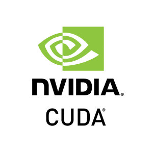

# Toolchain and Build System Components 🛠️


---

# Toolchain Overview 🔗

<br/><br/> 


<!-- 
A software toolchain is a set of software development tools used together to compile, link, optimize, and debug software. A well-integrated toolchain ensures compatibility across components.
-->

---

# Toolchain Components 🏗️


<!-- 
* GCC Toolchain: g++, objdump, readelf, strings, nm, c++filt, ar...
* MSVC: cl, link, dumpbin, editbin...
* LLVM Toolchain: clang++, lld, llvm-nm, llvm-objdump...
* Cross-compilation toolchains: aarch64-linux-gnu-gcc, arm-none-eabi-gcc...

the examples/simple.sh example
-->


---

# Build Systems 🔨


* **Features:** Dependency management, compiler flags, file manipulation, installation

<!-- 
Build systems automate compiling, linking, and installing software. Examples: Make, CMake, Ninja, Meson.
-->

---

# IDE - Integrated Development Environment 🖥️

* **Features:** Code Editor, Compilation, Debugging, Toolchain Integration


<!-- 
IDEs help developers by integrating all tools into a single interface. Examples: Visual Studio, CLion, VS Code.
-->

---

# Toolchains by Platform 💻

* **Windows:**
  * MSVC
  * MinGW-w64 / Clang
  * Intel C++ Compiler (icpc / icpx) [Classic/OneAPI]
* **Linux/macOS:**
  * GNU toolchain (GCC)
  * Clang
  * Intel C++ Compiler (icpc / icpx) [Classic/OneAPI]

<!-- 
LLVM
Different operating systems have different native toolchains. Some, like Intel's ICC, support multiple platforms.
-->

---

# heterogeneous computing Toolchains 🚀




* **Compiler** : `nvcc` / `icpx`
* **Debugger** 

<!-- 
**More** : `nvcc`, `cuobjdump`, `nvdisasm`, `nvprune`
CUDA toolchain is specialized for GPU programming. Works with MSVC, GCC, and Clang but requires specific linker configurations.
-->

---

# Toolchain Compatibility ⚠️

1. **Binary Formats:** ELF (Linux), PE (Windows)
2. **Application Binary Interface (ABI):** Function calling conventions, data alignment
3. **Debugging Symbols Formats:** DWARF (ELF), PDB (MSVC)

<!-- 
Ensuring toolchain compatibility requires using the correct binary format, ABI, and debug symbols.
-->

---


<!-- 
In the rest of the lecture, we will answer a (simple?) question :

I Compiled simple program that adds two numbers. 
Which platform can run it ?

And when the program is more complicated ?

I'll begin with both linux/windows but then I'll speak only about linux.
-->

---

# Static Executable Portability

* ISA - Instruction Set Architecture
   * X86 / X86_64 / Arm / 
* Instruction sets
   * MMX / SSE / AVX / FMA / AES
* Executable format :
   * PE (exe) / ELF 
* Execution :
   * _start → mainCRTStartup → main /  _start → main
<!-- 

Executable is not portable across different ISA/IS/OS

Demo : AVX instruction set

PE portable executable
ELF - Executable and Linkable format

-->

---

# Static Executable Portability

* Using syscalls/win32api that has changed:
   * Windows : CreateFile2() (windows8+)
   * Linux : clone3() (Linux 5.3+) 
* Explicit or implicit calls !

<!-- 
The compiler may add syscalls/win32pi calls to the program (cout !!)

It may not be compatible with the running kernel/windows version.

Example : syscall.cpp

Most of the time - we'll be fine, because kernel and win32api have backward compatibility.

-->

---

# Additional Components 📦

* **Standard Libraries:** `stdlib.h`, `malloc.h` /`vector`, `map`
* **OS-Specific Headers:** `windows.h`, `afxwin.h`/ `unistd.h`, `pthread.h`
* **Compiler-Specific Headers:** `x86intrin.h`, `intrin.h`

<!-- 
By default some of those are implemented in shared objects.

Libraries and headers differ by OS and compiler. 
Some functions are available only in specific environments.

<math.h>, <complex.h> and <fenv.h> implemented in libm.so

demo - simple program ("simple") link without "-static"

```sh
g++ simple.cpp -osimple
ldd simple
nm -D simple | c++filt
```

| **Shared Library**              | **Common Functions Implemented** |
|---------------------------------|---------------------------------|
| **`linux-vdso.so.1`** (Virtual Dynamic Shared Object) | `gettimeofday()`, `clock_gettime()`, `time()`, `getcpu()` (Optimized system calls hout a syscall instruction) |
| **`libstdc++.so.6`** (GNU C++ Standard Library) | `std::vector`, `std::string`, `std::cout`, `std::map`, `std::sort`, `std::thread` (C++ ndard Library functions) |
| **`libc.so.6`** (GNU C Library - glibc) | `printf()`, `malloc()`, `free()`, `open()`, `read()`, `write()`, `fork()`, `execve()`, `exit()` re C standard and system calls) |
| **`libm.so.6`** (Math Library) | `sin()`, `cos()`, `sqrt()`, `log()`, `pow()`, `exp()`, `tan()`, `floor()`, `ceil()` (Mathematical ctions) |
| **`/lib64/ld-linux-x86-64.so.2`** (Dynamic Linker) | `_start()`, `dlopen()`, `dlsym()`, `dlclose()` (Loads shared libraries and resolves bols) |
| **`libgcc_s.so.1`** (GCC Support Library) | `__gcc_personality_v0()`, `__cxa_throw()`, `__cxa_begin_catch()`, `__cxa_end_catch()` (Exception handling, stack unwinding) |


 ## **🚀 Function Breakdown**
 | **Function** | **Purpose** | **Implemented In** |
 |-------------|------------|--------------------|
 | **`__cxa_atexit@GLIBC_2.2.5`** | Registers a function to run when `exit()` is called (used for global/static destructors). | `libc.so.6` libc) |
 | **`__cxa_finalize@GLIBC_2.2.5`** | Runs functions registered with `__cxa_atexit` before program termination. | `libc.so.6` (glibc) |
 | **`__gmon_start__`** | Used for profiling (GNU `gprof`). **Weak symbol**, sometimes auto-inserted. | `libc.so.6` (if profiling enabled) |
 | **`_ITM_deregisterTMCloneTable`** | Transactional memory support (used in GCC's **Thread-Level Speculation**). **Weak symbol**. | `libgcc_s..1` |
 | **`_ITM_registerTMCloneTable`** | Registers transactional memory clone tables for **GCC optimizations**. | `libgcc_s.so.1` |
 | **`__libc_start_main@GLIBC_2.34`** | Entry point for **glibc-based programs** (sets up argc, env, calls `main()`). | `libc.so.6` (glibc) |
 | **`std::basic_ostream<char, std::char_traits<char> >::operator<<(...)`** | Handles `std::cout <<` operations (formatted output). | `libstdc.so.6` (GNU C++ Standard Library) |
 | **`std::ios_base::Init::Init()@GLIBCXX_3.4`** | Initializes global `std::cout` and `std::cin`. Required for C++ iostreams. | `libstdc++.so. |
 | **`std::ios_base::Init::~Init()@GLIBCXX_3.4`** | Cleans up iostreams (`std::cout`, `std::cin`) at program exit. | `libstdc++.so.6` |
 | **`std::cout@GLIBCXX_3.4`** | Global standard output stream (`std::cout`). | `libstdc++.so.6` |
 | **`std::basic_ostream<char, std::char_traits<char> >& std::endl(...)`** | Handles `std::endl`, which adds a newline (`\n`) and flushes tput. | `libstdc++.so.6` |
 | **`std::operator<< <std::char_traits<char> >(...)`** | Overloaded `operator<<` for C++ streams (`std::cout <<`). | `libstdc++.so.6` |


-->

---

# Dynamic linking

* `libstdc++.so.6` : c++ implementations.
* `libgcc_s.so.1` : gcc internal functions implementations.
* `ld-linux-x86-64.so.2` 
* `libc.so.6`

<!-- 
Mostly **backward** compatible.
Can install some older versions on same machine

Glibc must be compiled with the current kernel.

-->

---


# glibc - The GNU C Library

The project provides the **core libraries for the GNU system** and GNU/Linux systems. 

These APIs include such foundational facilities as **open, read, write, malloc, printf, getaddrinfo, dlopen, pthread_create, crypt, login, exit** and more.

The GNU C Library is designed to be a **backwards compatible**, portable, and high performance ISO C library.

<!-- 
Mostly **backward** compatible.
Can install some older versions on same machine

Glibc must be compiled with the current kernel.

example: running simple dynamic example on two ubuntu's : newer and older.

./simple: /lib/x86_64-linux-gnu/libc.so.6: version `GLIBC_2.34' not found (required by ./simple)
-->

---


* `ld-linux-x86-64.so.2` 
* `libc.so.6`
* `libm.so`
* `libdl.so`
* `ldd`

<!-- 
versionning @GLOBC... 
ldd --version
-->

---


# Some Thoughts 

* It's good to compile on `old` glibc (ipp!)
* The gcc uses glibc which uses the kernel of my computer.
* If I'm using static linked code, I'm (mostly) fine.
* When using dynamic linked code, it's tight with my glibc and kernel.
* When compiling to other target, I have to cross compile.


---

# When I cannot use static link ?

* Missing static libraries (3rd, gcc's c++)
* I want to use dynamic libraries.
* Some networking functions (gethostbyname)
* Using cuda or other library that supports only dynamic link.

---

# Executable Binaries 🏗️


<!-- 
Binary format varies by architecture and OS. x86_64, ARM, RISC-V have different instruction sets and calling conventions.
-->

---

# Why Can't I Compile on Windows and Run on Linux? 🤔

* **ABI Differences** (e.g., function calling conventions)
* **Executable Formats** (PE vs ELF)
* **Runtime Libraries & Syscalls** (`printf`, `malloc` differ)
* **OS-Specific APIs** (`pthreads` vs `Win32 API`)

<!-- 
Binaries compiled for one OS rarely run on another due to fundamental system differences.
-->

---

# Cross-Compilation 🌍


<!-- 
Cross-compilation allows compiling software for a different architecture or OS than the host system.
-->

---

# Cross-Compilation Challenges 🛠️

* **Missing target's C/C++ libraries**
* **Sysroot and cross toolchain dependencies**
* **More similarity between host & target = Bigger problems**

<!-- 
Cross-compilation requires careful dependency management. Example: ARM cross-compilers for embedded systems.
-->

---

### **🚀 Virtualization Methods**
| **Feature** | **QEMU User** | **QEMU Full** | **Docker** | **WSL 1** | **WSL 2** | **VMware** | **VBox** |
|-------------|---------------|---------------|------------|-----------|-----------|------------|----------------|
| **Emulation** | User | cpu | uses kernel | layer | full os | full os | full os |
| **Perform** | ⚠️  | ⚠️  | ✅  | ✅  | ✅   | ✅  | ✅   |
| **Cross-Arch** | ✅  | ✅  | ❌  | ❌  | ❌  | ❌  | ❌  |

---
| **Type** | User-mode | Full System | Container | Compatibility | Light VM | Full | Full |

# Cross-Compilation Demo 🏗️

```sh
apt install mingw-w64
x86_64-w64-mingw32-g++ -o hello.exe test.cpp
```

```sh
qemu-aarch64 ./binary
```

<!-- 
This demonstrates cross-compiling a Windows executable from Linux using MinGW-w64 and running an ARM binary using QEMU.
-->

---

# Usable but Unfamiliar Tool: `strace` 🕵️

```sh
strace -e open,read,write ./myprogram
```

🔍 **Shows system calls used by a program.**

<!-- 
`strace` is useful for debugging permission issues, missing files, and system call errors.
-->

---

# Usable but Unfamiliar Tool: `ldd` 🔎

```sh
ldd myprogram
```

🔍 **Lists shared library dependencies.**

<!-- 
Useful for checking which libraries are required and diagnosing missing dependencies.
-->

---

# Summary ✅

✔ Toolchains provide compilers, linkers, and libraries
✔ Build systems automate compilation
✔ Cross-compilation enables targeting different architectures
✔ Compatibility between components is key

<!-- 
This presentation covered toolchains, build systems, and challenges in cross-compilation.
-->

---

# Thank You! 🎯
