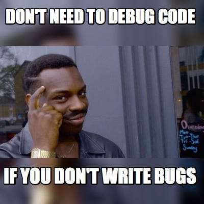
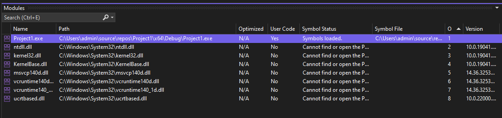
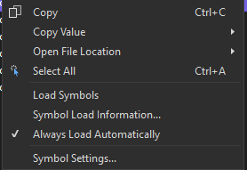
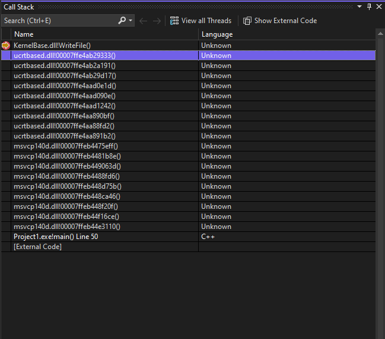
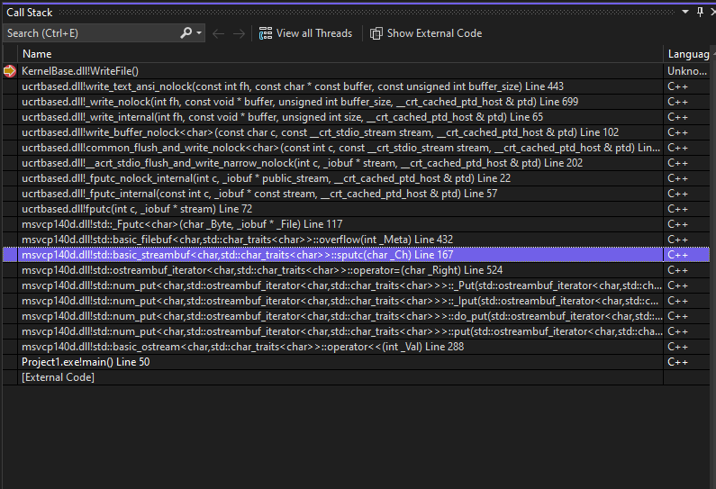
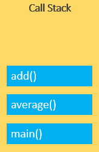
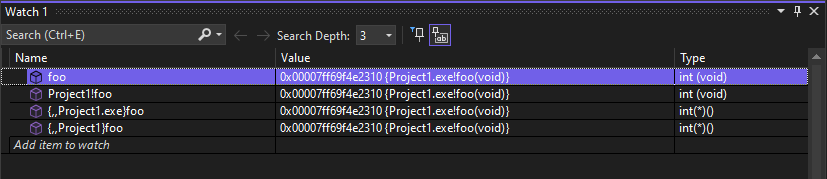
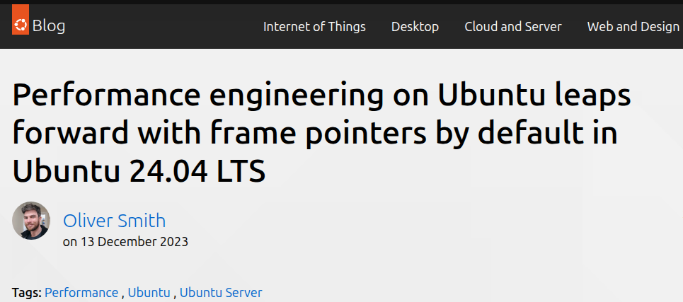
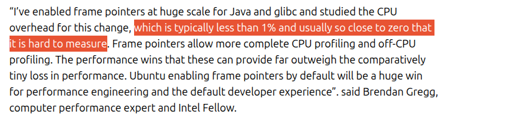

# Debugging

Some info and technics

---

## Agenda 📜

1. Debug Info 🏗️  
2. Debugging Techniques 🛠️  
   - Breakpoints
   - Stepping  
   - Backtraces  
   - Memory inspection  
3. Coredump Debugging 💥  
4. Remote Debugging 🌐  
5. Advanced Debugging Topics 🚀 

---

## What Is Debugging? 🧭

- Understanding program state  
- Finding where and why behavior diverges  
- **Iterative workflow: reproduce → isolate → understand → fix**
- Tools: 
  - `gdb`, `lldb`  
  - Visual Studio (**Version!**) / VSCode / WinDbg.exe
  - Helper tools (perf, valgrind)

---


---

## 🎯 What Is Debug Info?

- Maps binary addresses → source code/variables
- Needed for:
  - Breakpoints
  - Stack traces
  - Variable inspection


<!--
- Debug info connects machine instructions back to human-readable code.
- Without debug info, debugger only sees raw addresses and assembly.
- Breakpoints and step-debugging are impossible without it.
-->

---

## What Can I do without debug info ?

| # | Question | Result |
|---:|----------|:------:|
| 1 | Can I still get call stack ? | ✅❌  | <!-- yes; they just will not have symbol names -->
| 2 | Can I watch the disassembly? | ✅❌ | <!-- yes; you can disassemble and match addresses manually -->
| 3 | Can I still set breakpoints ? | ✅❌ |<!-- yes; But not with names-->
| 4 | Can I debug an `so` that has debug info ? | ✅❌ |<!-- yes; -->

<!-- demo - simple; -->
---


## What Can I do without debug info ?

| # | Question | Result |
|---:|----------|:-------|
| 1 | Can I still get call stack ? | ✅ But no function names | 
| 2 | Can I watch the disassembly? | ✅ Sure | 
| 3 | Can I still set breakpoints ? | ✅ But no function names |
| 4 | Can I debug an `so` that has debug info ? | ✅ Just break on the function |

---

## 🛠️ How Is It Stored?

- Formats:
  - Linux DWARF (Inside binary)
    - Can be stripped out after build
  - Windows PDB (Separate file)
    - Must be built in the same build process as the dll/exe


<!--
- You can remove debug info to shrink size, but then you lose easy debugging.
add-symbol-file libgm5.so.unstripped 0x00007ffff7fc3040
-->

---

## 🛡️ Compiler Flags

- Linux (GCC/Clang):
  ```bash
  -g
  ```
- Windows (MSVC):
  ```bash
  /Zi
  ```

✅ Adds debug symbols to build
✅ Always use `Debug`/`RelWithDebInfo` in cmake projects!


<!--
- Always compile with `-g` if you want debugging to be possible.
- On Windows, `/Zi` creates a .pdb file automatically.
- Debug info can be combined with Release optimizations too (`-g -O2`).
-->

---


# Release vs RelWithDebInfo

| Build Type        | Optimization | Debug Symbols | Binary Size | 
|-------------------|--------------|----------------|-------------|
| **Release** ⚡     | High (`-O3`) | ❌ None        | 📦 Medium   | 
| **Release+strip** ✂️ | High (`-O3`) | ❌ Removed     | 🪶 Smallest | 
| **RelWithDebInfo** 🔍 | High (`-O2`) | ✅ Present (`-g`) | 📚 Large    | 

* Note: In windows, the pdb name is embedded on `RelWithDebInfo` builds

---


## ✨ Demo

```bash
g++ -g -O3 hello.cpp -oRelWithDebInfo
g++ -g -O0 hello.cpp -oDebug
g++ -O3 hello.cpp -oRelease
cp RelWithDebInfo  "RelWithDebInfo+strip"
strip "RelWithDebInfo+strip"
ls -la

readelf --debug-dump=info Debug
readelf --debug-dump=info Release
```

---


# 🔗 PDB and Executable Link

| What | Where it lives | Why it matters |
|:-----|:---------------|:--------------|
| PDB file name | Embedded in EXE/DLL | Tells debugger where to find PDB |
| GUID | Embedded in EXE/DLL and PDB | Must match to load symbols |
| Age  | Embedded in EXE/DLL and PDB | Tracks small rebuilds |


> **PDB must match executable by name, GUID, and Age — or symbols won't load!**

<!--
pdbmatch of debuginfo.com
-->

---

# Inspect debug info / gdb

```
info functions main
info functions ^main()
info line main

info source
info sharedLibrary

add-symbol-file /path/to/libfoo.so.debug 0xADDRESS
```
---

# Inspect debug info / windows





Windbg : `x Project1!*main*`


---

# No MSVC symbols



---

# With MSVC symbols



---

# Breakpoints 


---

# 🎯 Breakpoints

✅ Pause execution at:

- A function
- A line
- A memory access (read/write)
- An exception

---

 🛠️ Breakpoints in GDB

| Type | Command | Meaning |
|------|---------|----------|
| 🎯 **Function** | `break my_function` | Stop when enter | 
| 📍 **Line** | `break file.cpp:42` | Stop at a line | 
| 🔎 **Regex** | `rbreak /regex/` | Stop at regex |
| ⚙️ **Condition** | `break f.cpp:2 if x==2` | Stop only when |
| ➗ **Nth-hit** | `ignore 1 6` | Stop 7th hit | 
| 👀 **Watchpoint** | `watch var` | Stop *change* |
| 📖 **Read** | `[r/a]watch var` | Stop is *read*/*access* |
| 🚨 **Exception** | `catch throw` | Stop when exception |

---

# ⚡ Break on Win32 or glibc Functions

| Library    | Useful Breakpoints        |
|:-----------|:---------------------------|
| Windows    | `CreateFile`, `HeapAlloc`, `VirtualAlloc`, `KERNELBASE!WriteFile`|
| glibc/Linux| `malloc`, `free`, `open`, `pthread_create`  `__GI___libc_write` `catch syscall write`|

✅ Find crashes, allocations, syscalls, prints.


* gdb : `command <breakpoint>`


<!--
- You can break when the OS API is called.
- E.g., break on `malloc` to catch who is allocating memory.
- In Windows, breaking on `CreateFileA` shows file usage.
- Helpful for deep bugs or performance profiling.
-->


---

# Stepping 


---
# 👣 Stepping I (GDB / MSVC)

| Action | GDB Command | MSVC Key | Meaning |
|--------|-------------|----------|---------|
| **Step Into** | `step` / `s` | **F11** | Exec next, enter function|
| **Step Over** | `next` / `n` | **F10** | Exec next, skip function |
| **Step Out** | `finish` | **Shift+F11** | Run until the current function returns |
| **Continue** | `continue` / `c` | **F5** | Resume program until next breakpoint |


---


# 👣 Stepping II (GDB / MSVC)

| Action | GDB Command | MSVC Key | Meaning |
|--------|-------------|----------|---------|
| **Until Line** | `until <line>` | **Ctrl+F10** | Run until reaching a specific source line |
| **Step Instruction (Into)** | `stepi` / `si` | **Ctrl + Alt + D** **F11**| Execute a single **assembly instruction**, diving into calls |
| **Next Instruction (Over)** | `nexti` / `ni` | **Ctrl + Alt + D** **F10** | Execute next **assembly instruction**, skip call bodies |

---



---

# 🔍 Backtrace 

| Name | GDB Command | MSVC | Meaning |
|------|-------------|--------------------------|---------|
| **Backtrace** | `bt` / `bt full` | Callstack | Show call stack |
| **Select frame** | `frame <n>` | Click in Call Stack | Switch to a specific frame |
| **List threads** | `info threads` | Thread window | Show all threads |
| **Switch thread** | `thread <n>` | Click thread | Change active thread |

---

# Memory Inspection 


---


# 🧠 Memory Inspection I 

| Task | GDB Command | MSVC | Meaning |
|------|-------------|-----------------------|---------|
| **Inspect variables** | `print x` / `p x` | Watch / Autos / Locals windows | Show values of variables |
| **Inspect registers** | `info all-registers` | Registers window | View CPU registers |
| **Examine raw memory** | `x/<count><format> <addr>` | Memory window | View arbitrary memory |

---

# 🧠 Memory Inspection II

| Task | GDB Command  | Meaning |
|------|-------------|---------|
| **Show int** | `x/d <addr>` |  Interpret as integer |
| **Show float** | `x/f <addr>` |Interpret as float |
| **Show double** | `x/gf <addr>` |Interpret as double |
| **Show hex** | `x/x <addr>` |  Hex memory view |
| **Search memory** | `find <start>,<end>,<pattern>` | Search for bytes |
| **Dump structure** | `ptype var`  | Show structure layout |

---


# Pretty Printing / Natvis

* gdb :
  - `Pretty Printers` can print stl
    - `info pretty-printer`
    - `disable pretty-printer`
  - Can write python code for custom types (e.g: eigen)
* MSVC :
  - Builtin stl
  - `ImageWatch` addon
  - `.natvis` for custom


---

# Static variable 

```cpp
int foo()
{
    static int a = 5;
    a += 10;
    return a;
}
```

* gdb : `p 'foo::a'`
* MSVC : Take the address of `a`

---

# Dll function


```cpp
int foo(); // defined in so
```



---

# XMM registers

```cpp
    __m128 vec;                
    vec = _mm_set_ps(1.0f,2.0f,3.0f,4.0f);
```

* gdb: `p $xmm0.v4_float`
* MSVC : `XMM0.m128_f32`

---

# Dump memory to file

```cpp
std::vector<uint8_t> v(800,1);
```

- gdb : `dump memory dump.bin &v[0] &v[100]`
- MSVC : `DumpMemory("a.bin", &v[0],100)`
```cpp
void DumpMemory(const char* f, void* address, size_t size) {
    std::ofstream file(f, std::ios::out | std::ios::binary);
    file.write(static_cast<const char*>(address), size);
    file.close();
}

```

---

# 🧠 Core Dumps: Crash Afterlife


<!--
Core dumps are memory snapshots when programs crash.
They capture memory, registers, call stack at the crash moment.
Allow analyzing the problem later without re-running.
-->

---

# 📦 What is a Core Dump?

- Snapshot of memory + CPU state
- Captured at crash
- Used for post-mortem debugging

✅ Analyze offline without rerunning

<!--
Core dumps are saved binary files.
They allow seeing why a crash happened.
Cannot continue execution, only inspect.
-->

---

# 🛠️ Linux: Enable Core Dumps

- Allow dumps:

```bash
ulimit -c unlimited
```

- Set core file location:

```bash
echo "/tmp/core.%e.%p" | sudo tee /proc/sys/kernel/core_pattern
```

<!--
By default, Linux may block core files with small size limits.
Use ulimit to remove the limit.
core_pattern controls the filename and location.
-->

---

# 🛠️ Linux: Crash Programmatically

```cpp
#include <signal.h>

raise(SIGSEGV); // or abort();
```

✅ Forces core dump creation

<!--
raise(SIGSEGV) triggers a segmentation fault immediately.
abort() triggers abnormal termination.
Both will create a core file if enabled.
-->

---

# 📂 Where is the Core File? (Linux)

- Default: working directory
- Configured: `/tmp/`, `/var/core/`
- Naming: `core`, `core.PID`, `core.exename.PID`

<!--
If no core pattern is set, the core file lands where the program ran.
With pattern, it can be redirected (e.g., /tmp/core.myapp.12345).
-->

---

# 🛠️ Windows: MiniDump (DMP File)

- Use `MiniDumpWriteDump`
- External tool: **procdump**

✅ Creates `.dmp` file for WinDbg or Visual Studio

<!--
Windows doesn't make dumps automatically unless you configure it.
Programs can generate .dmp manually with MiniDumpWriteDump.
Or admins can catch crashes with procdump.
-->

---

# 🛠️ Windows: Create Dump from Code

```cpp
#include <windows.h>
#include <dbghelp.h>

MiniDumpWriteDump(...);
```

✅ Needs linking with `dbghelp.lib`

<!--
MiniDumpWriteDump can capture process memory on request.
Useful for crash handlers or bug reporting systems.
-->

---

```cpp
#include <windows.h>
#include <dbghelp.h>

#pragma comment(lib, "Dbghelp.lib")

int main()
{
    HANDLE hFile = CreateFileA("crash.dmp",
        GENERIC_WRITE,
        FILE_SHARE_READ,
        nullptr,
        CREATE_ALWAYS,
        FILE_ATTRIBUTE_NORMAL,
        nullptr);

    if (hFile == INVALID_HANDLE_VALUE)
        return 3;

    MINIDUMP_EXCEPTION_INFORMATION mdei;
    mdei.ThreadId = GetCurrentThreadId();
    //mdei.ExceptionPointers = pep;
    mdei.ClientPointers = FALSE;

    MiniDumpWriteDump(
        GetCurrentProcess(),
        GetCurrentProcessId(),
        hFile,
        MiniDumpNormal, 
        &mdei,
        nullptr,
        nullptr);

    CloseHandle(hFile);

	  return 3;
}
```
---

# 📚 Post-Mortem Debugging: What You Can Do

✅ View call stack  
✅ Inspect variables  
✅ Analyze CPU registers  
✅ Investigate crash reasons

<!--
You can fully navigate backtrace.
You can see values of variables (if debug symbols exist).
Registers like EIP, ESP can show crash cause.
-->

---

# 🚫 Post-Mortem Debugging: Limitations

❌ Cannot continue running  
❌ Cannot change memory  

<!--
A dump is frozen in time.
Cannot resume program execution.
If debug info missing, some variables will be invisible.
-->


---

# 🎯 Summary

- Core dumps = crash snapshots
- Need enabling first
- Symbols make dumps useful
- Powerful tool for real-world debugging

<!--
Core dumps are vital in production systems.
Always compile with debug info, even in Release if you want meaningful crash dumps.
-->

---

# Remote debugging


---


# 🛠️ Remote Debugging with gdbserver

✅ Debug running programs on remote target  
✅ Control them from your local machine

---

# 🎯 Roles

| Machine | Role |
|:--------|:----|
| Target  | Runs `gdbserver` |
| Host    | Runs `gdb` locally, connects remotely |

✅ Target = small embedded / Linux device  
✅ Host = your laptop / PC

<!--
gdbserver runs on the target to control the program.
gdb runs on your host machine to give you a full UI, source code, etc.
-->

---

# 🛠️ On Target

- Install `gdbserver`
- Copy **binary** to target (not necessarily symbols)
- Start program under `gdbserver`:

```bash
gdbserver :2000 ./myapp
```

✅ Waits for host connection

<!--
gdbserver runs the program and pauses it until a debugger attaches.
The port (e.g., 2000) must be open and reachable.
The binary must match the one on the host.
-->

---

# 🛠️ On Host

- Install `gdb` locally
- Start gdb:

```bash
gdb ./myapp_with_symbols
```

- Connect:

```bash
target remote target_ip:2000
```

✅ Now you control remote program!

<!--
You need the exact same binary, but with full debug symbols.
Connect with 'target remote ip:port'.
Then you can set breakpoints, step, inspect memory.
-->

---

# 📦 Needed Files: Host vs Target

| File                | Target (device) | Host (your PC) |
|:--------------------|:----------------|:--------------|
| gdb      | ✅     | ❌ (gdbserver only) |✅|
| Stripped binary      | ✅              | ✅ (debug copy) |
| Full symbols         | ❌              | ✅             |
| Source code          | ❌              | ✅             |

✅ Target keeps it minimal.

<!--
The target has only what it needs to run.
All debug info and source files stay safely on the host.
Saves target disk space and keeps binaries smaller.
-->

---

# 🛠️ Source File Location Mapping

- Tell GDB where sources are:

```bash
set substitute-path /original/path /local/path
```

✅ Fixes mismatch if source was built elsewhere.

<!--
Useful when the binary was built on a different system.
GDB thinks sources are in /build/system/path/src/, but you have them locally elsewhere.
set substitute-path fixes that.
-->

---

# 🛠️ Load Symbols from Unstripped Shared Object

```bash
symbol-file /path/to/unstripped_binary
```

✅ Loads debug info manually

---

```bash
add-symbol-file /path/to/unstripped.so 0xADDRESS
```

✅ For shared objects (need base address)

<!--
symbol-file replaces all symbols at once.
add-symbol-file adds additional symbols without replacing everything.
For shared libraries (SO files), you must specify the load address.
Use info proc mappings to find it.
-->

---

# 🔥 Useful Commands After Connect

| Command                | Purpose                  |
|:------------------------|:-------------------------|
| `info sharedlibrary`    | See loaded .so files      |
| `info files`            | Check symbol file loaded  |
| `info source`           | Show source file paths    |
| `info proc mappings`    | Show memory layout        |

✅ Helps when debugging remote programs.

<!--
info sharedlibrary: See which shared libraries are loaded.
info files: Confirm which symbols are loaded.
info source: Check if GDB knows where sources are.
info proc mappings: Needed to find load addresses for SOs.
-->

--- 


---

# 🎯 Summary

- `gdbserver` on target, `gdb` on host
- Host has full symbols and sources
- `symbol-file` or `add-symbol-file` to reload symbols
- `set substitute-path` to fix sources

✅ Full remote control for debugging anywhere!

<!--
Remote debugging lets you debug small systems, embedded devices, even Docker containers.
You don't need heavy setup on the target.
Only gdbserver + minimal binary are needed.
-->


---

# 🚀 Advanced Debugging Topics


---

# 🚀 Advanced Debugging Topics

* Windbg
* GDB tui
* GDB + Visual studio
* VScode debugging
* Debug child processes
* MSVC symbols import
* ABI 


---

# 🛠️ WinDbg (Windows)

- Microsoft’s low-level debugger
- Analyze `.dmp` files, kernel dumps
- Powerful scripting (`!analyze -v`)

<!--
WinDbg is used for crash analysis, even at OS level (blue screens).
More complex but very powerful.
Common for production crash dumps.
Symbol servers supported automatically.
-->

---

# 🛠️ GDB TUI Mode

- Text User Interface inside GDB
- Enable:

```bash
gdb -tui

Ctrl+X Ctrl+a
Ctrl+X Ctrl+o
layout src/asm/split/regs
help 
```

✅ Source + disassembly side by side

<!--
TUI splits the screen: top shows source, bottom shows GDB command line.
You can step, set breakpoints visually without leaving terminal.
Useful on servers without GUIs.
-->

---

# 🛠️ GDB + Visual Studio

- Visual Studio 2022+ can remote debug via GDB
- Cross-compile on Windows, debug on Linux
- Needs SSH setup

✅ Nice GUI + breakpoints

<!--
Visual Studio now supports connecting to remote Linux systems over SSH.
Compiles C++ projects remotely.
GDB runs on target, Visual Studio acts as the front-end.
-->

---

# 🛠️ VSCode Remote Debugging

- Install **Remote - SSH** extension
- Configure `launch.json`
- GDB runs on target, VSCode controls

✅ Lightweight, flexible, free

<!--
VSCode remote extensions let you edit, compile, and debug entirely over SSH.
Launch.json lets you control GDB arguments.
Very good for embedded and IoT targets.
-->

---


# 🧠 Debugging Child Processes

- GDB:

```bash
set follow-fork-mode child
```

- Attach to new PID manually

✅ Control forked processes
✅ MSVC has addon : `Microsoft Child Process Debugging Power Tool`

<!--
By default, GDB follows parent after fork.
set follow-fork-mode child lets you automatically attach to child instead.
Useful for server processes spawning workers.
-->

---


# 🛠️ Importing MSVC symbols

- Download Microsoft's PDB

```powershell
"C:\Program Files (x86)\Windows Kits\10\Debuggers\x64\symchk.exe" C:\windows\System32 /om manifest.txt"
```

```
kernel32.pdb,F193989D78E17120B3BC156240BD021E1,1
```

```bash
wget https://msdl.microsoft.com/download/symbols/kernel32.pdb/F193989D78E17120B3BC156240BD021E1/kernel32.pdb -okernel32.pdb
```

<!--

-->
---

# **Do not omit frame pointers**
  - GCC/Clang: `-fno-omit-frame-pointer`
  - MSVC: `/Oy-`
  - Why: preserves a consistent frame chain for profilers and debuggers; better call stacks under optimization.

---





---


# CMake: one file — force **no optimization** (with `if`)

```cmake
set(src bad.cpp)

if (MSVC)
  set_source_files_properties(
    ${src} PROPERTIES COMPILE_OPTIONS "/Od"
  )
else() # GCC/Clang
  set_source_files_properties(
    ${src} PROPERTIES COMPILE_OPTIONS "-O0"
  )
endif()
```

<!--
Both O3 and O0, but last one takes...
-->


---
# x64 calling conventions 

| topic | Linux x64 (SysV) | Windows x64 |
|---|:---|:---|
| Integers | RDI, RSI, RDX, RCX, R8, R9 | RCX, RDX, R8, R9 |
| `this` | RDI | RCX |
| Floating | XMM0..7 | XMM0..3 |
| Additional | stack (right→left) | stack (right→left) |
| Return | RAX (int), XMM0 (float) | RAX (int), XMM0 (float) |

---