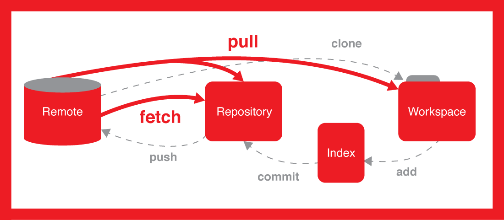

# git

Some advanced usage tips

---

# Basics

``` bash
git init
echo hello > hello.txt
git add hello.txt
git commit -m "Adding new file"
```

---

# Basic actions - I




---

# Basic actions - II


---

# Branch


---

# Flow


---

# Tips

* Git 
  * Small commits
  * Compilation = commit
  * Precommit hooks
* Gitlab 
  * Protected branches
  * CI + Automatic deploy
  * Flow

--- 

# Stash


---

# Danger !

* History change (Confidential, large files)
* Force push
* Adding commit after wrong merge
* Reset --hard
* Git clean
* Delete a branch

---

# Submodules

* Clone address type (ssh/https)
* Access rights
* Target version


---

# Large files

* Types :
  * Data files
  * 3rd party binaries
  * Precompiled files (other library)
* Solutions :
  * Lfs
  * Artifactory
  * Shared directory
  * commit

---

# etc.

* New project – add all, then force push
* Gitlab packages
* Cherry-pick
* Format at precommit hooks
* Git worktree
* Partial clone
* bisect
