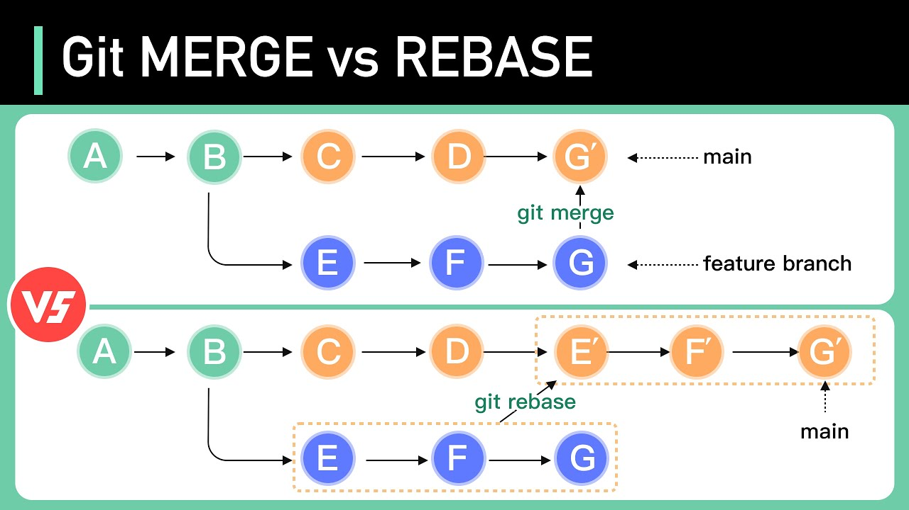

# 🛠️ Git – Advanced Usage

Some **pro tips** to level up your Git skills! 🎯

---

# 🔥 Git Basics

```bash
git init
echo "hello" > hello.txt
git add hello.txt
git commit -m "Adding new file"
```
✅ **Initialize, stage, and commit** a file!

---

# 📌 Basic Actions


```bash
git reset HEAD myfile.cpp
```

---

# 📦 Stash – Save Work in Progress


🔹 **Temporarily save uncommitted changes**  
🔹 Useful before switching branches  


---

# 🌱 Branching Strategies


  ```bash
  git checkout -b feature-xyz
  ```

---

# 🔄 Merge vs. Rebase



---

# 📜 Git Flow – Best Practices


---

#  Pro Tips

- **Small commits** – Easier debugging  
- **Pre-commit hooks** – Automate checks  
- **GitLab best practices**:
  - **Protected branches**
  - **CI/CD Pipelines**
  - **Efficient workflows**

---

# ✅ Pre-Commit Hooks


💡 `.pre-commit-config.yaml`

---

# 🛡️ Useful Pre-Commit Hooks

| 🛠️ Hook | 🔍 Purpose |
|---------|-----------|
| **Clang-Format** | Ensures consistent C++ style |
| **Clang-Tidy** | Finds potential bugs |
| **CMake-Format** | Enforces clean CMake syntax |
| **EOF Fixer** | Adds missing newline at end of file |
| **Trailing Space Fix** | Removes unnecessary spaces |
| **Large File Detector** | Prevents committing large files |
| **ShellCheck** | Validates shell scripts |

---

# ⚠️ Git Dangers! 🚨

❌ **Avoid these risky actions unless you're sure!**  
- **Force push (`git push --force`)** 🔥  
- **Rewriting history (e.g., `git rebase -i`)** 🕰️  
- **Accidentally deleting a branch** 🗑️  
- **`git reset --hard` (Loses changes!)** 😱  
- **Committing large files (Use Git LFS)** 📂  

---

# 🏗️ Working with Submodules

🛠️ **Managing external repositories inside your repo**  
- **Choose SSH or HTTPS**  
- **Access rights matter!**  
- **Always checkout the correct version**  


---

# 📦 Large Files

❌ **Common large file types**:
- 📊 Data files
- 🏗 3rd-party binaries
- 🔧 Precompiled libraries  

---

# Solutions for Large Files

- ✅ Use **Git LFS**
- ✅ Store in **Artifactory**
- ✅ Keep in a **shared directory**
- ✅ Committing them directly  

---

# 🎯 More Git Tips & Tricks

🚀 **Power moves** every developer should know:
- **New project?** → `git add . && git commit -m "Initial commit"`
- **Cherry-pick commits** from another branch  
- **Git Worktree** – Work on multiple branches at once  
- **Partial Clone** – Speed up large repo clones  
- **`git bisect`** – Find the commit that introduced a bug  

---


# Some company's specific problems

- Availabe space in the servers
- Access rights 
  - gitlab ssh
  - Project user
- Network drive access rights (mount linux/windows)

---

# Questions? 🤔

