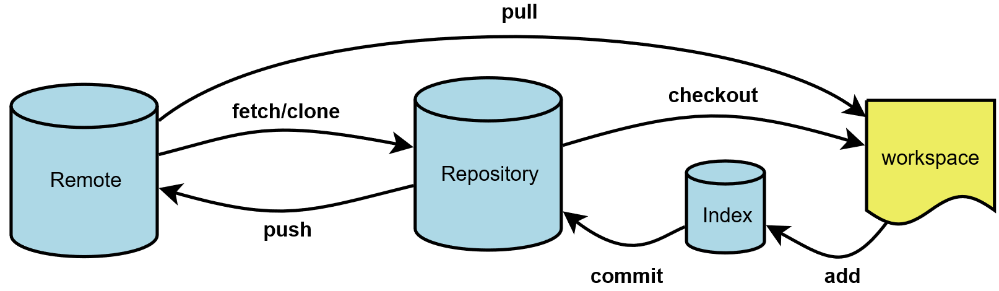
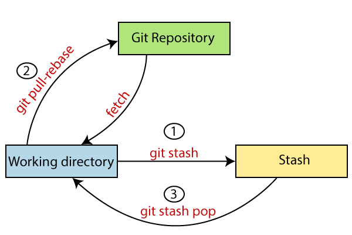
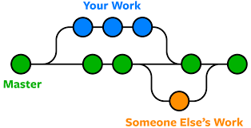
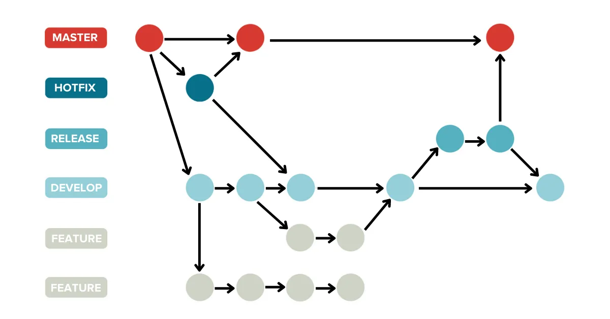

# 🛠️ Git – Advanced Usage

Some **tips** to level up your Git skills!


---

# 🔥 Git Basics

```bash
git init
echo "hello" > hello.txt
git add hello.txt
git commit -m "Adding new file"
```
✅ **Initialize, stage, and commit** a file

<!---
Always work within git repo, even when it's very small project.
[When it begins to be bigger - open gitlab project]
-->

---


# **SCM - Source Control Management** 🛠️  

* **Source control** = ניהול תצורה ? 🤔  
* **Source** 📄  
  * Small 📏  
  * Comparable 🔍  

<!---
Make everything text : 
  markdown/marp
  dot/mermaid
  latex
-->
---

### **Version Control Evolution**  

📂 **SourceSafe** → 
🏛 **ClearCase** → 
🔄 **SVN** → 
🌀 **Mercurial (Hg)** → 
🐙 **Git**  


---

# 📌 Basic Actions



```bash
git reset HEAD -- myfile.cpp
```

<!---
Missing arrow - from staging back to working
Missing stash
-->

---

# 📦 Stash – Save Work in Progress




🔹 **Temporarily save uncommitted changes**  


<!---
May skip this
-->

---

# 🌱 Branch



  ```bash
  git checkout -b feature-xyz
  ```

<!---
[Many flavours of same command]
Lightweight.
Branch == Mission
-->

---

# **Branch == Single Task** 🚀

- Each branch should **focus on one task** ✅
- Keeps changes **isolated** 🔍
- Makes **code reviews easier** 👀
- Allows **parallel development** 🔄

<!---
feature, bugfix, squash
-->

---


- Merge **Frequently** ✅
- Use **common repository** 🤝

---

# 📜 Git Flow 



---


<!---
Protect the important branches !
main/master/release
-->

---

#              פינת פשעי הקוד      


---

# 🖥️ Coding Practices - git

- ✅ **Always** ensure that code is compiled from a *verified* and *specific* Git revision.  
- 🚫 **Never** use/deliver code compiled on a developer's personal machine.


---

# **🚀 Tips**  

- **Small commits** – Easier debugging  
- **Pre-commit hooks** – Automate checks  
- **GitLab best practices**:
  - **Protected branches**
  - **CI/CD Pipelines**
  - **Efficient workflows**

---

# ✅ Pre-Commit Hooks


💡 `.pre-commit-config.yaml`

---

# 🛡️ Useful Pre-Commit Hooks

| 🛠️ Hook | 🔍 Purpose |
|---------|-----------|
| **Clang-Format** | Ensures consistent C++ style |
| **Clang-Tidy** | Finds potential bugs |
| **CMake-Format** | Enforces clean CMake syntax |
| **EOF Fixer** | Adds missing newline at end of file |
| **Trailing Space Fix** | Removes unnecessary spaces |
| **Large File Detector** | Prevents committing large files |
| **ShellCheck** | Validates shell scripts |

---

# ⚠️ Git Dangers! 🚨

❌ **Avoid these risky actions unless you're sure!**  
- **Force push (`git push --force`)** 🔥  
- **Rewriting history (e.g., `git rebase -i`)** 🕰️  
- **Accidentally deleting a branch** 🗑️  
- **`git reset --hard` (Loses changes!)** 😱  
- **Committing large files (Use Git LFS)** 📂  

<!---
May skip this !
-->
---

# 🏗️ Working with Submodules

🛠️ **Managing external repositories inside your repo**  
- **Choose SSH or HTTPS**  
- **Access rights matter!**  
- **Version/Branch/tip**  

<!---
In order to share code, we have to split into small repositories.
-->

---

# 🏗️ Alternatives

| **Scenario** | **Alternative** |
|-------------|----------------------|
| Managing **multiple repositories** | ✅ **Google Repo, gitman** |
| Get **precompiled** binaries | ✅ **Manual Download** |
| Working with **third-party libraries** | ✅ **Package Manager** |
| Get other repo **into mine** | ✅ **Git Subtree** |

<!---
The other locations must be very stable !
-->


---

# 📦 Large Files

**Common large file types**:
- 📊 Data files
- 🏗 3rd-party binaries
- 🔧 Precompiled libraries  

---

# Solutions for Large Files

- ✅ Use **Git LFS**
- ✅ Store in **Artifactory**
- ✅ Keep in a **shared directory**
- ✅ Commit directly  

---

# 🎯 More Git Tips & Tricks

- **New project?** → `git add . && git commit -m "Initial commit"`
- **Cherry-pick commits** from another branch  
- **Git Worktree** – Work on multiple branches at once  
- **Partial Clone** – Speed up large repo clones  
- **`git bisect`** – Find the commit that introduced a bug  

---


# 🚀 Continuous Integration / Continuous Deployment

### 🏗️ What is CI/CD?
- **Continuous Integration (CI):** Automates code integration, testing, and building.
- **Continuous Deployment (CD):** Automates the release process to production.

---

# 🚀 CI / CD

### Why is it important?
- ✅ **Automated testing** 🧪  
- 🔄 **Ensures we don't go back** 🔙 (🪟 Windows, 🐧 Linux, 🎯 Target, 📊 Results)  
- 🖥️ **Independent machine compilation** ⚙️  
- 📜 **The best README** 🏆 


---

# 🏆 Best Practices

⚡ **Keep pipelines fast** – Aim for **20-40 minutes** ⏳  
🔄 **Move slow tests to nightly/weekly** – Must be checked frequently 🕒  
🛠️ **Start with a build** – Add tests gradually 🔧  
📦 **Deploy artifacts** – With/without debug info 📁  
☁️ **Use cloud, Docker, or dedicated targets** 🌍  
👥 **Ensure everyone can manage CI** – No single-point bottlenecks 🏗️  


---


# Some company's specific problems

- Available space in the servers
- gitlab CI vs Jenkins
- Access rights 
  - gitlab ssh
  - Project user
- Network drive access rights (mount linux/windows)

---

# Questions? 🤔

