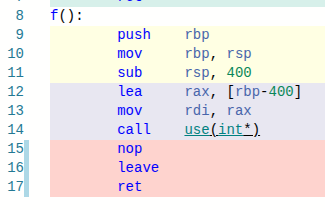

# Memory in C++ 🧠

### Three Fundamental Memory Regions

🧱 **Stack**  
Fast, automatic, scope-bound

📦 **Heap**  
Dynamic, flexible, explicitly managed

🏛️ **Static / Global**  
Program-lifetime, shared state

---

# Stack Memory 🧱

### What lives on the stack?

```cpp
void foo(int a, int b) 
{
    int x = 42;
    int y = a * x * 2;
    bar(x);
};
```

<!-- a,b ? x64 are registers
     x, y may be registers
    calling bar - putting stack pointer on the stack, and return address.
-->

---

# Stack Memory 🧱

### Key properties

⚡ **Very fast** - Allocation = pointer movement
⏱️ **Deterministic** 
📏 **Limited size** - Per thread
🧨 **Unsafe when misused** - Stack overflow, dangling references
🧩 **Compiler-managed** - Layout, alignment, calling convention

---

# Stack - fast 

### When does allocation happen?

```cpp
void f()
{
    int a[100];   // stack array
    use(a);
}
```




<!-- Allocation happen when entring the function. The compiler "knows" that 100*4 bytes are reserved.
     They won't be cleaned before/after usage
-->

---

# Stack management registers 🧠


* rsp → moving top of the stack

* rbp → fixed anchor for the function

<!--
-fno-omit-frame-pointer → “Keep the anchor, even if it costs a little”
-->

---

# How much stack does function call takes ?

```cpp
void measure_stack(int depth, uint8_t* prev_addr)
{
    volatile std::uint8_t marker = 0;
    std::ptrdiff_t bytes = prev_addr - &marker;
    std::cout << bytes << " bytes" << std::endl;

    if (depth == 0) return;

    measure_stack(depth - 1, (uint8_t*)&marker);
}
```

<!--
-140729952818439 bytes
64 bytes
64 bytes
64 bytes
64 bytes
64 bytes
-->

---
 
## Adding arguments

```cpp
#include <iostream>
#include <stdint.h>


void measure_stack(int depth, uint8_t* prev_addr,int a,int b, int c, int d, int e,int f,int g)
{
    volatile std::uint8_t marker = 0;
    std::ptrdiff_t bytes = prev_addr - &marker;
    std::cout << bytes << " bytes" << std::endl;

    if (depth == 0) return;

    measure_stack(depth - 1, (uint8_t*)&marker,a,b,c,d,e,f,g);
}

int main()
{
    measure_stack(5, nullptr,0,0,0,0,0,0,0);
    return 0;
}
```

<!--
-140729952818439 bytes
128 bytes
128 bytes
128 bytes
128 bytes
128 bytes

Try -O0 and -O3, you may be surprised.
(-O3 stack is bigger, because it stores more registers and calls directo iostream functions)
-->

---

# Types of Memory in C++

C++ uses different types of memory storage:

1. **Static Memory** (Global and static variables)
2. **Stack Memory** (Local variables, function calls)
3. **Heap Memory** (Dynamic allocation via `new`/`malloc`)
4. **Shared Memory** (Interprocess Communication)
5. **Text Segment** (Code and constants storage)

---

# **Static Memory**

- Global and static variables are stored here.
- Lifetime: Entire duration of the program.
- Initialized at program startup, deallocated at exit.

**Example:**
```cpp
#include <iostream>
static int counter = 0;  // Stored in static memory

void increment() {
    static int calls = 0;  // Persists across function calls
    calls++;
    std::cout << "Function called " << calls << " times\n";
}

int main() {
    increment();
    increment();
    return 0;
}
```

---

# **Stack Memory**

- Stores local variables and function calls.
- Fast allocation and deallocation.
- Limited size; stack overflow if exceeded.

**Example:**
```cpp
void recursive(int n) {
    int arr[1000];  // Consumes stack memory
    if (n > 0) recursive(n - 1);
}

int main() {
    recursive(10000);  // May cause stack overflow
    return 0;
}
```

---

# **Heap Memory**

- Used for dynamic memory allocation (`new`, `malloc`).
- Requires manual deallocation (`delete`, `free`).
- Slower than stack but flexible.

**Example:**
```cpp
int* ptr = new int(10);  // Allocates on heap
std::cout << *ptr << std::endl;
delete ptr;  // Must free memory to prevent leaks
```

---

# **Shared Memory Across Processes**

- Shared memory allows **multiple processes** to access the **same memory region**, enabling fast communication.
- Used in **multi-process applications** like databases, real-time systems, and IPC (Inter-Process Communication).

## **Cross-Platform Shared Memory Methods**

| Method | Platform | Description |
|--------|----------|-------------|
| **POSIX Shared Memory (`shm_open`)** | Linux, macOS | Uses file-backed shared memory objects. |
| **System V Shared Memory (`shmget`)** | Linux, Unix | Traditional shared memory implementation. |
| **Boost.Interprocess Shared Memory** | Cross-Platform | Portable abstraction over shared memory APIs. |
| **Windows Memory-Mapped Files (`CreateFileMapping`)** | Windows | Uses file mapping for shared memory. |

---

# Boost.Interprocess Overview

- Boost.Interprocess provides a portable way to manage shared memory.
- It abstracts OS-specific APIs like:
  - `shm_open()` (POSIX)
  - `CreateFileMapping()` (Windows)
- Ensures safe memory management using **mutexes and semaphores**.

---

# Creating Shared Memory

```cpp
#include <boost/interprocess/shared_memory_object.hpp>
#include <boost/interprocess/mapped_region.hpp>
#include <iostream>
#include <cstring>

using namespace boost::interprocess;

int main() {
    // Create a shared memory object
    shared_memory_object shm(create_only, "MySharedMemory", read_write);
    shm.truncate(1024);
    
    // Map the shared memory region
    mapped_region region(shm, read_write);
    
    // Write data into shared memory
    std::strcpy(static_cast<char*>(region.get_address()), "Hello from shared memory!");
    
    std::cout << "Shared memory created and initialized.\n";
    return 0;
}
```

✅ **Creates a shared memory segment** named `MySharedMemory`.
✅ **Maps it into the process address space**.
✅ **Writes a string into shared memory**.

---

# Accessing Shared Memory in Another Process

```cpp
#include <boost/interprocess/shared_memory_object.hpp>
#include <boost/interprocess/mapped_region.hpp>
#include <iostream>

using namespace boost::interprocess;

int main() {
    try {
        // Open existing shared memory
        shared_memory_object shm(open_only, "MySharedMemory", read_write);
        
        // Map the shared memory region
        mapped_region region(shm, read_write);
        
        // Read data from shared memory
        std::cout << "Read from shared memory: " << static_cast<char*>(region.get_address()) << "\n";
    } catch (const interprocess_exception& e) {
        std::cerr << "Error: " << e.what() << "\n";
    }
    return 0;
}
```
---

# **Memory Leaks and Prevention**

- A memory leak occurs when allocated memory is never freed.
- Leads to increasing memory usage over time.

**Example of Memory Leak:**
```cpp
void leak() {
    int* ptr = new int(100);  // Never deleted!
}
```

**How to Prevent Leaks:**
✅ Use smart pointers (`std::unique_ptr`, `std::shared_ptr`).
✅ Always match `new` with `delete` and `malloc` with `free`.
✅ Use tools like Valgrind or AddressSanitizer.

---

# **Smart Pointers**

## **`std::auto_ptr` (Deprecated)**
- Transfers ownership but has unsafe copy semantics.
- Replaced by `std::unique_ptr`.

```cpp
#include <memory>
std::auto_ptr<int> ptr(new int(10));  // Deprecated!
```

---

## **`std::unique_ptr` (C++11)**
- Owns memory exclusively.
- Automatically deleted when going out of scope.

```cpp
#include <memory>
std::unique_ptr<int> ptr = std::make_unique<int>(20);
```

✅ **Thread Safety:** Safe as long as it’s not shared.

---

## **`std::shared_ptr` (C++11)**
- Allows multiple shared ownerships.
- Uses reference counting.

```cpp
#include <memory>
std::shared_ptr<int> ptr1 = std::make_shared<int>(30);
std::shared_ptr<int> ptr2 = ptr1;  // Shared ownership
```

✅ **Thread Safety:** Read access is thread-safe; modifying shared_ptr from multiple threads requires external synchronization.

---

# **Conclusion**

- Proper memory management prevents crashes and improves performance.
- Use **stack** for short-lived local variables.
- Use **heap** for dynamically allocated objects with controlled lifetime.
- Avoid **memory leaks** using **smart pointers** and debugging tools.
- Shared memory is useful for **fast inter-process communication**.

🚀 **Mastering memory management leads to efficient and robust C++ applications!**
