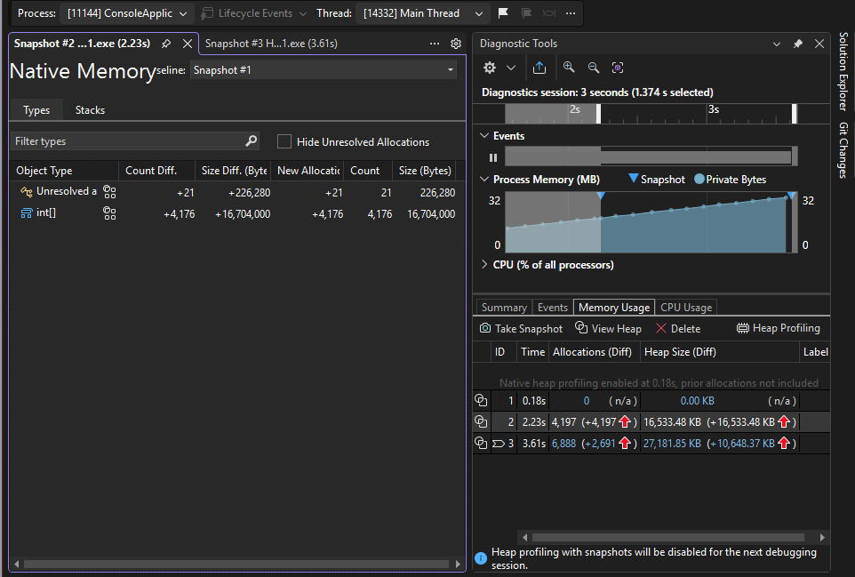
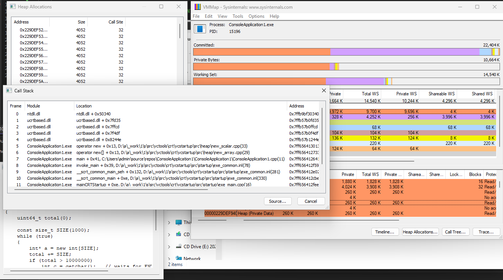
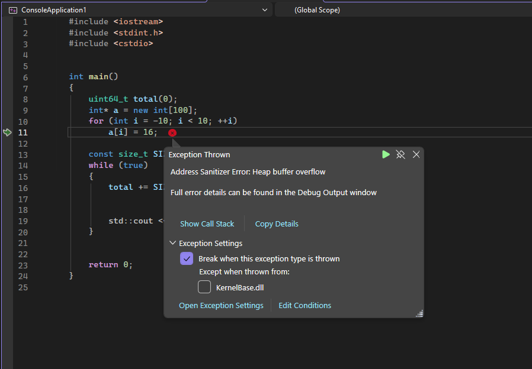

# Heap related bugs - II

```cpp
#include <vector>
#include <iostream>
#include <memory>

struct Base
{
};

struct Derived : Base
{
    std::vector<int> v;
    Derived() : v(1'000'000, 42) {}
};

int main()
{
    std::unique_ptr<Base> p(new Derived());
}
```


---

# Heap related bugs - II Debug

``` cpp
#include <crtdbg.h>
#include <stdlib.h>

int main()
{
    //_CrtSetBreakAlloc(154);

    _CrtSetDbgFlag(_CRTDBG_ALLOC_MEM_DF | _CRTDBG_LEAK_CHECK_DF);
    _CrtSetReportMode(_CRT_WARN, _CRTDBG_MODE_FILE);
    _CrtSetReportMode(_CRT_ERROR, _CRTDBG_MODE_FILE);
    _CrtSetReportMode(_CRT_ASSERT, _CRTDBG_MODE_FILE);
    _CrtSetReportFile(_CRT_WARN, _CRTDBG_FILE_STDERR);
    _CrtSetReportFile(_CRT_ERROR, _CRTDBG_FILE_STDERR);
    _CrtSetReportFile(_CRT_ASSERT, _CRTDBG_FILE_STDERR);
}
```

---

# Heap debugging windows - MSVC



---

# Heap debugging windows - gflags

```cpp
int main()
{
    int* a = new int[10];
    for (int i = -10; i < 13; ++i)
        a[i] = 16;
    return 0;
}
```

```bash
# Enable full page heap verification.

"C:\Program Files (x86)\Windows Kits\10\Debuggers\x64\gflags.exe" /p /enable C:\Users\admin\source\repos\ConsoleApplication1\x64\Debug\ConsoleApplication1.exe /full
```

---

# Find head errors

```cpp

int main()
{
    int* a = new int[1];
    for (int i = -30; i < 0; ++i) a[i] = 0;
    a[0] = 123321;
    if (!_CrtCheckMemory())
        throw std::runtime_error("heap corrupted !");

    delete[] a;
    return 0;
}

```

---

# Heap debugging windows - VMMAP



* Admin
* Launch & Trace
* Timeline
* Symbols path
* Heap allocations

---

# Heap debugging windows - ASAN




---

# Heap debugging linux - electric fence

```bash
sudo apt install electric-fence
g++ ./heap_corrupt.cpp 
LD_PRELOAD=/usr/lib/libefence.so gdb ./a.out
```

---

# 🧠 Windows Heap Debugging 

| Tool |  Release |  Leaks | Corruption | Notes |
|-----|:--:|:--:|:--:|------|
| 🧩 **`_Crt`** | ⚠️ | ✅ |  ❌ | Metadata only, /Mtd |
| 📊 **VMMap** | ✅ | ⚠️ |  ❌ | Usage analysis |
| 🛠️ **VS Diagnostic** |  ⚠️ | ✅ |  ❌ | High-level |
| 🚩 **GFlags** | ✅ | ⚠️ |  ✅ | Guard pages |
| 🧪 **ASan (MSVC)** | ⚠️ | ✅ |  ✅ | Best, Heavy |
| 📡 **ETW (WPR/WPA)** |  ✅ | ⚠️ |  ❌ | Production analysis |

---

# 🧠 Linux Heap Debugging

| Tool | Release | Leaks | Corruption | Notes |
|-----|:--:|:--:|:--:|------|
| 🧩 **glibc `mcheck`** | ⚠️ | ❌ | ⚠️ | Metadata only |
| 🧪 **ASan** | ⚠️ | ✅ | ✅ | Best, heavy |
| 🔍 **Valgrind (Memcheck)** | ⚠️ | ✅ | ✅ | Very slow |
| ⚡ **Electric Fence** | ⚠️ | ❌ | ✅ | Guard pages |
| 📡 **perf / ETW-like (LTTng)** | ✅ | ⚠️ | ❌ | Production tracing |
