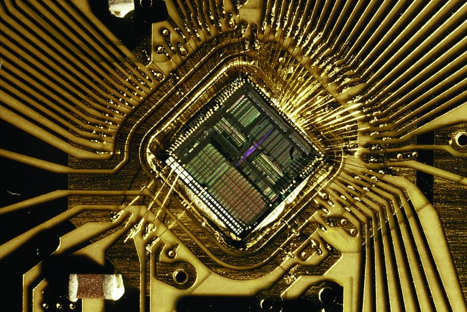
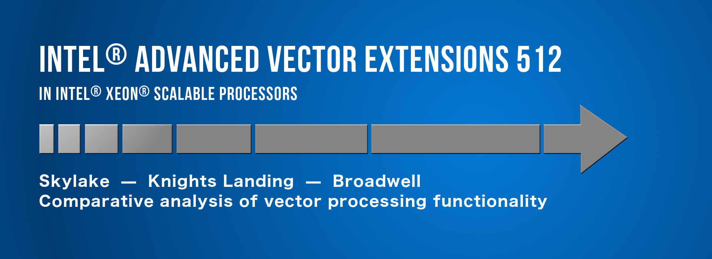
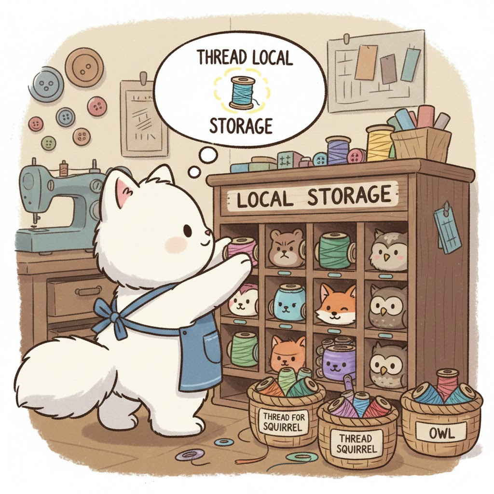

# Agenda 

* Symbols server !
* -march=native
* -march=avx512
* sudo sysctl -w vm.overcommit_memory=2
sudo sysctl -w vm.overcommit_ratio=100
VS

mlockall(MCL_CURRENT | MCL_FUTURE)
* global memory
* thread local storage


---


---

---




# -march=native


---

# 🚀 `-march=native`

- 🧠 Detects **build machine CPU**
- 🧩 Enables **all supported ISA**
  - SSE / AVX / AVX2 / FMA …
- ⚡ Better auto-vectorization
- 🏎️ CPU-specific tuning

➡️ **Maximum speed on this machine**

---

## 💥 Why it’s risky

- 🧪 Built on new CPU  
- 🖥️ Run on older CPU / VM  
- ❌ `SIGILL` (illegal instruction)

📦 **Non-portable binary**
📉 CI & releases break silently

---

## ✅ When to use it

- 🧑‍💻 Local developer tools
- 🧪 Benchmarks / profiling
- 📟 Embedded / fixed hardware
- 🧮 HPC (build per node)

🚫 **Never for distributed binaries**

---

## 🔍 See what it really enables

```bash
gcc -march=native -Q --help=target
```

👀 Shows the *real* flags & macros

---

## 🧠 Better practice

* 🎯 Prefer explicit targets:

  * `-march=haswell`
  * `-march=skylake`
* 🧩 Or multi-version + runtime dispatch
* 🚫 Don’t ship `-march=native`

**Fast ≠ portable** ⚖️

---




---

## 🚀 AVX-512

- 📏 512-bit vectors (×2 AVX2 width)
- 🧮 More math per instruction
- 🎭 Mask registers (no tail loops)
- 🤖 Great for:
  - ML / AI
  - Compression

➡️ **Huge throughput potential**

---

## ⚠️ The hidden cost

- 🔥 Much higher power & heat
- ⏬ CPU **drops clock frequency**
- 🧵 Slows *other* code on same core
- ⏳ Clock stays low **after** AVX-512 ends

➡️ Fast instructions, slower CPU

---


## ❌ Why Intel removed it (Gen 12 / 13)

- 🧩 Hybrid CPUs (P-cores + E-cores)
- ❗ E-cores **cannot run AVX-512**
- 🔒 Intel choice:
  - **Gen 12 (Alder Lake): disabled**
  - **Gen 13 (Raptor Lake): fused off**

---

## 🧠 Real-world guidance

- 🧩 Check your hardware !
- 🧪 Use for **large, heavy kernels**
- ❌ Avoid in latency-critical code

**Measure end-to-end. Always.**

---


# Linux memory


---


## ⚙️ `vm.overcommit_*` (sysctl) 

```bash
sudo sysctl -w vm.overcommit_memory=2
sudo sysctl -w vm.overcommit_ratio=100
```

* 🧾 Controls **whether Linux *allows* allocations**
* 🧠 Mostly affects **commit accounting**
* ✅ Helps: fail early (less “malloc ok → crash later”)
* ❌ Does *not* prevent page faults
* ❌ Does *not* keep pages in RAM


---

## 🔒 `mlockall(MCL_CURRENT|MCL_FUTURE)` 

```c
mlockall(MCL_CURRENT | MCL_FUTURE);
```

* 🧱 Prevents **paging to swap** for:

  * 🟢 current mappings
  * 🔵 future mappings
* ✅ Reduces latency spikes from swap/page-in
* ⚠️ Needs permissions/limits:

  * `ulimit -l` / `/etc/security/limits.conf`


---

## Recommended pattern 🎯

* ✅ Pre-allocate at startup
* ✅ Touch them once
* ✅ Lock all
* ✅ Keep overcommit conservative 

---




# Thread Local Storage 🧵

---


```cpp
#include <ipps.h>  

class IppFilter {
public:
    IppFilter(int len) : len_(len) {
        // Query scratch size (IPP pattern)
        ippsFirGetBufferSize_32f(len_, &bufSize_);
        scratch_.resize(bufSize_);
    }

    void Process(const float* in, float* out) {
        ippsFir_32f(in, out, len_,
                    scratch_.data());
    }

private:
    int len_;
    int bufSize_;
    static std::vector<Ipp8u> scratch_; // shared!
};

```

---

## ❓ What problem TLS solves

- 🧠 Per-thread **scratch buffers**
- 📊 Per-thread **counters / stats**
- 🚫 Avoids locks & false sharing

```cpp
// without TLS → needs locks
static int scratch[1024];

// with TLS → each thread has its own
thread_local int scratch[1024];
````

➡️ Same variable name, **different memory per thread**

---

## 🛠️ APIs & portability

### C++ native (recommended)

```cpp
thread_local int counter = 0;
```

* ✅ Standard since **C++11**
* ✅ GCC / Clang / MSVC
* ✅ Linux / Windows / embedded

### Boost (legacy / fallback)

```cpp
boost::thread_specific_ptr<Foo> ptr;
```


---

# ⚙️ How TLS works

### 🧍‍♂️ One instance per thread

### 🏗️ Storage created:
* at thread start
* or on first access (implementation-defined)

### 🧨 Destruction:
* when the thread exits

---

## 🧨 Caveats (important!)

* ⚠️ Not free:

  * access slower than plain local
* ⚠️ Ctors/Dtors run per thread
* ⚠️ Large TLS objects - per thread ! (`readelf -lW ./a.out | grep TLS`)
* ⚠️ DLL / shared-lib boundaries can bite
* ⚠️ Thread pools (Careful)

---

## 🎯 When to use 

✅ Use TLS for:

* Scratch buffers
* Counters, caches
* Lock-free per-thread state (logger)

🚫 Avoid TLS for:

* Large data
* Frequently created threads


```

