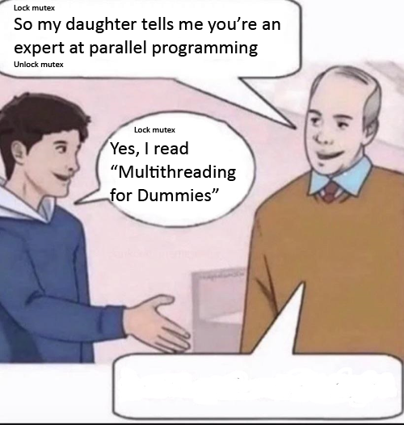

---

title: multithreading
author: eranbu
date: 2.2026
marp: true
theme: gaia
paginate: true

---


## GTest / GMock

```cpp
TEST(MyServiceTest, SuccessPath) {
    MockDatabase mock_db;
    MyService service(&mock_db);

    // script the expected behavior:
    // "Expect Login called with 'admin' and 8080 exactly once. Return true."
    EXPECT_CALL(mock_db, Login("admin", 8080))
        .Times(1)
        .WillOnce(Return(true));

    // "Expect Query called with ANY string. Return 21."
    EXPECT_CALL(mock_db, Query(_))
        .WillOnce(Return(2m1));

    // ACT
    int result = service.ProcessData("admin");

    // ASSERT
    EXPECT_EQ(result, 42); // 21 * 2 = 42
}
```

---




# 🚀 Writing Multithreaded Code

Some info and technics

---

# 📅 Agenda

1. **The Thread:** History 📜, APIs 🔌, & Properties
2. **The Race:** Mechanics 🏎️ & Detection 🕵️‍♂️
3. **C++ Primitive Safety:** The "Is it Safe?" Checklist ✅
4. **Thread vs. Task:** Architecture 🏗️ & Pools 🏊
5. **Synchronization:** Mutex 🔒, CV 🔔, & Custom
6. **Priority Inversion:** The Silent Killer 🔕
7. **OS Nuances:** Windows 🪟 / Linux 🐧 / VxWorks 🤖


---


<style scoped>
h1 {
    color: #ffffff;
    text-shadow: 2px 2px 4px #000000;
}
</style>

# Basics 🧱🛠️📚💡

---


# What is a Thread? 🧵
## 📜 Evolution

* **Process Era 🏭:** Heavyweight, isolated memory.
* **OS Threads (pthreads/WinAPI) 🤝:** Lightweight, shared address space.
* **Language Support 🗣️:**
    * **Pre-C++11 🌑:** Library only (Boost, Qt). No memory model.
    * **C++11 🌟:** `std::thread`, Memory Model defined.
    * **C++20 ✨:** `std::jthread` (Cooperative, auto-join).

---

# APIs: The Wrapper Layers 📦

```cpp
// 1. POSIX (Raw & Dangerous ☠️)
pthread_t t;
pthread_create(&t, NULL, func, arg);

// 2. Boost (The Precursor 🦕)
boost::thread t(func);

// 3. C++11 (The Standard 📘)
std::thread t([]{ /* work */ });

// 4. C++20 (The Safe Wrapper 🛡️)
std::jthread t([](std::stop_token st){
    while(!st.stop_requested()) { /*...*/ }
});

```

---

# Thread Properties 🏷️

* **Affinity 🧲:** Binding to a CPU Core.
* **Priotiry 🚀** 
* **Stack Size 📚** 
* **Name 📛** 

```cpp
// Example: Setting name (Platform specific 🐧)
pthread_setname_np(pthread_self(), name);

// Example: Affinity (Core Binding 📍)
cpu_set_t cpuset;
CPU_ZERO(&cpuset);
CPU_SET(0, &cpuset); // Core 0
pthread_setaffinity_np(thread.native_handle(), sizeof(cpu_set_t), &cpuset);

```

---

# The Race 🏎️💨

**Data Race Definition ⚠️:**
Two threads access memory concurrently, one is a **write** ✍️.

```cpp
int counter = 0; // Shared Resource 

void run() {for (int i = 0; i < 100000; ++i) { counter++; }}

int main() {
    std::thread t1(run);    std::thread t2(run);
    t1.join(); t2.join();

    std::cout << counter << "\n";
}

```

---


<style scoped>
h1 {
    color: #ffffff;
    text-shadow: 2px 2px 4px #000000;
}
</style>

# Multithreading & C++ 🏗️🏭


---

# Static Initialization 🧙‍♂️

**Is it safe?**

* **C++98 ❌:** No. (Broken Double-Checked Locking).
* **C++11 ✅:** **YES.** "Magic Statics".

```cpp
bool& a()
{
    static bool b = [](){bool c; std::cin>>c;return c;}();
    return b;
}
```

---

# Smart Pointers: `shared_ptr` 🧠

**Thread Safety Levels:**

1. **Control Block (Ref Count) 🔢:** Thread-Safe (Atomic).
2. **Managed Object 📦:** **NOT** Thread-Safe.

```cpp
std::shared_ptr<int> ptr = std::make_shared<int>(0);

// Thread A 🟢
*ptr = 20; 
std::shared_ptr<int> a = ptr; 

// Thread B 🔵
*ptr = 20; 

```

---

# Containers (`vector`, `map`) 📦

* **Read/Read 👀:** Safe.
* **Write/Write ✍️:** Unsafe.
* **Read/Write 💣:** Unsafe.

```cpp
std::vector<int> v = {1, 2, 3};

// Thread A 🟢
int x = v[0]; // OK

// Thread B 🔵
v.push_back(4); // DATA RACE! 💥
                // Reallocation invalidates A's view.

```

---

# IO 📠

**IO (`cout`):** Thread-safe characters, interleaved lines 🔀.

```cpp
void speak(int id) {

    std::cout << "Thread " << id << " says: " << "Hello!\n";
}

int main(
  
) {
    std::thread t1(speak, 1);
    std::thread t2(speak, 2);
    t1.join(); t2.join();
}
```

---

# Atomics: What Can Be Atomic? ⚛️

* **Integers/Pointers (≤ 8 bytes):** **Lock-Free** (CPU Instructions) ⚡.
* **Large Structs (> 16 bytes):** **Uses a Mutex** 🔒.


```cpp
struct Tiny { uint8_t a; uint8_t b; }; // 2 bytes
struct Heavy { long data[100]; };      // 800 bytes 🐘

std::atomic<Tiny>  fast; 
std::atomic<Heavy> slow; 

// Runtime Check 🕵️‍♂️:
if (fast.is_lock_free()) { /* fast  */ }
if (!slow.is_lock_free()) { /* mutex */ }

```

---

# Memory Ordering I 🧠


```cpp
std::atomic<std::string*> ptr;
int data;
 
void producer()
{
    std::string* p = new std::string("Hello");
    data = 42;
    ptr.store(p);
}
 
void consumer()
{
    std::string* p2;
    while (!(p2 = ptr.load()))
        ;
    assert(*p2 == "Hello"); 
    assert(data == 42); 
}

```


---

# Memory Ordering II 🧠


```cpp
std::atomic<std::string*> ptr;
int data;
 
void producer()
{
    std::string* p = new std::string("Hello");
    data = 42;
    ptr.store(p, std::memory_order_release);
}
 
void consumer()
{
    std::string* p2;
    while (!(p2 = ptr.load(std::memory_order_acquire)))
        ;
    assert(*p2 == "Hello"); 
    assert(data == 42); 
}

```


---

# Malloc/New 🏗️

* **Safety:** **Thread-Safe** ✅.
* **Performance:** **Contention** 🐢.

```cpp
void worker() {
    std::vector<int> temp(1000); // Global lock  🔒
}
```

* Use stack
* Use thread local storage
* Allocate once
* `MALLOC_ARENA_MAX`

---


<!-- 
Bad practice
-->

---


# 🚀 Don't write if you don't have to

---


<style scoped>
h1 {
    color: #ffffff;
    text-shadow: 2px 2px 4px #000000;
}
</style>

# C++ Threads Internals 🧩🔬⚙️


---


# Thread vs Task 🏋️‍♂️ 

**Thread:** An OS resource (Heavy 🐘).
**Task:** A unit of work (Logical ☁️).


---

# Thread Pools 🏊‍♂️

* **Thread Pool:** Fixed OS threads (Hardware Limit 💻).
* **Single Thread Pool:** Event Loop 🔄.

## ✅ Use These
* **Boost** /  **Intel TBB** 

## ❌ Avoid These
* **Windows PPL** / **std::async**

---

# Primitives

## Mutex (The Lock 🔒)

**RAII 🛡️.**

```cpp
std::mutex mtx;

void critical_section() {
    // NEVER call mtx.lock() manually 🚫
    std::lock_guard<std::mutex> lock(mtx); 
    
    // Critical section... 🗝️
    // Unlocks automatically on return
}

```

---

# Condition Variable 🚦

Signal threads to wake up 🔔. 


---

Spot the bug !
```cpp
std::condition_variable cv;
std::mutex mtx;

// Consumer 😴
{
  std::unique_lock<std::mutex> lk(mtx);
  cv.wait(lk); 
  process();
}

// Producer 📢
{
  cv.notify_one();
}

```

---

 **Always** use a predicate.

```cpp
std::condition_variable cv;
std::mutex mtx;
bool ready = false;

// Consumer 😴
{
  std::unique_lock<std::mutex> lk(mtx);
  cv.wait(lk, []{ return ready; }); // Prevents Spurious Wakeups 👻
  process();
}

// Producer 📢
{
  {
    std::lock_guard<std::mutex> lk(mtx);
    ready = true;
  }
  cv.notify_one();
}

```

---

# New Message

```cpp
// Basic mt primitive
// Single writer - multiple readeders safe
template <typename T>
class NewMessage {
public:
    // 1. Writer: Update the current value ✍️
    // Thread-Safe. Overwrites previous data if not read yet.
    void AddMessage(const T& msg);

    // 2. Reader: Get Latest message 🛑
    // Returns: The latest message. Always valid memory
    T* GetLatest();
};
```

---


<style scoped>
h1 {
    color: #ffffff;
    text-shadow: 2px 2px 4px #000000;
}
</style>

# Enhanced Topics 🚀🧠🔮

---

# Priority Inversion ⏫⏬

**Scenario:**

1. Low Priority 🐢 holds Mutex.
2. High Priority 🐇 needs Mutex -> Blocks 🛑.
3. Medium Priority 🐕 preempts Low.
**Result:** High Priority blocked by Medium 🤯.

---

# OS Differences 🌍

| Feature | Windows 🪟 | Linux 🐧 | 
| --- | --- | --- | 
| **Scheduler** | Preemptive | Completely Fair Scheduler  | 
| **Time Slice** | Variable | Dynamic | 
| **Priority** | 0-31 | 0-99 (RT) | 
| **API** | WinAPI | pthreads | 

---

# More Topics 📚

* **Deadlock 💀:** Lock A -> Lock B vs Lock B -> Lock A.
* **Livelock 🧟:** Polite yielding forever.
* **False Sharing 📉:** Cache Line contention.

```cpp
// False Sharing Example 🎭
struct {
    std::atomic<int> a; // alignas(64)
    std::atomic<int> b; // alignas(64)
} shared; // 'a' and 'b' fight for L1 cache 🥊

```


---

# API Contracts: Blocking & Reentrancy 📜

**1. Blocking 🛑 (Synchronous)**
* **Definition:** The function does not return until the task is complete.

**2. Reentrant 🔄 (Thread Safe)**
* **Definition:** Can be safely called again before the first call finishes.
* **Key Rule:** **NO** `static` or global state. 

