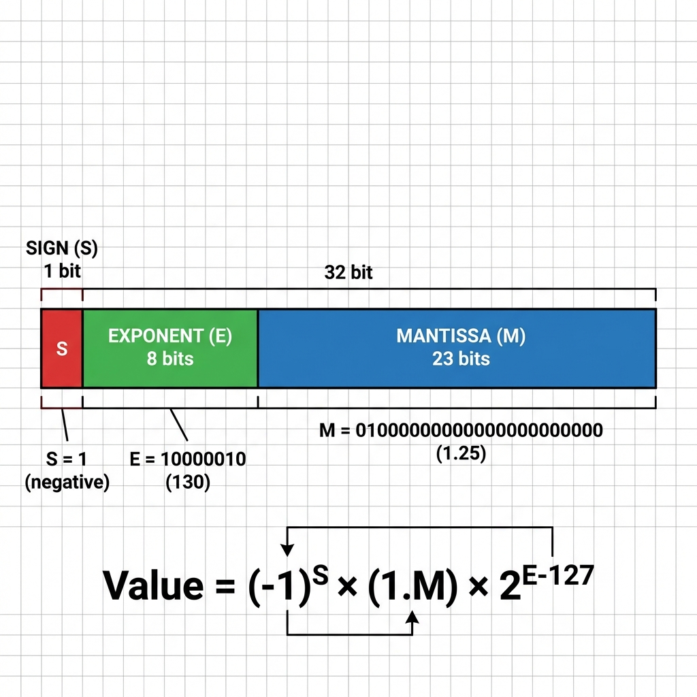
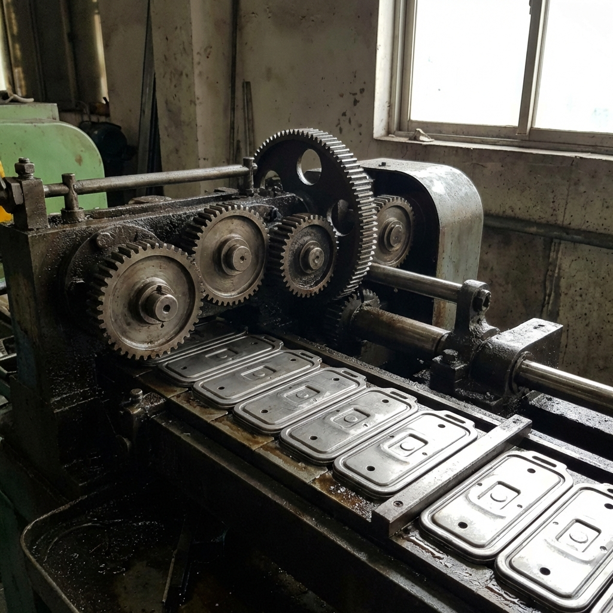
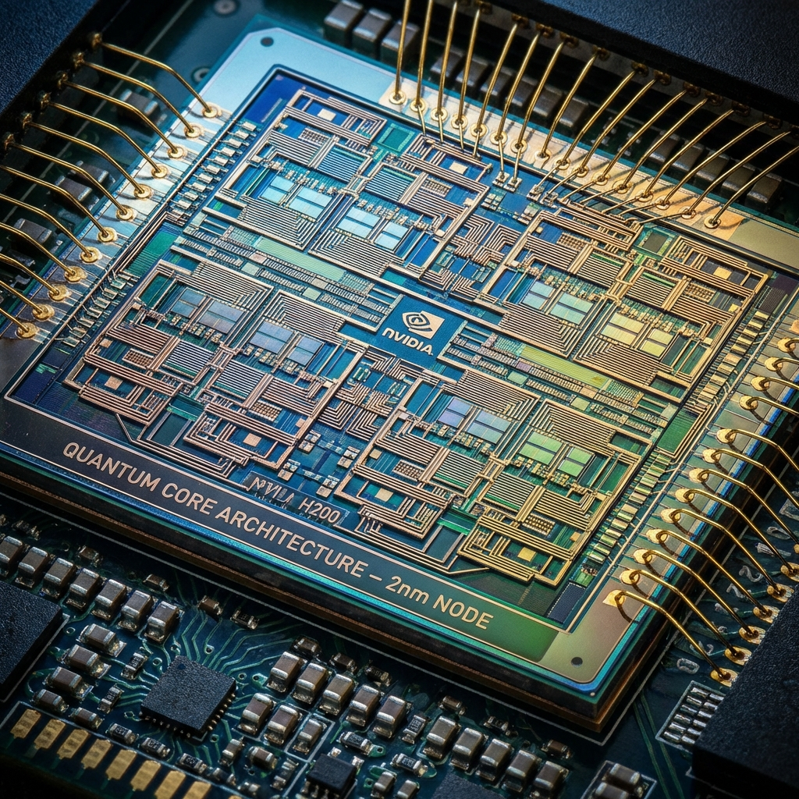

# Floating Point

## 🌊 Fluid Numbers in C++

<!-- Intro to floats. -->

---

# Agenda

1. 💾 Representation (IEEE 754)
2. 🎯 Accuracy & Math Rules
3. 🔄 Binary Consistency
4. 🚀 Hardware & Optimization (SIMD, ARM, Bottlenecks)

<!-- The plan. -->

---

# 💾 Representation




---

<!-- _class: lead -->

# 🧩 Puzzle: Arithmetic

```cpp
if (0.1 + 0.2 == 0.3) {
    std::cout << "Equal!";
} else {
    std::cout << "Not Equal!";
}
```

* A) Equal
* B) Not Equal
* C) Compilation Error
* D) Not Equal with -O3

<!-- Answer: B. 0.1 and 0.2 are infinite fractions in binary. sum is slightly larger than 0.3. -->

---

# 🧩 Puzzle: Order Matters?

```cpp
float a = 1.0f;
float b = 1e20f;
float c = -1e20f;

// Algebra: (a + b) + c  ==  a + (b + c)
std::cout << (a + b) + c << "\n";
std::cout << a + (b + c) << "\n";
```

* A) `1`, `1`
* B) `0`, `1`
* C) `1`, `0`
* D) `0`, `0`

<!-- Answer: B. (1 + 1e20) is 1e20 (percentage of 1 is too small). 1e20 - 1e20 = 0.
1 + (1e20 - 1e20) = 1 + 0 = 1. Associativity holds for Reals, NOT Floats! -->

---

# 🧩 Puzzle: Division vs Reciprocal

```cpp
float a = 1.2f;
float b = a / 3.0f;
float c = a * (1.0f / 3.0f);

if (b == c) {
    std::cout << "Equal";
} else {
    std::cout << "Not Equal";
}
```

* A) Equal
* B) Not Equal
* C) Depends on Flags
* D) Compilation Error

<!-- Answer: B (Usually). Division is NOT multiplication by reciprocal (rounding differences). 
However, C is also correct if `-freciprocal-math` is used! -->

---


## 💾 IEEE 754

* 🔢 Sign bit, Exponent, Mantissa.
* 📏 `float` (32-bit), `double` (64-bit).
* ♾️ Special values: `Inf`, `-Inf`, `NaN`.

<!-- IEEE 754 details. S E M. -->

---

## 🎯 Accuracy

* ❌ Not all real numbers typically represented exactly.
* 🧮 `0.1 + 0.2 != 0.3`

<!-- 0.1 + 0.2 != 0.3 demo. -->

---

## 📐 Math Rules

* ⚠️ Associativity holds in algebra, NOT in floating point.
* 🔢 `(a + b) + c != a + (b + c)`
* 🚩 **Implication**: Compilation flags can change results (reordering).

<!-- Associativity fails. Compiler reordering. -->

---

# 🌍 Example: Geo Coordinates

* Earth Radius $R \approx 6,371,000$ meters.
* `float` (23 bits) has $\approx 7$ significant digits.
* Precision at $R$:
    * $6.371 \times 10^6 \times 1.19 \times 10^{-7} \approx 0.75$ meters.
* ⚠️ **1 Meter Error!**
* **Conclusion**: Use `double` for ECEF / UTM coordinates!

<!-- Show code example of nextafter. -->

---

# 🧩 Puzzle: NaNs
```cpp
using n = std::numeric_limits<double>;
auto q = n::quiet_NaN();
auto s = n::signaling_NaN();
double r1 = q + 1.0; 
double r2 = s + 1.0;
```
*Which operation crash ?*
* A) None (Both silent)
* B) 1 only
* C) 2 only
* D) Both

<!-- Answer: A. qNaN propagates silently. sNaN signals invalid operation. 
BUT...  Environment must support/enable traps for it to crash, but the flag is raised. -->

---

# ⚠️ Signaling vs Quiet NaN

* **qNaN (Quiet NaN)**:
    * Default `NaN`. Propagates silently.
    * **Set**: `std::numeric_limits<T>::quiet_NaN()` or `0.0/0.0`.
    * **Check**: `std::isnan(x)`.
* **sNaN (Signaling NaN)**:
    * Triggers exception (`FE_INVALID`) on use. Rare.
    * **Set**: `std::numeric_limits<T>::signaling_NaN()`.

<!-- 
sNaN traps. qNaN flows. 
Note: Math operations (0/0, sqrt(-1)) produce qNaN. 
sNaN is manually created (numeric_limits) or from uninitialized memory (if supported). 
-->

---

# 🧩 Puzzle: Manual Abs?

```cpp
float my_abs(float f) {
    int* i = (int*)&f;
    *i &= 0x7FFFFFFF; // Clear sign bit
    return f;
}
```
*What happens?*

* A) Returns `abs(f)`
* B) Undefined Behavior
* C) Returns `-f`
* D) Compilation Error

<!-- Answer: A. But .. Strict Aliasing Violation! . -->

---

# 📉 Denormals (Subnormals)

* **What?** Very small numbers (near 0) without leading 1.
    * $0.mantissa \times 2^{min\_exp}$ vs $1.mantissa \times 2^{exp}$
* **Problem**: handled by Microcode / Software Trap 🐢.
    * Can be **100x slower**!
* **Solution**:
    * **FTZ** (Flush-to-Zero): Output $\to$ 0.
    * **DAZ** (Denormals-Are-Zero): Input $\to$ 0.
    * Standard in Audio / Games.

<!-- Denormals are slow. Use FTZ/DAZ. -->

---


<!-- _class: lead -->

# 🔄 Binary Consistency & Environment



---

## 🔄 Consistency (Why results differ?)

* 💻 **Same code, different results?** Yes!
* ⚙️ **Instruction Sets (ISA)**:
    * **FMA** (`a*b+c`): One step, **one rounding**.
    * **No FMA**: `(a*b)+c`: Two steps, **two roundings**.
* 🏗️ **Architecture & Dispatching**:
    * **AVX / AVX2 / AVX-512**: Different instructions -> different rounding.
    * **Libraries (IPP/MKL)**: **Auto-dispatch** code based on CPU.
    * ⚠️ **Result**: Same binary gives different results on i7 vs i9!
* 🧵 **Parallelism**:
    * Reduction `sum(vector)` depends on order (threads/chunks).
    * Since `(a+b)+c != a+(b+c)`, order changes result!

<!-- Different results on different machines? Yes. -->

---

## 🚩 Flags and Optimization

* 🚀 `-ffast-math` (or `-Ofast`):
    * `-fno-math-errno`, `-funsafe-math-optimizations`
    * `-ffinite-math-only`, `-fno-rounding-math`
    * `-fno-signaling-nans`, `-fcx-limited-range`
    * `-fexcess-precision=fast`
* ⚠️ **Unsafe Math Includes**:
    * `-fno-signed-zeros`, `-fno-trapping-math`
    * `-fassociative-math`, `-freciprocal-math`

<!--
-ffast-math breakdown:

* -fno-math-errno: `sqrt(-1)` returns NaN but doesn't set global `errno`. (Syscall avoidance).
* -funsafe-math-optimizations: Enables the risky ones below.
* -ffinite-math-only: Assumes NO NaN/Inf! `isnan(x)` -> `false` (always). `x != x` -> `false`.
* -fno-rounding-math: Assumes default (Nearest) rounding. Changing `fesetround` won't affect optimizers (constant folding).
* -fno-signaling-nans: sNaN behaves like qNaN (no trap).
* -fcx-limited-range: Complex mult `(a+bi)(c+di)` uses simple formula `ac-bd...`. Overflows easier.
* -fexcess-precision=fast: Casts to `float`/`double` immediately (no 80-bit temp precision on x87).

Unsafe/optimization flags:
* -fno-signed-zeros: Treat `-0.0` as `+0.0`. `x + 0.0 -> x` (safe?).
* -fno-trapping-math: Assume code doesn't trap. Moves instructions past checks.
* -fassociative-math: `(a + b) + c` == `a + (b + c)`. Enables vectorization/parallel reduction!
* -freciprocal-math: `x / y` -> `x * (1/y)`. `1/y` computed once. 1.0/3.0 is not exactly 1/3.
-->

---

## ⚡ Intel IPP / MKL

* 🏎️ **Hand-Tuned Assembly**: Beats compiler auto-vectorization.
* 🔄 **Auto-Dispatch (Merged Static)**:
    * Single binary contains code for SSE, AVX, AVX-512.
    * `ippInit()` detects CPU and points to correct function.
* 🎯 **Single Processor Static Linkage**:
    * Link **only** the AVX2 code (e.g., `ipp_h9.lib` / custom build).
    * ✅ **Smallest binary**. No runtime dispatch overhead.
    * ⚠️ **Risk**: Crashes if run on unsupported CPU (e.g., old Atom).
    * *Use case*: Embedded systems, known hardware.

---


# 📝 Summary

* 🤷‍♂️ Reproducibility is hard with floats.

<!-- Reproducibility issues. -->

---

<!-- _class: lead -->

# 🚀 Hardware Aspects



---

## ⚡ Intel IPP / MKL

* 🏎️ **Hand-Tuned Assembly**: Beats compiler auto-vectorization.
* 🔄 **Auto-Dispatch (Merged Static)**:
    * Single binary contains code for SSE, AVX, AVX-512.
    * `ippInit()` detects CPU and points to correct function.
* 🎯 **Single Processor Static Linkage**:
    * Link **only** the AVX2 code (e.g., `ipp_h9.lib` / custom build).
    * ✅ **Smallest binary**. No runtime dispatch overhead.
    * ⚠️ **Risk**: Crashes if run on unsupported CPU (e.g., old Atom).
    * *Use case*: Embedded systems, known hardware.

<!-- IPP Static Linking. Dispatch vs Single Processor. -->

---

## 🎛️ Floating Point Control Register

* **MXCSR** (SSE) / (**FPU CW** (x87)).
* Controls:
    * **Rounding Mode** (Nearest, Down, Up, Zero).
    * **Exception Masks** (Invalid, DivByZero, etc.).
* ⚠️ **Global State!**

---

## 💥 Example: Rounding Mode Bleed

```cpp
void bad_lib() {
    std::fesetround(FE_DOWNWARD); // Global change!
}

int main() {
    // 1.0 / 3.0 normally 0.33333334
    bad_lib();
    // Now it might be 0.33333331!
}
```

<!-- Rounding mode affects everything. Be careful with libraries. -->
<!-- Full example: numbers/examples/rounding/main.cpp -->

---

## 📱 ARM / Neon

* �️ **FMA (Fused Multiply Add)**: Standard in ARMv8 (AArch64).
    * x86 only got FMA recently (Haswell). **Results will differ!**
* 🛑 **Denormals / FTZ**:
    * Older NEON (32-bit) **always** flushed to zero (Non-IEEE).
    * AArch64 is IEEE compliant but often runs in FTZ mode for speed.
* ⚠️ **NaN Propagation**:
    * Default NaN payloads may differ from x86.
* **Exceptions**: Neon often doesn't generate FP traps by default.

<!-- Neon, FTZ. FMA is standard. -->

---

## ⏳ Data vs Commands Bottleneck

* 🐌 FP operations can be fast, waiting for data (memory) is often the bottleneck.

<!-- Memory bandwidth vs Compute. -->

---


# 📝 Summary

* 💻 Hardware details matter for high performance.

<!-- Hardware details. -->

---

<!-- _class: lead -->

# 🛑 Don't

🚫 Do not compare floating point numbers with `==`.
✅ Use an epsilon or helper functions.

<!-- Don't use ==. -->

---

<!-- _class: lead -->

# 🛠️ Tool

**Godbolt** (Compiler Explorer)
🔬 Check how your floating point code compiles with different flags (`-O3`, `-ffast-math`).

<!-- Godbolt demo. -->

---

# 🎓 Lecture Summary

* 💾 IEEE 754 Representation.
* 🎯 Precision pitfalls and non-associativity.
* 💻 Hardware influence (SIMD, Registers).
* 🚀 Optimization flags trade accuracy for speed.

<!-- Wrap up. -->
