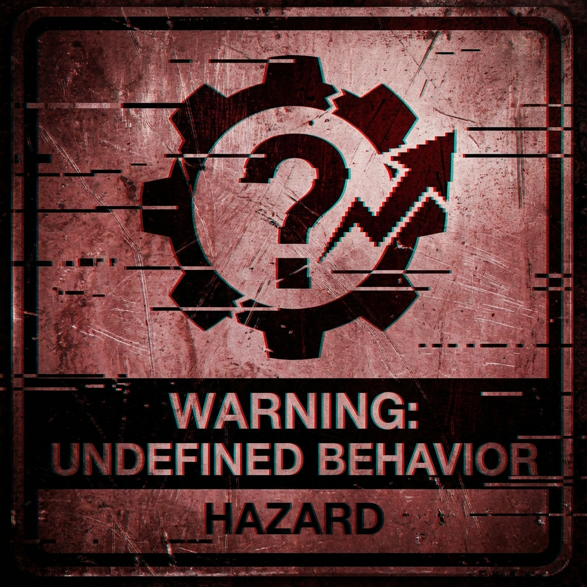
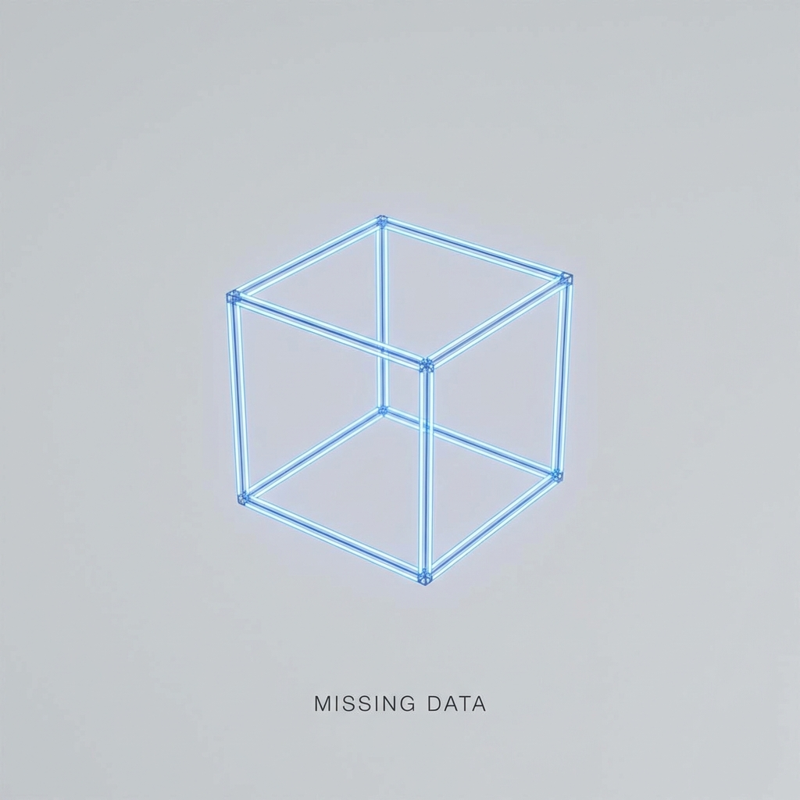
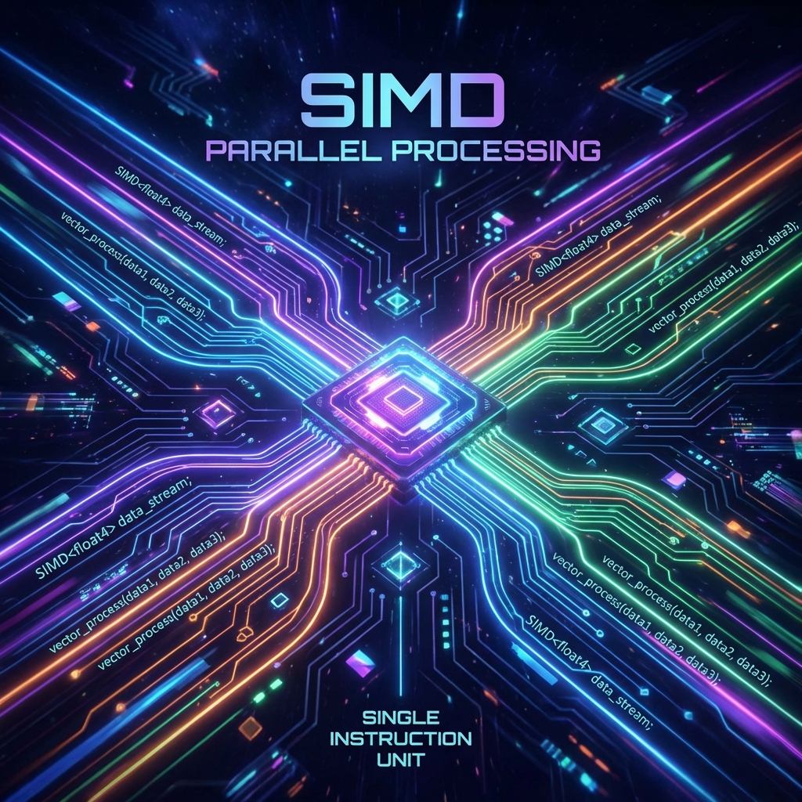

# Integers

## 🔢 Integers in C++

<!-- int, short, long, long long, char. sizes. signed/unsigned. -->

---

# Agenda

1. 🔢 Integer Types & Representation
2. 💣 Undefined Behavior (UB)
3. ➗ Division by Zero
4. 🔄 Rounding & Division
5. ❓ Alternatives to NaN (std::optional)

<!-- The plan for this lecture. -->

---

<!-- _class: lead -->

# 🔢 Types & Representation


---

## Integer Types

| Bits | Fixed Width (`<cstdint>`) | C++ Standard Types |
| :--- | :--- | :--- |
| **8** | `int8_t`, `uint8_t` | `signed char`, `unsigned char`, `char` |
| **16** | `int16_t`, `uint16_t` | `short`, `unsigned short` |
| **32** | `int32_t`, `uint32_t` | `int`, `unsigned int`, `long`* |
| **64** | `int64_t`, `uint64_t` | `long long`, `unsigned long long` |


<!-- show sizeof(int) etc. std::int32_t. <cstdint> -->

---

## 🧐 Type Nuances

* **`size_t`**: The type returned by `sizeof` and `std::vector::size`. Guaranteed to hold the size of the largest object.
* **`long`**: 32-bit on Windows (even 64-bit builds!), 64-bit on Linux (64-bit). ⚠️ Portability Trap!
* **`char`**: Can be `signed` or `unsigned` by standard (compiler flag dependent).
    * Use `char` for text characters.
    * Use `uint8_t` for raw data / pixels.
* **32-bit Systems**: `size_t` is 32-bit. Pointers are 32-bit.
    * $2^{32} = 4GB$ memory limit.

<!-- size_t matches pointer size usually. long is tricky. char signedness varies (x86 usually signed, arm unsigned). chars for text, uint8_t for bytes. -->


---

## 🧩 Puzzle: Range of 8-bit Types

What is the range of `int8_t` and `uint8_t`?

A) `0..255`, `-128..127`
B) `-128..127`, `0..255`
C) `-127..128`, `0..256`
D) `-127..127`, `0..255`

<!-- Answer: B. int8_t is signed (-128 to 127). uint8_t is unsigned (0 to 255). -->

---

## 💾 Representation: 2's Complement

* 📉 How negative numbers are stored
* 🔄 `~x + 1`
* 📊 Range: $[-2^{n-1}, 2^{n-1}-1]$
* 0️⃣ Two zeros? No.

<!-- 2's complement explanation. Flip bits + 1.
C++20 required to use two's complement representation -->


---

<!-- _class: lead -->

# 💣 Undefined Behavior in Integers



---

## 🧩 Puzzle

```cpp
int main() {
  char buf[50] = "y";
  for (int j = 0; j < 9; ++j) {
    std::cout << (j * 0x20000001) << std::endl;
    if (buf[0] == 'x') break;
  }
}
```

* A) Prints 9 numbers
* B) Does not compile
* C) Prints 4 numbers
* D) Infinite Loop 
    

<!-- Answer: D. j*0x20000001 overflows when j=4. Compiler assumes UB impossible, so j < 4, which means j < 9 is always true! -->

---

## 💥 Signed Overflow

* ⚠️ `INT_MAX + 1` is UB!
* 🔄 **Unsigned** overflow is well-defined (modulo arithmetic).


---

## 🧩 Puzzle: Big Arrays

```cpp
int main() {
    size_t Count = 5ull * 1024 * 1024 * 1024; // 5GB array
    char* array = (char*)malloc(Count); 
    int index = 0; // ⚠️
    for (size_t i = 0; i < Count; i++) {
        array[index++] = 0;
    }
}
```

* A) Works fine
* B) Segmentation Fault (Crash)
* C) Infinite Loop

<!-- Answer: B/C. index is int (32-bit). Overflows at 2GB, becomes negative -> Invalid Access -> Crash.
BUT with -O3 it becomes C. The compiler assumes UB impossible and uses long long for the index !

g++ main.cpp -O3 -fsanitize=undefined

main.cpp:15:20: runtime error: signed integer overflow: 2147483647 + 1 cannot be represented in type 'int'
 -->

---

## ⬅️ Shifting

* 🚫 `x << -1` (UB)
* 🚫 `(-1) << 4` (UB)
* 📏 `x << 32` (on 32-bit int) (UB)

<!-- Shifting by negative or >= width is UB. -->

---

<!-- _class: lead -->

# ➗ Division


---

## 🧩 Puzzle: Division by Zero

```cpp
int main() {
    int a = 100, b = 0;
    try {
        int c = a / b;
    } catch (...) {
        std::cout << "caught";
    }
}
```

* A) Prints "caught"
* B) Crash (SIGFPE)
* C) Prints "0"
* D) Prints "inf"

<!-- Answer: B. try-catch does not catch hardware exceptions (SIGFPE). The program crashes. -->

---

## 💥 Division by Zero

* ☠️ Runtime crash (SIGFPE) on Integer division.
* ⚠️ `a % 0` (modulo) is also a crash!
* 🔍 **Checks:**
    * `if (b == 0)`
    * Image Processing: Threshold the divisor

<!-- Hardware exception on x86/x64. Modulo 0 is same as div 0. Threshold/Clamp divisor for pixels. -->

---

## ✂️ Rounding

* ⬇️ Integer division truncates towards zero.
* 🧮 `5 / 2 = 2`
* 📉 `-5 / 2 = -2`

<!-- Truncation towards zero. -5/2 is -2. -->

---

## 💥 Handling SIGFPE

```cpp
jmp_buf buf;
void handler(int) { longjmp(buf, 1); } // Must jump!

int main() {
    signal(SIGFPE, handler);
    if (setjmp(buf) == 0) {
        int a = 1 / 0; // Crash -> Handler -> longjmp
    } else {
        std::cout << "Recovered!";
    }
}
```

* **When to use?**
    * ⚠️ **Never**

---

<!-- _class: lead -->

# 🚫 No NaN for Integers



---

## 🤷‍♂️ The Problem

* 🌫️ Floats have `NaN` (Not a Number).
* 🔢 Integers don't.
* ❓ How to represent "No Value"?

<!-- No NaN for int. -1 is often used but bad. -->

---

## 📦 The Solution: std::optional

* ✨ C++17 feature.
* 🚫 Don't use "Magic Numbers" (e.g., -1 for error).

```cpp
std::optional<int> divide(int a, int b) {
    if (b == 0) return std::nullopt;
    return a / b;
}
```

<!-- std::optional is better. typesafe. -->


---

<!-- _class: lead -->

# 🚀 SIMD & Integers



---

## 🏎️ SIMD Integers

* **S**ingle **I**nstruction, **M**ultiple **D**ata.
* Process 4 `int`s (SSE) or 8 `int`s (AVX2) at once.
* 🛡️ **Safety**:
    * 🔄 Signed overflow is **defined** to wrap (no UB!).
    * 🚫 No `SIGFPE`. No integer division.

---

## 💻 Example: SIMD Addition

```cpp
#include <immintrin.h>

int main() {
    // [1, 2, 3, 4] + [10, 20, 30, 40]
    __m128i a = _mm_setr_epi32(1, 2, 3, 4);
    __m128i b = _mm_setr_epi32(10, 20, 30, 40);
    
    __m128i sum = _mm_add_epi32(a, b);
    
    // Overflow? Wraps! No UB.
    __m128i max = _mm_set1_epi32(INT_MAX);
    __m128i wrap = _mm_add_epi32(max, _mm_set1_epi32(1));
}
```

<!-- Wraps to negative. Cross platform (x86). -->

---

# 🛑 Don't

📏 Do not assume `int` size is always 32 bit.
🔢 Do not use `int` for everything (consider `size_t` for sizes/indices).

<!-- Don't assume sizes. Don't use int for size_t. -->

---

<!-- _class: lead -->

# 🛠️ Tool

**UBSan** (Undefined Behavior Sanitizer)

`g++ -fsanitize=undefined main.cpp`

🕵️‍♂️ Catches signed overflows, invalid shifts, etc. at runtime.

<!-- UBSan demo. -->

---

