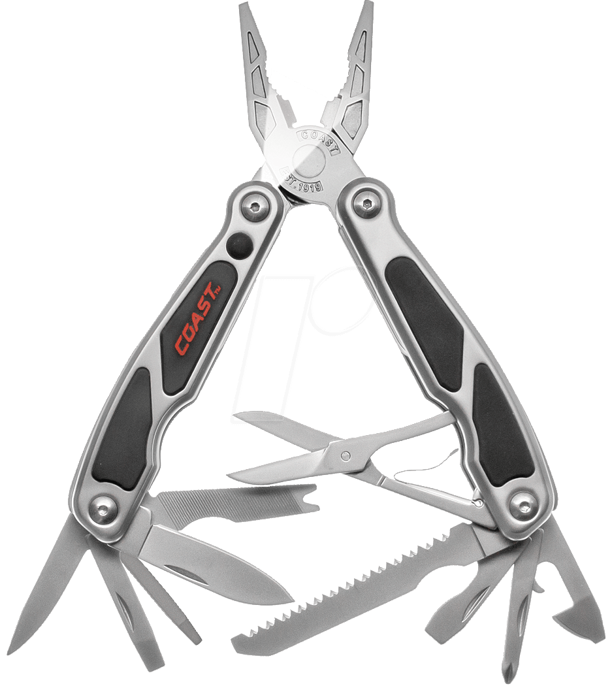

<!--
Preparations :
  vscode :     "C_Cpp.errorSquiggles": "disabled",
  cl.exe window, with large font, on the lecture directory
  g++ in linux, large font, on the lecture directory
-->

# C/C++ Preprocessor

Some advanced usage tips


<!--
-->

--- 


# Preprocessing 🛠️

* #include
* #define
* #define ()
* #pragma

<!--
לא נכנס לשלבי הקומפילציה של קורס קומפילציה
מה שמעניין אותנו כמתכנתים
אילו שגיאות עלולות להגרם משלב זה
-->

--- 


# Preprocessing 🛠️

## **#include**
* #define
* #define ()
* #pragma

<!--
searches a sequence of implementation-defined places for a header identified uniquely by the specified sequence between the < and > delimiters, and causes the replacement of that directive by the entire contents of the header.
-->

--- 

# `#include`

* Two kinds :
  * `#include <>` > `#include ""`
  * In most implementations, `""` looks **first** in the local directory

<!--
Takes all contents and put in the the file
In practice <> are library, user may change the warning level

Other default include directories :

g++:
echo | g++ -E -Wp,-v -

msvc:
echo %INCLUDE%
-->

---

### **📂 Include Search Directories**  

#### **🌍 Environment Variables:**  
🔹 **G++/Clang:** `CPATH` / `C_INCLUDE_PATH` / `CPLUS_INCLUDE_PATH`  
🔹 **MSVC:** `INCLUDE`  

#### **⚙️ Compiler Flags:**  
✅ **G++/Clang:** `-I /path/to/include` | `-isystem /path/to/include`
✅ **MSVC:** `/I"path\to\include"`  

#### **🛠️ CMake:**  
```cmake
target_include_directories(my_target PRIVATE /path/to/include)
```

<!--
target_include_directories(my_target SYSTEM PRIVATE /path/to/include)

system directory - no warnings by default in g++ !

no_warn demo.
-->

---

# 🕒 **Demo Time**  

<br/><br/><br/>

## 📂 **Hierarchy**

<!--
show the files hierarchy
 g++ hierarchy.cpp 
 vs
 cl.exe hierarchy.cpp 

-->
--- 

# `#include ""` Hierarchy 🏗️

<br/>


hierarchy.cpp : `#include <1/1.h>`
1.h : `#include <2/2.h>`
2.h : `#include "1b.h"`

<!--

msvc:
"" searches back in the #include hierarchy

g++:
does not 
-->
---

# Hierarchy in `#include ""`

<br/>


---

# Hierarchy in `#include ""`

🛠 **Compiler Differences:**
- **MSVC**: `""` searches **back up** the `#include` hierarchy
- **g++**: `""` does **not** search back up

---

# **Filename Conflicts**

```cpp
#include "string"

int main()
{
    std::string str("Hello World");
    return 0;

}
```

<!--
clash

has string file in directory.
use <>, dont use common names, use prefix or directory (proj/string)

-->

---

# Platform-Dependent Paths ⚠️


```cpp
#include "1\foo.h" // defines foo

int main()
{
    foo();
    return 0;
}
```
<br/>
<br/>


<!--
plat 


(The problem is that it's windows slash and not platform independent backslash)
Same with lowercase and uppercase (windows ignores)
-->

---

# Circular Dependencies 🔄

```cpp
#include "a.h" // defines a()

int main() {
    a();
    return 0;
}
```

```cpp
In file included from a.h:3,
                 from main.cpp:1:
b.h: In function ‘int sum_a_and_b()’:
b.h:13:16: error: ‘a’ was not declared in this scope
   13 |     return b()+a();
```
<!--
circ 

must show whole example...

Circular dependency.
-->

---

# `math.h` vs `cmath`

Very simple :

All **C standard library header files** has equivalent `c???` where the symbols are defined in `std` namespace.

```cpp
#include <math.h>
double mysin(double x){return sin(x);}
```

```cpp
#include <cmath>
double mysin(double x){return std::sin(x);}
```

---


<!-- 
Bad practice
-->

---

# Tracking API
<br/>


<!--

g++ main.cpp -Itracker -Itracker/manager -Itracker_manager

The api should be flat.
How to flatten ? 
1. Use trampoline :"manager.h" : `#include "../../manager/manager.h"`
2. Add -I of all directories
3. Install flat
-->

---

🚨 **Bad Practices to Avoid:**
- Use **forward declarations** whenever possible.
- Always use **forward slashes** `/` and **lowercase**.
- **Use quotes (#include "")** for non system includes.
- Use **single and flat** include directory for each api.
- Use **directory** name in the #include command (`#include <myproj/myfile.h>`)

- **Avoid using common names** - `#include <common_defs.h>`
- Do not use **absolute paths** - `#include "c:\Users\davido\project\mordor.h"`
- Don't **force include** or use **precompiled headers**.
<!--

-->

---


# Detecting Include Issues 🕵️‍♂️

📌 **Show included files:**
```sh
g++ -H main.cpp
cl /showIncludes main.cpp
```

🔍 **Find which header caused an issue**

<!--

-->

---


# Warning source (msvc)


<br/>


<!--
endian

show in msvc. 
cl will write a warning without it's source
-->

---

# Slow Compilation 🐌💨


```cpp
int main() {
    using namespace boost::multiprecision;

    cpp_dec_float_100 big_float = fibonacci<cpp_dec_float_100>(10);
    std::cout << "Fibonacci(10) as decimal: " << big_float << '\n';

    return 0;
}
```

<!--
Show includes :
1. look for network files
2. look for large files/heavy dependencies
3. try `g++  -ftime-report slow.cpp`
4. forward declarations (remove some headers)
5. move include to cpp (fwd/pimpl)
-->

---

# PImpl Idiom 🏗️

### ❌ Without PImpl (Slow Compilation)

```cpp
#include <my_class_impl.h> // very slow / problematic header file

class MyClass {
public:
    MyClass(const std::string& name);
    void printName();

private:
    MyClassImpl m_impl; 
};
```

---

# PImpl Idiom 🏗️

### ✅ With PImpl (Optimized)

```cpp
#include <memory>

class MyClassImpl;  // Forward declaration

class MyClass {
public:
    MyClass(const std::string& name);
    ~MyClass();  // Required to properly delete the pimpl object
    void printName();

private:
    std::unique_ptr<MyClassImpl> m_pImpl;  // Pointer to implementation
};
```

---

# Tool



--- 

# Tool: clang-tidy

```bash
git clone --depth=1 https://github.com/llvm/llvm-project.git
cd llvm-project/
mkdir build
cd build/
```

linux :
```
wget https://github.com/Kitware/CMake/releases/download/v3.31.6/cmake-3.31.6-linux-x86_64.sh
chmod +x cmake-3.31.6-linux-x86_64.sh 
bin/cmake -DLLVM_ENABLE_PROJECTS="clang;clang-tools-extra;" -DCMAKE_BUILD_TYPE=Release -DCMAKE_INSTALL_PREFIX=install/ -G "Unix Makefiles" ../llvm 
make -j8 install-clang-tidy
```
windows :
```
cmake -DLLVM_ENABLE_PROJECTS="clang;clang-tools-extra;" -DCMAKE_BUILD_TYPE=Release -DCMAKE_INSTALL_PREFIX=install/  ../llvm 
cmake --build build --target install-clang-tidy -- -j8
```

install/clang-tidy iwyu.cpp -p build/ --checks "-*,misc-include-cleaner" --fix -- -I./llvm-project/build/lib/clang/21/include 

---

### **📌 `.clang-tidy` File**
```yaml
Checks: >
  fuchsia-header-anon-namespaces,
  google-global-names-in-headers,
  hicpp-deprecated-headers,
  misc-definitions-in-headers,
  misc-header-include-cycle,
  modernize-deprecated-headers,
  bugprone-suspicious-include,
  misc-include-cleaner,
  readability-duplicate-include

CheckOptions:
  - key: misc-header-include-cycle.IgnoredFilesList
    value: "/my_project/third_party/"

```
<!--

| **Check Name** | **Purpose** |
|--------------|------------|
| `fuchsia-header-anon-namespaces` | Prevents anonymous namespaces in headers (avoids ODR violations). |
| `google-global-names-in-headers` | Warns against defining global names in headers. |
| `hicpp-deprecated-headers` | Detects deprecated C headers (`<stdio.h>` → `<cstdio>`). |
| `misc-definitions-in-headers` | Detects variable/function definitions in headers. |
| `misc-header-include-cycle` | Detects circular includes. |
| `modernize-deprecated-headers` | Replaces deprecated C headers (`<string.h>` → `<cstring>`). |
| `bugprone-suspicious-include` | Detects likely incorrect includes (e.g., local files shadowing system headers). |
| `misc-include-cleaner` | Detects unnecessary includes. |
| `readability-duplicate-include` | Detects duplicate `#include` statements. |
-->

--- 

# Tool: clang-tidy in windows

* Use MSVC `command prompt`
* Create `compile_commands.json`
  * `-G "Ninja" -DCMAKE_MAKE_PROGRAM="d:\ninja\ninja.exe"`
* Run `run-clang-tidy.py` 
  * `-quiet -fix`

* More
  * `clang-apply-replacements` .
  * `// NOLINTBEGIN(readability-magic-numbers)` .
  * `// NOLINTEND(readability-magic-numbers)` .

<!--

| **Check Name** | **Purpose** |
|--------------|------------|
| `fuchsia-header-anon-namespaces` | Prevents anonymous namespaces in headers (avoids ODR violations). |
| `google-global-names-in-headers` | Warns against defining global names in headers. |
| `hicpp-deprecated-headers` | Detects deprecated C headers (`<stdio.h>` → `<cstdio>`). |
| `misc-definitions-in-headers` | Detects variable/function definitions in headers. |
| `misc-header-include-cycle` | Detects circular includes. |
| `modernize-deprecated-headers` | Replaces deprecated C headers (`<string.h>` → `<cstring>`). |
| `bugprone-suspicious-include` | Detects likely incorrect includes (e.g., local files shadowing system headers). |
| `misc-include-cleaner` | Detects unnecessary includes. |
| `readability-duplicate-include` | Detects duplicate `#include` statements. |
-->
--- 


# Preprocessing 🛠️

* #include
## **#define**
* #define ()
* #pragma

---

# Definitions
<br/>


---

# Definitions

```bash
g++ -DUSE_EIGEN  my_program.cpp
g++ -DUSE_EIGEN=1  my_program.cpp
```

```bash
cl /DUSE_EIGEN my_program.cpp 
cl /DUSE_EIGEN=1 my_program.cpp /
```

```cmake
target_compile_definitions(my_program PRIVATE USE_EIGEN)
target_compile_definitions(my_program PRIVATE USE_EIGEN=1)
```

<!--
Do not use many definitions !
It a different program !!

Check each definition, it's a different code !
-->


---


# 🛠️ Predefined - windows


```cpp
#include <algorithm>
#include <Windows.h>

bool is_odd(int IN){return IN % 2 == 1;}

int main()
{

    int k = std::min(3, 4);
    return 0;
}
```

```
error C2589: '(' : illegal token on right side of '::'
error C2059: syntax error : '::'
```

<!---
used_defs

#define NOMINMAX 
#define WIN32_LEAN_AND_MEAN
windows defines min and max
(it defines IN and OUT too)
-->

---


# 🛠️ Predefined - windows


```cpp
#define NOMINMAX 
#define WIN32_LEAN_AND_MEAN

#include <Windows.h>
```

* `#include <Windows.h>` only in cpp file !

---

# 🛠️ Predefined - unix

```cpp
#include <string>
#include <iostream>

std::string is_unix(bool unix){return unix?"yes":"no";}

int main()
{

    std::cout<<"Is Unix: "<<is_unix(true)<<std::endl;
    return 0;
}
```


<!---
used_defs: main2

main2.cpp:4:26: error: expected ‘,’ or ‘...’ before numeric constant
    4 | std::string is_unix(bool unix){return unix?"yes":"no";}
-->


---


# Predefined 

* Standard :
  * `__FILE__`  `__LINE__`  `__func__`
  * `__DATE__`  `__TIME__`
  * `__cplusplus` → **C++ standard version**

<br/>

...all identifiers that contain a double underscore __ in any position and each identifier that begins with an underscore followed by an uppercase letter **is always reserved**


---

# Predefined 


* Non-standard:
  * `_MSC_VER/__INTEL_COMPILER/__clang__/__INTEL_LLVM_COMPILER/__GNUC__`

* Show all definitions:
```bash
echo | g++ -dM -E -x c++ -
```

```
Properties -> C/C++ -> Preprocessor
```

[MSVC](images/msvc_macros.pdf)

<!--
echo | g++ -dM -E -x c++

https://learn.microsoft.com/en-us/cpp/preprocessor/predefined-macros?view=msvc-170
-->

---


# 🛠️  Words to Avoid 

| Category | Examples |
|----------|---------|
| **C Standard Macros** | `NULL`, `TRUE`, `FALSE`, `EOF` |
| **OS-Specific Macros** | `unix`, `linux`, `WIN32` |
| **Windows API Conflicts** | `IN`, `OUT`, `min`, `max` |
| **STL Conflicts** | `index`, `count`, `list`|
| **Reserved Names** | `find`, `erase`, `_MyVar`, `__my_var` |

---

# Debug Definitions

``` cpp
#ifdef DEBUG
std::cout << "The value of x is " << x << std::endl
#endif
```

* Debug definitions :
  * "NDEBUG" - standard (for <assert.h>)
  * "_DEBUG" - used in MSVC (using debug runtime)
  * "DEBUG" - commonly used

---

# Tester

``` cpp
class Algorithm
{
public :
    Algorithm(int v);
    void Add(int n);
    void Print();
private:
    int _v;
};

void test1()
{
    Algorithm a(10);
    a.Add(5);
    assert(a._v == 15);
}
```

<!--
test
-->

---


``` cpp
#include <iostream>


int main()
{
    std::cout<<"hello world"<<std::endl;
    return 0;
}
```

<!--
semicol

linux : 
Ctrl+Shift+U → 037E → Enter
-->


---

# Include guard

Old :
```cpp
#ifndef _MY_HEADER
#define _MY_HEADER
#endif
```

New :
```cpp
#pragma once
```

* Don't use within a cpp file
* If file can be #included more than once, use `.inc` extension

<!--
not standard !
-->


---

# 🛠️ Debugging

```cpp
#include <gdal.h>

int main()
{
  return 1;
}
```

`undefined reference to 'main'`

<!---
#define main Main
-->

---

# Preprocessing 🛠️ to file

The **BEST** method to debug preprocessor problems.

* `g++ -E`
* `cl.exe /P`
* `C/C++ -> Preprocessor -> Preprocess to a file`

---


# Preprocessing 🛠️

* #include
* #define
## **#define ()**
* #pragma

---


# Macro

* Avoid:
```cpp
#define SQUARE(x) x * x
#define ABS(x) (x < 0 ? -x : x)

void main(){
    int a = 1;
    std::cout<<"a="<<a<<std::endl;
    std::cout<<"SQUARE(a)="<<SQUARE(a + 1)<<std::endl;
    std::cout<<"ABS(a)="<<ABS(a++)<<std::endl;
    std::cout<<"a="<<a<<std::endl;
}
```

---

# Macro

* Exception :
```cpp
#define DEBUG_PRINT(x) std::cout << "DEBUG: " << #x " = " << x << "in line" << __LINE__ << std::endl

void foo(int x)
{
  DEBUG_PRINT(x);
}
```

<!--
macro/main.cpp
macro/good.cpp
-->


---

# Stringify

```cpp
#define xstr(s) str(s)
#define str(s) #s
#define foo 4.0

int main()
{
     std:: cout << foo << std::endl;
     std:: cout << str(foo) << std::endl;
     std:: cout << xstr(foo) << std::endl;
     return 0;
}
```

<!--
4
foo
4.0
-->

---

# 🛠️ Debugging Macros  


**Check command-line definitions:**
- Use `#ifdef` + `#error` to debug:
```cpp
#ifdef MY_MACRO
#error "MY_MACRO is defined!"
#endif
```
🔹 **Compilation will stop, and the error will be shown.**

---

⚠ **Common pitfalls:**
- Ensure headers are **self-contained**
- **Avoid contamination** - Do not define macros or `using namespace` in header file.
- **Don't use contaminating headers in headers** - `#include <windows.h>`
- **Undef** at the end of the file.


<!--
-->

---


# Preprocessing 🛠️

* #include
* #define
* #define ()
## **#pragma**


--- 

# ⚡ `#pragma` Directives  

* #pragma omp
* #pragma warning(disable: 4996) 
* #pragma warning
* #pragma pack()

* #pragma GCC optimize ("O3")  
* #pragma GCC poison free   

<!--
The ISO C++ language standard does not require the compilers to support any pragmas. However, several non-standard pragmas are supported by multiple implementations

From the standard : 
A preprocessing directive of the form

# pragma pp-tokensopt new-line
causes the implementation to behave in an implementation-defined manner.
-->

---

# ⚡ `#pragma` vs `_Pragma()`  

`_Pragma()` can be inserted into a macro :

```cpp
#define DO_PRAGMA(x) _Pragma (#x)
#define TODO(x) DO_PRAGMA(message ("TODO - " #x))

TODO(Remember to fix this)

```

---


# Boost preprocessor library I

## Example : to_string

```cpp

enum Color{RED,GREEN,BLUE};

int main() {
    Color color = RED;
    std::cout << "Color: " << to_string(color) << std::endl;

    color = BLUE;
    std::cout << "Color: " << to_string(color) << std::endl;

    return 0;
}
```


<!--
color/color.cpp
-->


---

# Boost preprocessor library II

```cpp
// Define attributes as a valid sequence of tuples
#define ATTRIBUTES ((name, std::string)) ((age, int)) ((height, double))

// Define a class using the macros
class Person {
private:
    BOOST_PP_SEQ_FOR_EACH(GENERATE_MEMBERS, _, ATTRIBUTES)

public:
    BOOST_PP_SEQ_FOR_EACH(GENERATE_GETTERS, _, ATTRIBUTES)
    BOOST_PP_SEQ_FOR_EACH(GENERATE_SETTERS, _, ATTRIBUTES)
};
```

---


# 🎉 Questions?  