---
<!-- ✅ D -->

### Q1. 🐙 What does 'git stash' do?

**A)** 🗑️ Deletes untracked files
**B)** 📦 Commits all staged changes
**C)** ⏪ Resets to last commit
**D)** 💾 Saves uncommitted changes, cleans working directory

---
<!-- ✅ C -->

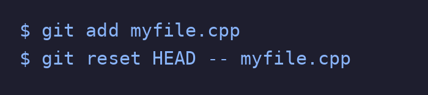

### Q2. 🔄 What is the state of myfile.cpp after these two commands?

**A)** 🌿 Committed to branch
**B)** ❌ Deleted from repo
**C)** 📝 Modified, unstaged
**D)** 📬 Staged, ready to commit

---
<!-- ✅ D -->

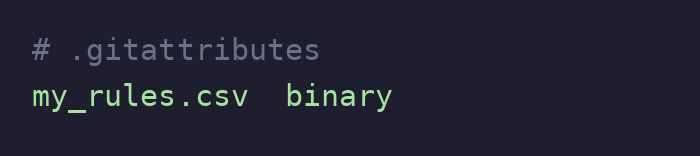

### Q3. ⚙️ What does 'my_rules.csv binary' in .gitattributes do?

**A)** 🪟 Forces CRLF on checkout
**B)** 🗜️ Compresses the file
**C)** 👻 Ignores the file in commits
**D)** 🚫 git won't try to merge it

---

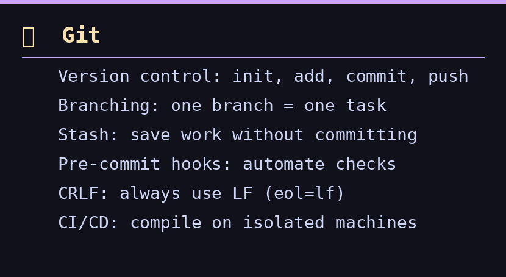

---
<!-- ✅ C -->

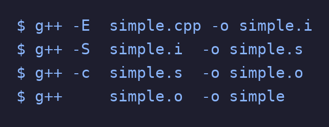

### Q5. 🔧 What is the correct order of these 4 steps?

**A)** Compile → Preprocess → Assemble → Link
**B)** Assemble → Compile → Preprocess → Link
**C)** Preprocess → Compile → Assemble → Link
**D)** Preprocess → Assemble → Compile → Link

---
<!-- ✅ D -->

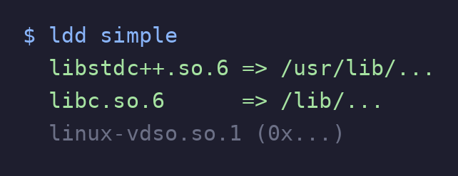

### Q6. 🔍 What does 'ldd simple' show?

**A)** 🏷️ All symbols defined in the binary
**B)** 🖥️ System calls used at runtime
**C)** 🗃️ Static libraries linked into the binary
**D)** 📚 Shared libraries the binary depends on

---
<!-- ✅ D -->

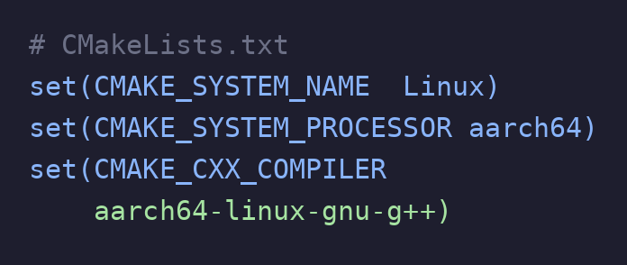

### Q7. 🌍 What does CMAKE_SYSTEM_NAME set in a CMake toolchain file?

**A)** 🏠 The host machine's OS name
**B)** ⚙️ The build system generator
**C)** 🏭 The compiler vendor name
**D)** 🎯 The target OS for cross-compilation

---

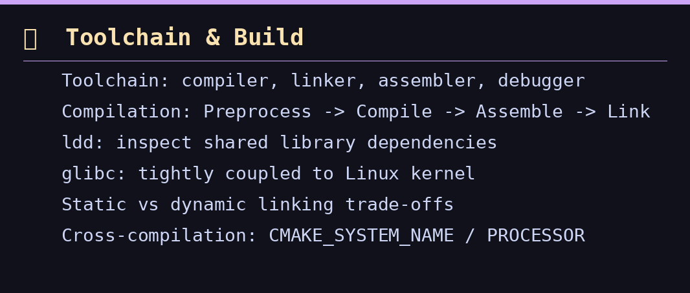

---
<!-- ✅ C -->

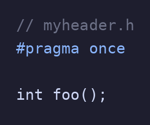

### Q9. 🛡️ What does '#pragma once' do in a header file?

**A)** 🔇 Disables all warnings in the file
**B)** 🏷️ Marks the file as system header
**C)** 📌 Prevents the file from being included more than once
**D)** 🚀 Forces the file to compile before all others

---
<!-- ✅ C -->

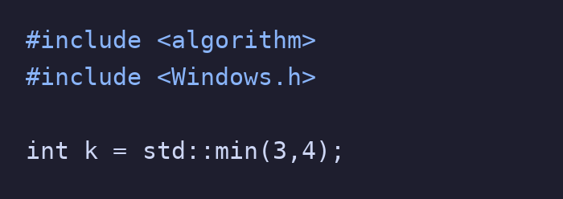

### Q10. 💥 This code fails to compile on Windows. What is the cause?

**A)** 🚫 algorithm is not available on Windows
**B)** 📂 Missing #include for < windows.h>
**C)** 🪟 Windows.h defines min/max as macros
**D)** 📐 std::min needs two identical types

---
<!-- ✅ A -->

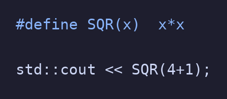

### Q11. 🤯 #define SQR(x) x*x What is the output of SQR(4+1)?

**A)** 9
**B)** 21
**C)** 25
**D)** 1

---

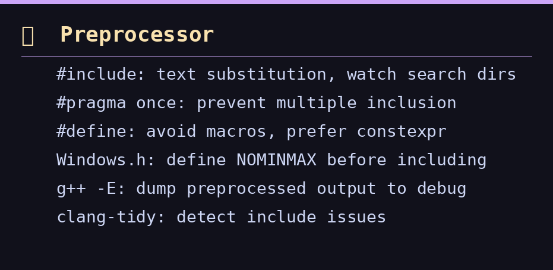

---
<!-- ✅ C -->

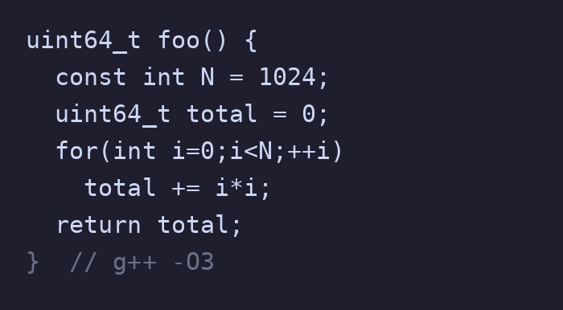

### Q13. 🚀 What does g++ -O3 return for this function?

**A)** 💥 A compiler error: loop is infinite
**B)** 0️⃣ Zero, loop body is optimized away
**C)** 🧮 A single constant (constant folding)
**D)** 🔁 The loop runs 1024 times at runtime

---
<!-- ✅ D -->

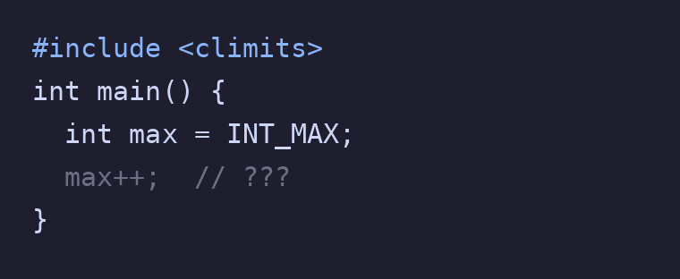

### Q14. 💀 What is the behavior of 'max++' when max == INT_MAX?

**A)** 🛑 Compiler error: overflow detected
**B)** 🔄 Wraps to INT_MIN (guaranteed)
**C)** 0️⃣ Result is 0
**D)** 💣 Undefined behavior (signed overflow)

---
<!-- ✅ D -->

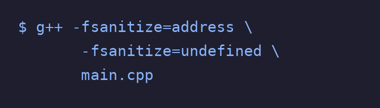

### Q15. 🩺 What do sanitizer flags like -fsanitize=address do?

**A)** ✂️ Strip debug symbols from the binary
**B)** 🔕 Disable compiler optimizations
**C)** ⚡ Speed up execution by removing bounds checks
**D)** 🔎 Add runtime checks that detect memory errors

---

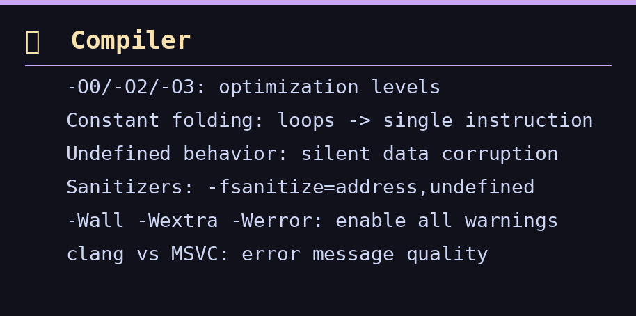

---
<!-- ✅ C -->

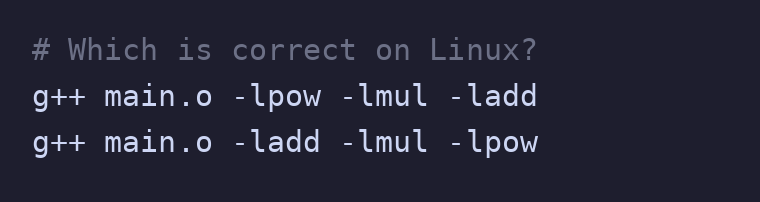

### Q17. 🔗 Which link command is correct on Linux?

**A)** 🛠️ Use --start-group for all cases
**B)** g++ main.o -ladd -lmul -lpow
**C)** g++ main.o -lpow -lmul -ladd
**D)** 🤷 Order does not matter on Linux

---
<!-- ✅ D -->

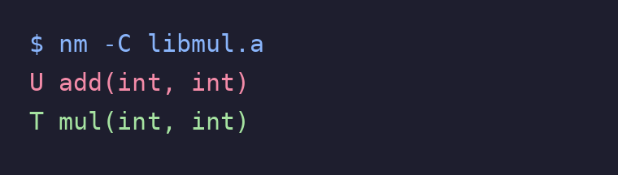

### Q18. 🔍 In nm output, what does 'T' mean next to a symbol?

**A)** 📊 In a data section
**B)** 📋 Template function
**C)** ❓ Undefined, must be linked
**D)** 💡 Defined in the text (code) section

---
<!-- ✅ A -->

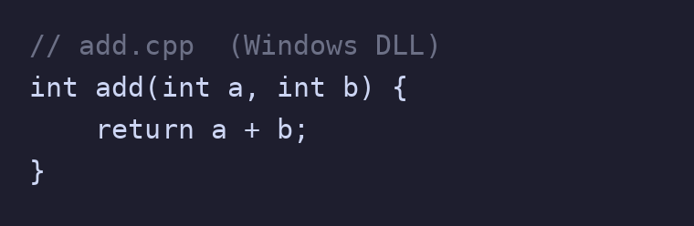

### Q19. 🪟 A Windows DLL is built but no .lib file is created. Why?

**A)** 🚫 No __declspec(dllexport) symbols in the code
**B)** ⚙️ CMake forgot to set SHARED keyword
**C)** 🔑 Wrong architecture (x86 vs x64)
**D)** 🏗️ Missing /MD compiler flag

---

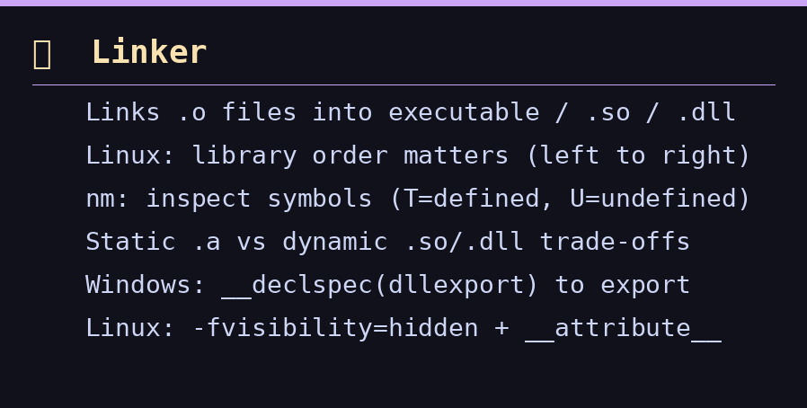

---
<!-- ✅ B -->

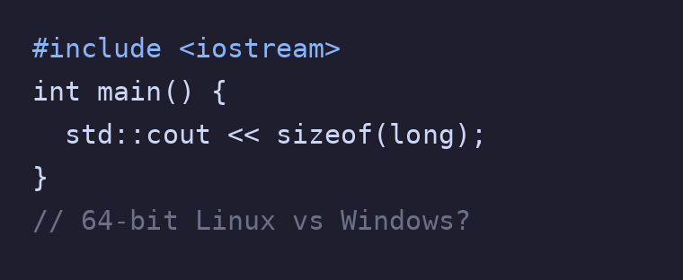

### Q21. 📏 sizeof(long) on 64-bit Linux vs 64-bit Windows?

**A)** Both: 4
**B)** Linux: 8, Windows: 4
**C)** Both: 8
**D)** 🪟 Linux: 4, Windows: 8

---
<!-- ✅ D -->

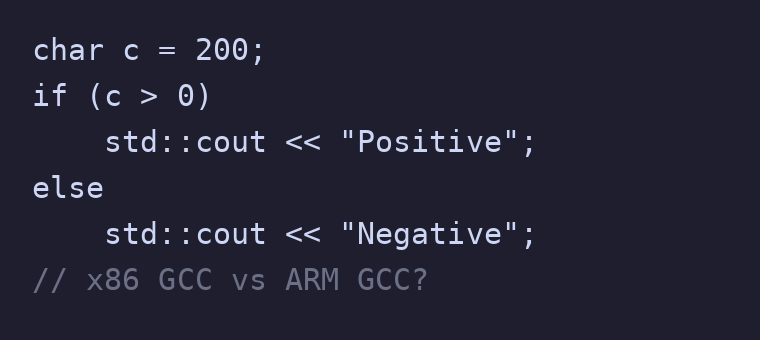

### Q22. 🤔 char c = 200 — what is the output on x86 GCC vs ARM GCC?

**A)** ➖ Both print Negative
**B)** 💀 Undefined behavior on both platforms
**C)** ➕ Both print Positive
**D)** 🔀 Different — char signedness is implementation-defined

---
<!-- ✅ C -->

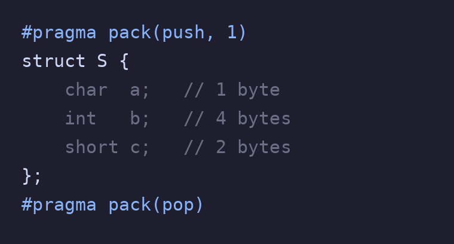

### Q23. 📦 What is sizeof(S) after #pragma pack(push,1)?

**A)** 12
**B)** 4
**C)** 7
**D)** 8

---

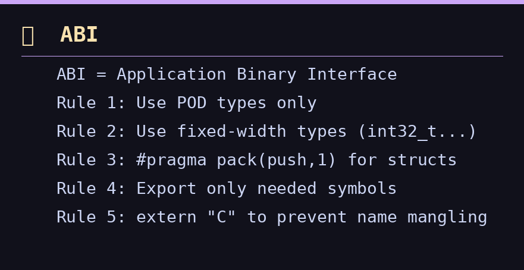

---
<!-- ✅ D -->

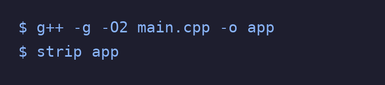

### Q25. ✂️ What does 'strip app' do to the binary?

**A)** 🗑️ Deletes the binary from disk
**B)** 🔒 Encrypts the binary for distribution
**C)** 🔄 Removes optimizations, adds debug info
**D)** 📉 Removes debug symbols, shrinks binary size

---
<!-- ✅ A -->

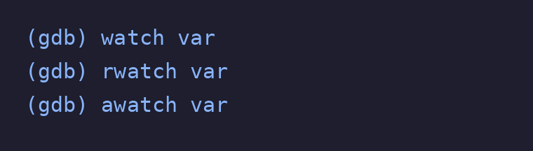

### Q26. 👀 What does 'watch var' do in gdb?

**A)** ⏸️ Stops execution when var is written
**B)** 📖 Stops execution when var is read
**C)** 🖨️ Prints var value every step
**D)** 0️⃣ Sets var to zero and continues

---
<!-- ✅ A -->

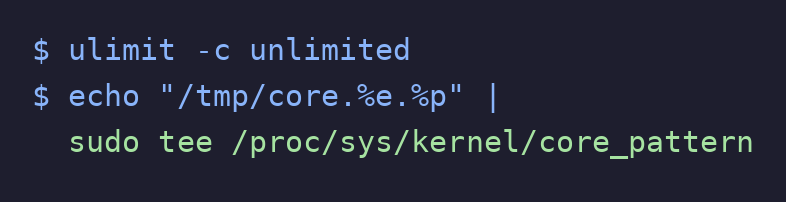

### Q27. 💥 What do these two commands enable on Linux?

**A)** 💾 Core dump creation when a process crashes
**B)** 🔍 Debug symbol loading from /proc
**C)** 🌐 Remote gdbserver on port 2000
**D)** 📝 Full memory logging to /tmp

---

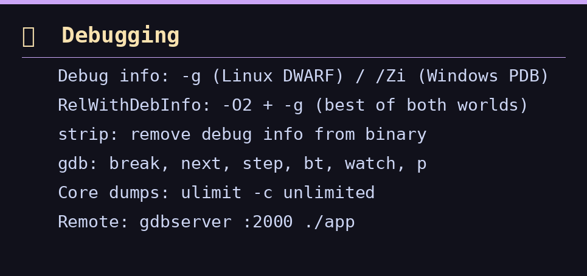

---
<!-- ✅ A -->

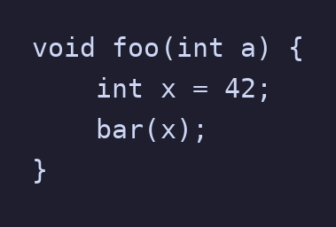

### Q29. 🧱 What memory region holds local variables like 'int x'?

**A)** 📚 Stack
**B)** 💾 ROM
**C)** 🏛️ Global/Static
**D)** 📦 Heap

---
<!-- ✅ D -->

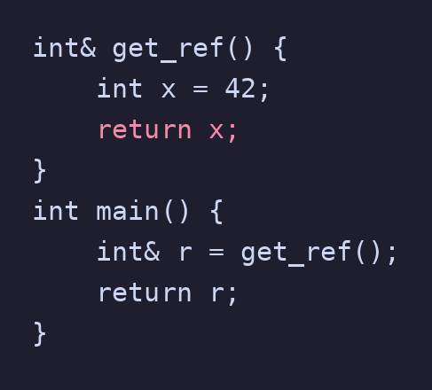

### Q30. 💀 What is wrong with this get_ref() function?

**A)** 📦 x is allocated on the heap
**B)** 🔁 Infinite recursion
**C)** 🔕 Missing return type
**D)** 🔥 Returns a dangling reference to a local variable

---
<!-- ✅ C -->

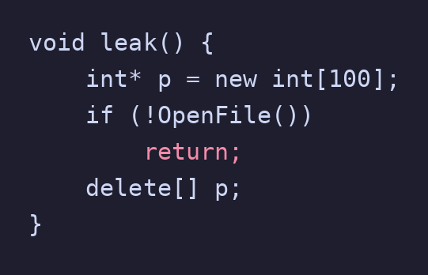

### Q31. 🪣 What bug does this leak() function contain?

**A)** 📏 Buffer overflow
**B)** 👻 Use-after-free
**C)** 💧 Memory leak when OpenFile() returns false
**D)** 🔥 Double free of p

---
<!-- ✅ B -->

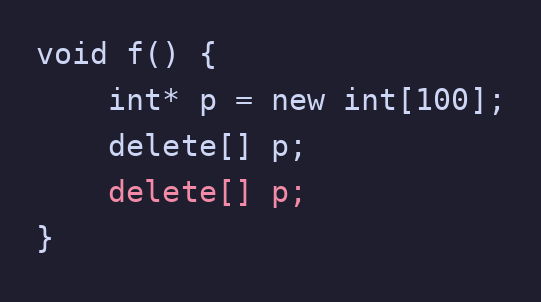

### Q32. 💥 What is wrong with deleting p twice?

**A)** 📦 p becomes nullptr automatically
**B)** 💀 Double free: undefined behavior
**C)** ✂️ Extra memory is freed safely
**D)** 🔕 Compiler catches it at build time

---
<!-- ✅ C -->

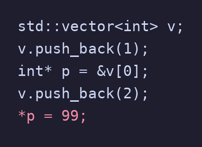

### Q33. 🔄 What happens when you dereference 'p' after push_back?

**A)** 📝 p still points to v[0]
**B)** 📏 Buffer overflow on the stack
**C)** 👻 Use-after-free: push_back may reallocate the vector
**D)** 🛑 Compile error: p is const

---
<!-- ✅ D -->

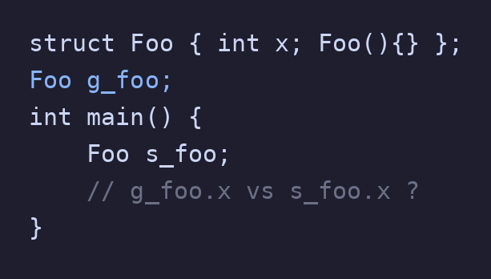

### Q34. 🏛️ What is g_foo.x vs s_foo.x before any assignment?

**A)** g_foo.x is undefined, s_foo.x is 0
**B)** Both are undefined
**C)** Both are 0 (always zero-init)
**D)** g_foo.x is 0, s_foo.x is undefined

---

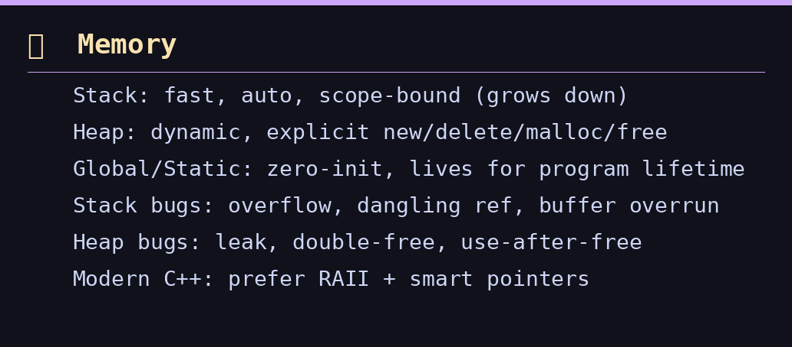

---
<!-- ✅ C -->

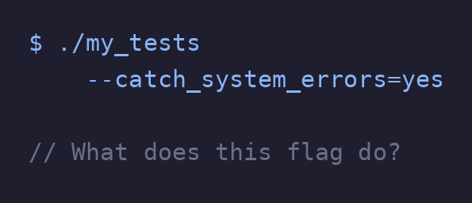

### Q36. 🔴 Boost.Test: what does --catch_system_errors=yes do?

**A)** Lets segfaults produce a core dump
**B)** Only catches C++ exceptions
**C)** Catches segfaults/signals and reports them as test failures
**D)** Disables all error checking

---
<!-- ✅ C -->

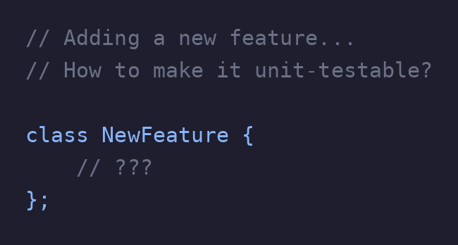

### Q37. 🧪 How do you make a new feature easy to unit test?

**A)** Write the tests after the full feature is done
**B)** Add it directly inside main()
**C)** Implement it as a standalone class
**D)** Use global variables for shared state

---
<!-- ✅ B -->

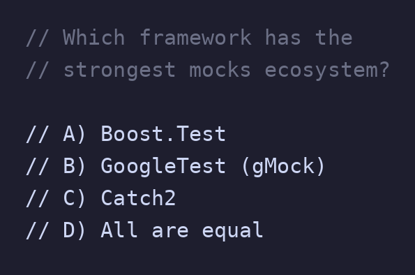

### Q38. 🎭 Which C++ test framework has the strongest mocks ecosystem?

**A)** GoogleTest (gMock)
**B)** Boost.Test
**C)** Catch2
**D)** All are equal

---

---
<!-- ✅ B -->

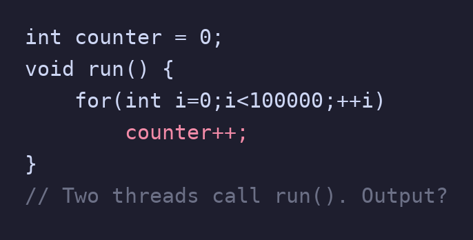

### Q40. 🏎️ Two threads call run(). What is the output of counter?

**A)** 0 (both threads cancel each other out)
**B)** Unpredictable (data race, could be anything)
**C)** A compile error
**D)** Exactly 200000 (always)

---
<!-- ✅ A -->

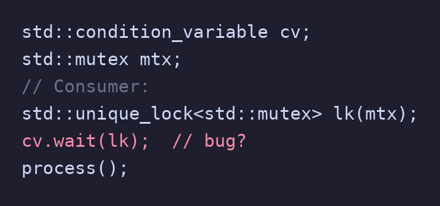

### Q41. 👻 What is the bug in this condition_variable usage?

**A)** Missing predicate: susceptible to spurious wakeups
**B)** mtx must be a recursive_mutex
**C)** process() must be called before wait()
**D)** cv.wait() needs a timeout argument

---
<!-- ✅ A -->

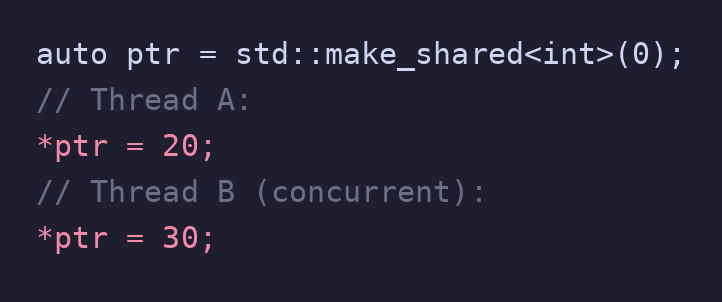

### Q42. 🧵 Is writing *ptr from two threads simultaneously safe?

**A)** No: data race on the managed object
**B)** Yes: shared_ptr is fully thread-safe
**C)** Yes: atomic ref-count protects the value
**D)** Only unsafe on ARM

---

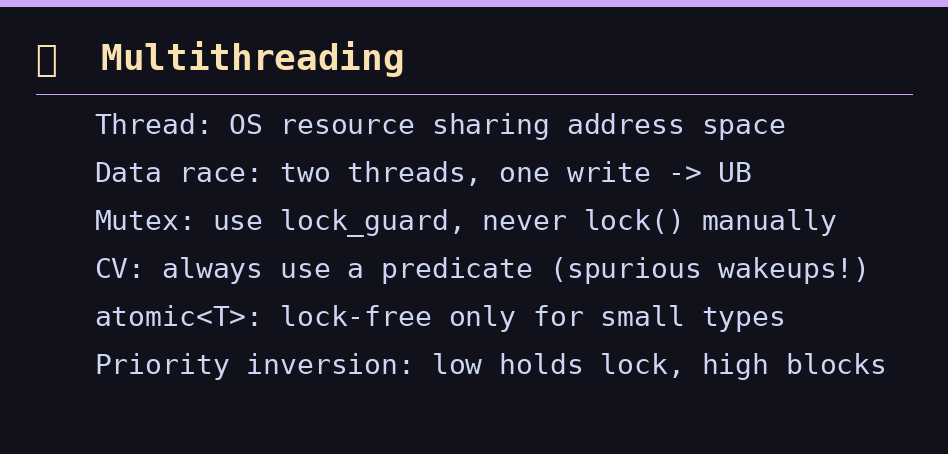

---
<!-- ✅ C -->

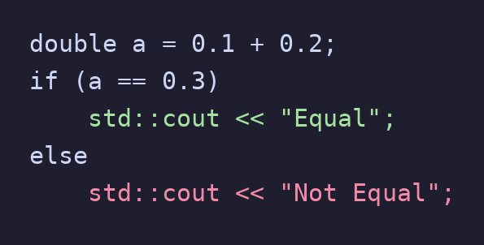

### Q44. 🔢 What does this code print?

**A)** Equal (IEEE 754 is exact)
**B)** Undefined behavior
**C)** Not Equal (0.1+0.2 has rounding error)
**D)** Compile error: == invalid for doubles

---
<!-- ✅ C -->

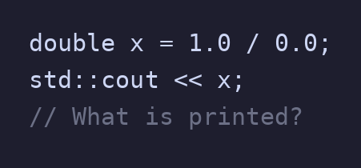

### Q45. ♾️ What does 'double x = 1.0/0.0' print?

**A)** Crash: divide by zero
**B)** 0
**C)** +inf
**D)** NaN

---
<!-- ✅ D -->

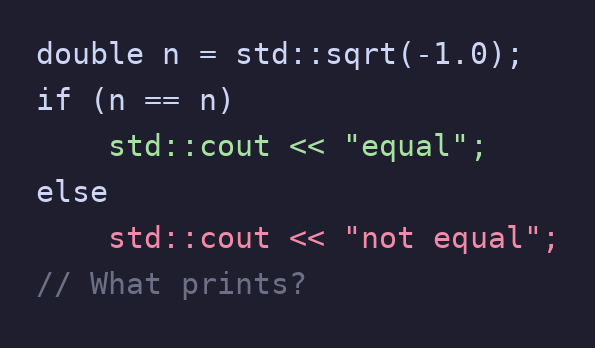

### Q46. 🤯 What does this NaN comparison print?

**A)** equal (NaN is unique)
**B)** Undefined behavior
**C)** Compile error
**D)** not equal (NaN != NaN is always true)

---
<!-- ✅ B -->

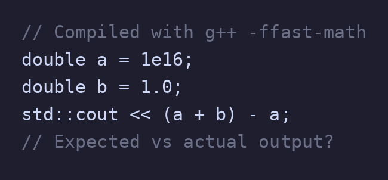

### Q47. ⚡ What does -ffast-math do to floating-point code?

**A)** Only speeds up integers, floats unchanged
**B)** Allows non-IEEE optimizations, may change results
**C)** Forces strict IEEE 754 compliance
**D)** Disables SIMD instructions

---

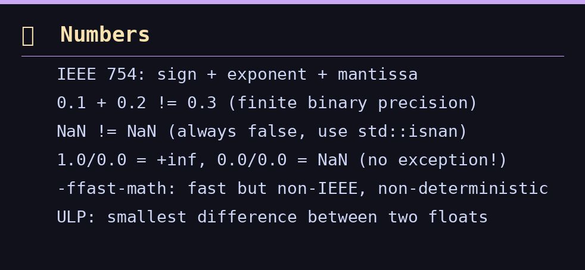

---
<!-- ✅ A -->

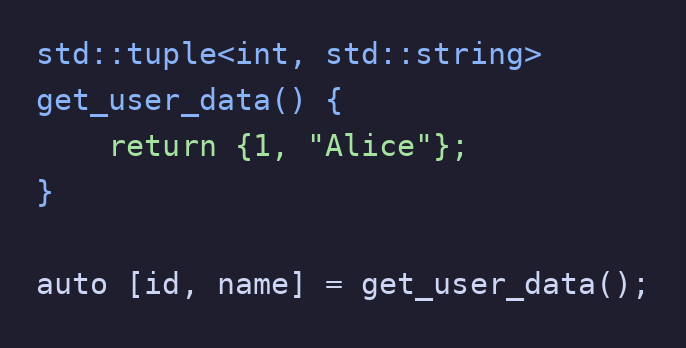

### Q49. 17️⃣ What C++17 feature does 'auto [id, name] = ...' use?

**A)** Structured bindings: unpack tuple/struct
**B)** std::pair destructuring (C++11 feature)
**C)** Template parameter pack
**D)** Move semantics on return value

---
<!-- ✅ B -->

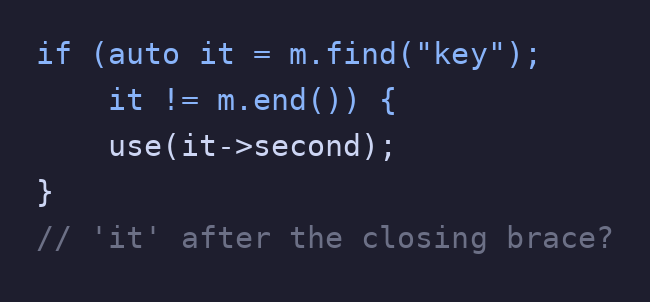

### Q50. 🔍 After the closing brace, is 'it' accessible?

**A)** Yes: 'it' is a regular local variable
**B)** No: 'it' is scoped to the if block
**C)** Only if the if condition was true
**D)** Only in the else branch

---
<!-- ✅ D -->

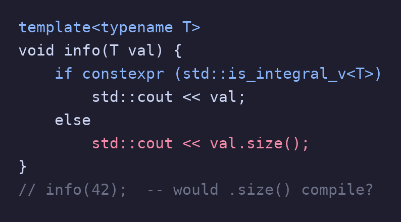

### Q51. ⚙️ Why does info(42) compile even though 'val.size()' is in the code?

**A)** Template instantiation defers all checks
**B)** The compiler ignores unreachable code paths
**C)** int has a .size() method in C++17
**D)** constexpr if discards the else branch at compile time for int

---

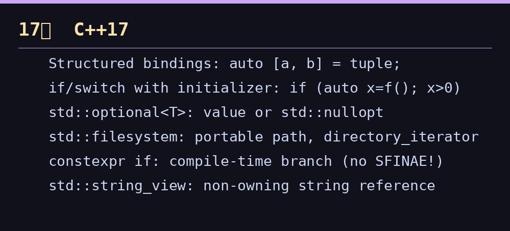
