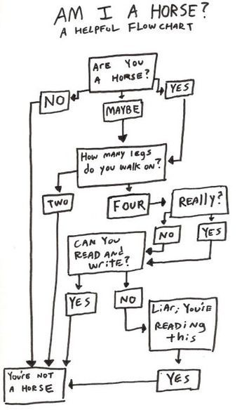
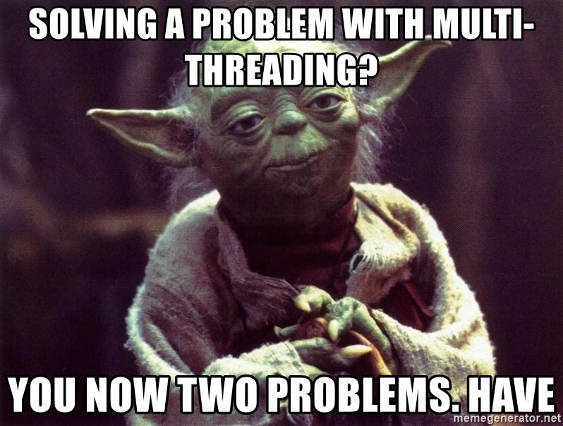

# 🚀 Beyond C++
## 🧪 Testing

<!--
-->


---

## 🧭 Agenda

* 🤔 Why testing?
* 🧩 *Unit* testing / *Algorithm* testing / *System* testing
* 🧠 TDD (Test Driven development)
* 🛠️ Frameworks: GTest / Boost.Test
* 🔁 CI & automation
* 🎭 System tests & mocks

<!--

-->

---

## 🤔 Why Testing?

* 🪟 Windows + Linux always checked
* 🧪 Stress & edge cases
* ➕ Add features safely
* 📘 Usage examples
* 🧩 Forces better design

<!--
Examples:
Threadpool - adding some functionality - will it crash under stress test ?
Adding some feature - does the class does what it should ?
"If it’s not tested on Windows, it’s broken."
-->

---


---


## 🧪 Testing Levels — Terminology

| Scope | Name | What It Tests |
|---|---|---|
| 🔬 Single class / function | **Unit Test** | Isolated behavior |
| 🧩 Full algorithm | **Component Test** | Algorithm correctness |
| 🌍 Whole project | **System Test** | Threads · IO · Flow |

---

# 🔬 Unit Tests
## “If this breaks, it’s *your* fault”


---

## 🧠 TDD — The Idea

* 🔴 Write a failing test
* 🟢 Make it pass
* 🔵 Refactor safely

<!--
-->

---


## 🧠 TDD — Class Example

```cpp
BOOST_AUTO_TEST_CASE(VectorLength)
{
    Vector2 v{3, 4};
    BOOST_TEST(v.length() == 5);
}
```

<!--
Walk through:
- No Vec yet
- No length()
- Let the test drive API shape
-->

---

## 🧠 TDD — Another Example

```cpp
BOOST_AUTO_TEST_CASE(InvalidImageBlack)
{
    InvalidImage img = load("black.png");
    BOOST_TEST(img.isInvalid());
}

BOOST_AUTO_TEST_CASE(InvalidImageWhite)      {}
BOOST_AUTO_TEST_CASE(InvalidImageLowStd)     {}
BOOST_AUTO_TEST_CASE(InvalidImageTiming)     {}
BOOST_AUTO_TEST_CASE(InvalidImageTooSmall)   {}
BOOST_AUTO_TEST_CASE(InvalidImageCorrupted)  {}
BOOST_AUTO_TEST_CASE(InvalidImageNaN)         {}
```

<!--
-->

---

## 🧩 Unit Testing

* 🎯 One class / function
* ⚡ Fast (milliseconds)

<!--
Rule of thumb:
If it needs sleep() → not a unit test.
-->


---

## 🧪 C++ Test Frameworks (Quick View)

| Feature | Boost.Test | GoogleTest | Catch2 |
|---|---|---|---|
| Single header | ⚠️ | ❌ | ✅ |
| Auto registration | ✅ | ✅ | ✅ |
| IDE integration | ⚠️ | ✅ | ⚠️ |
| Parameterized tests | ⚠️ | ✅ | ⚠️ |
| Mocks ecosystem | ❌ | ✅ | ⚠️ |

<!--
Legend:
✅ strong
⚠️ usable / partial / external help
❌ not built-in

- GTest dominates industry

-->

---


## 🔁 CI + Testing

* 🏗️ Build
* 🧪 Test
* 📦 Package
* ❌ Fail fast

<!--
CI is the contract.
If tests are slow → CI will be bypassed.
-->


---


# 🧩 Component Tests
## “Does the algorithm actually work?”




---


## 🧩 Component Tests — Getting Data

- 📥 From real users
- 🎥 Recorded sessions
- 🧰 Synthetic generators (edge cases)
- 🧊 Golden datasets

<!--
system tests are only as good as their data.
-->

---

## ▶️ Component Tests — Replay

- ▶️ Replay deterministically
- ✅ Validate outputs (internal metry ?)
- 📏 Compare to baseline (tolerances)
- ⏱️ Timing, timing, timing

<!--
-->

---

# 🌍 System Tests
## “Welcome to reality”




---

## 🎭 System Tests & Mocks

* 🌐 Multiple components
* 🎭 Replace real dependencies
* 📦 Fake services

<!--
-->

---

## ⚙️ Injecting Test Parameters

* 🌱 Environment variables
* 📄 Config files

<!--

-->

---

## More tips

---

## 🧱 Testing Base Libraries (Shared Code)

### Option A — Minimal at base 📦
- ✅ API + invariants
- ✅ Cheap smoke tests
- ➕ Consumer tests the rest

### Option B — Maximal at base 🏗️
- ✅ Run real projects in CI
- 🔁 Catch integration breakage early

<!--

-->


---

## 🎯 Summary


<!--
Testing is not overhead.
-->

```
